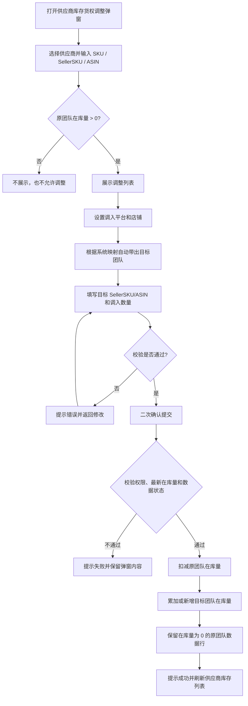

# 供应商库存货权调整 PRD

## 一、需求概述

### 1.1 需求目标

在【供应商库存】页面，通过货权调整弹窗，将某个 SKU 的在库量从原团队调整至目标团队。

> 本功能调整的是【在库量】，不是在途量。所有“调整数量”均指在库量。

### 1.2 范围

- 入口：供应商库存页面的【货权调整】按钮。
- 载体：现有货权调整弹窗，不新增页面。
- 结果：更新供应商库存中的原团队和目标团队在库数据。
- 供应商库存页面不新增交互，调整成功后刷新即可查看结果。

## 二、弹窗交互

### 2.1 弹窗结构

弹窗标题：`供应商库存货权调整`

分为两个步骤：

1. 批量搜索 SKU
2. 设置调入信息

### 2.2 批量搜索

- 支持按供应商筛选。
- 支持输入或粘贴 SKU、SellerSKU、ASIN。
- 支持换行、逗号、中文逗号、空格、分号分隔。
- 单次最多输入 100 个编码。
- 查询结果去重展示，同一条数据只保留一条调整记录。
- 只有原团队该 SKU 的【在库量 > 0】时，才进入搜索结果和调整列表。
- 原团队在库量为 0 的 SKU 不展示，也不允许调整。
- 未匹配的编码提示未匹配数量及编码，不影响已匹配结果展示。

### 2.3 调整列表

列表至少展示以下字段：

| 类型 | 字段 |
|---|---|
| 来源信息 | SKU、SellerSKU、品名、供应商 |
| 原团队信息 | 原平台、原店铺、原团队 |
| 数量信息 | 在库量、可调整数 |
| 目标信息 | 调入平台、调入店铺、调入 SellerSKU/ASIN、调入团队、调入数量 |
| 操作 | 移除 |

规则：

- 可调整数默认为原团队当前在库量。
- 调入数量为正整数，且不能大于可调整数。
- 调入平台必填；调入店铺根据平台联动筛选。
- 调入团队根据系统已有的平台/店铺映射自动带出，不允许手工修改。
- 调入 SellerSKU/ASIN 沿用系统已有映射规则。

### 2.4 批量设置

公共字段区域提供：

- 调入平台
- 调入店铺
- 【应用到勾选 SKU】
- 【按可调整数填充勾选行】

交互规则：

- 选择平台后，店铺下拉只展示该平台的店铺。
- 点击【应用到勾选 SKU】，将平台和店铺应用到选中行。
- 未勾选数据时，提示“请先勾选 SKU”。
- 点击【按可调整数填充勾选行】，将选中行的调入数量填充为对应的可调整数。
- 未勾选数据时，提示“请先勾选 SKU”。
- 每行仍可单独修改目标信息和调入数量。

### 2.5 提交

点击【确认调整】后：

1. 校验所有调整行。
2. 校验通过后弹出二次确认，展示 SKU 数量和调入总数。
3. 用户确认后提交，按钮进入 loading 状态，避免重复提交。
4. 成功后提示“货权调整成功”，关闭弹窗并刷新供应商库存列表。
5. 失败时提示失败原因，保留弹窗中的搜索结果和已填写内容，支持修改后重试。

## 三、核心流程图



## 四、数据流转规则

调整数量为 `N` 时，数据定位沿用系统已有逻辑。

### 4.1 原团队

```text
原团队在库量 = 原团队在库量 - N
```

- 原团队在库量必须大于 0 才能进入调整列表。
- `N` 不得大于原团队当前在库量。
- 扣减后原团队在库量为 0 时，保留原团队数据行，数量更新为 0。
- 本功能不删除原团队数据行。

### 4.2 目标团队

```text
目标团队在库量 = 目标团队在库量 + N
```

- 目标团队已有该 SKU 数据：直接累加在库量。
- 目标团队不存在该 SKU 数据：在供应商库存页面新增该 SKU 的目标团队数据。
- 目标团队由目标平台/店铺按系统已有映射自动确定。

### 4.3 数据一致性

- 原团队扣减和目标团队增加必须作为一次完整调整处理。
- 任一侧更新失败，不产生部分成功结果。
- 提交时以后端最新在库量为准，避免并发调整导致数量为负数。
- 调整成功后，供应商库存列表刷新展示最新数据。

## 五、校验与异常

| 场景 | 处理规则 |
|---|---|
| 原团队在库量为 0 | 搜索结果中不展示，不允许调整 |
| 调入数量为空、非正整数 | 阻止提交并提示 |
| 调入数量大于原团队在库量 | 阻止提交并提示可调整上限 |
| 未选择调入平台 | 阻止提交并提示 |
| 未选择调入店铺 | 阻止提交并提示 |
| 未填写目标 SellerSKU/ASIN | 阻止提交并提示 |
| 未勾选 SKU 点击批量操作 | 提示先勾选 SKU |
| 最新在库量不足 | 提交失败，保留弹窗内容并允许重试 |
| 数据更新失败 | 整体回滚，不产生部分调整结果 |
| 重复点击提交 | 提交期间按钮 loading，禁止重复提交 |

## 六、权限与系统规则

- 货权调整权限沿用系统现有权限控制。
- 后端校验用户权限、数据状态和最新在库量。
- SKU、SellerSKU/ASIN 映射规则沿用现有系统逻辑。
- 数据定位、同 SKU/团队数据合并规则沿用现有系统逻辑。
- 调整单号、操作日志和历史记录沿用现有系统逻辑。
- 供应商库存页面本身不改版，仅刷新后展示调整结果。

## 七、验收标准

- [ ] 供应商库存页面可打开【货权调整】弹窗。
- [ ] 支持供应商筛选和 SKU、SellerSKU、ASIN 批量搜索。
- [ ] 只有原团队在库量大于 0 的 SKU 进入结果和调整列表。
- [ ] 在库量为 0 的 SKU 不展示、不允许调整。
- [ ] 支持平台、店铺批量应用及按可调整数填充。
- [ ] 目标团队按系统映射自动带出，不允许手工选择。
- [ ] 调入数量不能超过原团队在库量。
- [ ] 原团队在库量正确扣减，扣减为 0 后数据行仍保留。
- [ ] 目标团队已有数据时累加，不存在时新增数据行。
- [ ] 任一侧更新失败时不产生部分调整结果。
- [ ] 调整成功后关闭弹窗并刷新供应商库存列表。

## 八、关联代码

- 供应商库存页面：`pages/supplier-inventory/index.html`
- 货权调整交互：`pages/supplier-inventory/ownership.js`
- 货权调整样式：`pages/supplier-inventory/ownership.css`
