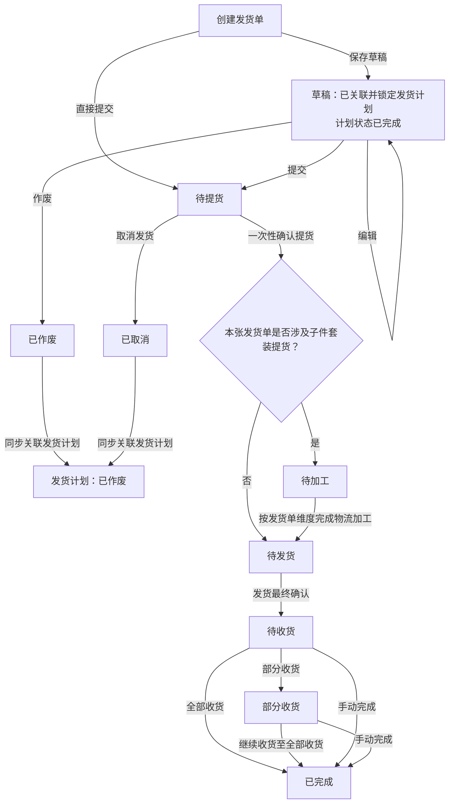
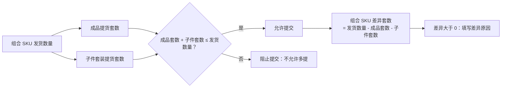
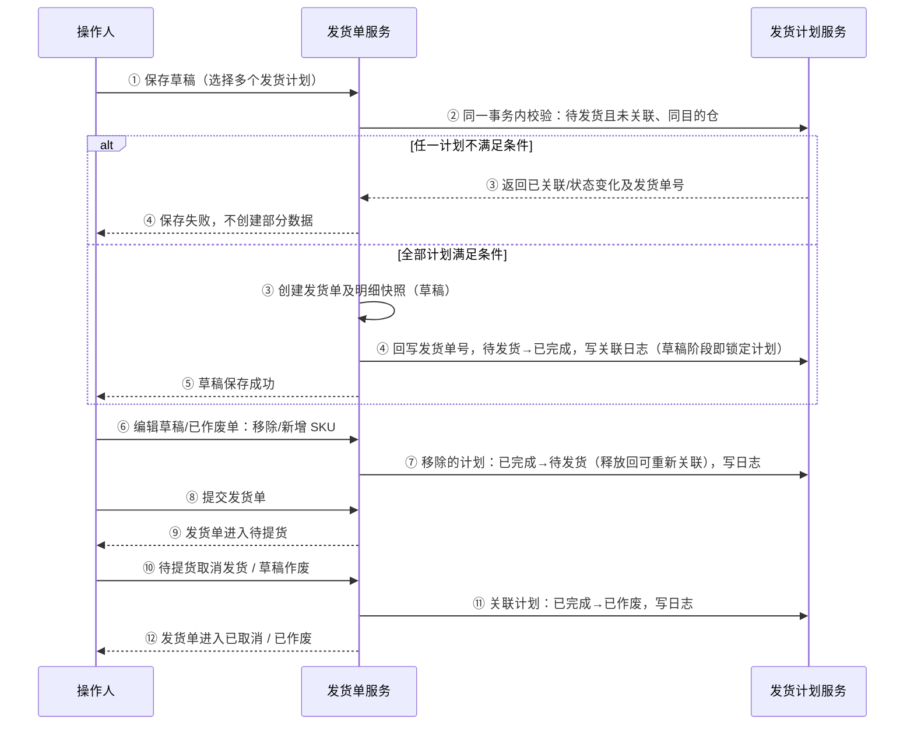
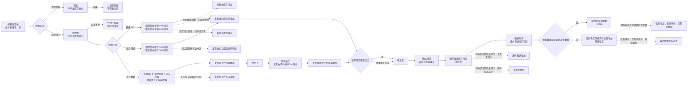
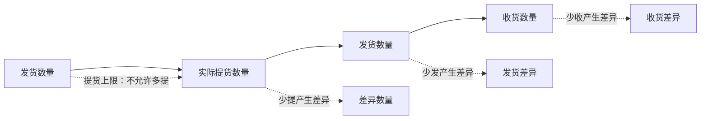

# 发货单全流程管理 PRD V2

> 本文件为原 PRD 的 V2 备份版本。原版文档保持不变；当前先更新本版本的业务流程图，待确认后再继续同步其他 PRD 内容。

## 一、评审会后改动清单（2026-08-12）

> 以下为需求评审及后续确认的改动，均已落地到对应章节；开发按下表定位章节查看口径。序号 15-18 为导入弹窗相关改动，序号 22-24 为后续库存、自动收货范围及数量调整相关改动；序号 12 的自动收货方案已被序号 23 覆盖，最终口径以序号 23 为准。

| 序号 | 改动内容                                                                                                                                                                                                                                                                                                                                                                                                                        | 对应章节                                      |
| -- | --------------------------------------------------------------------------------------------------------------------------------------------------------------------------------------------------------------------------------------------------------------------------------------------------------------------------------------------------------------------------------------------------------------------------- | ----------------------------------------- |
| 1  | 关联时点提前：草稿创建即关联锁定发货计划（计划→已完成）；草稿作废/待提货取消 → 关联计划同步已作废                                                                                                                                                                                                                                                                                                                                                                         | 5.1 主流程、5.2 计划联动、六、7.2（第8条）、7.8、十一、验收标准摘要 |
| 2  | 草稿/已作废可编辑（移除+新增 SKU，移除释放回待发货）；已取消不可编辑                                                                                                                                                                                                                                                                                                                                                                                       | 六、7.2（第8条）                                |
| 3  | 物流费用、轨迹信息在草稿/已作废/已取消状态禁用编辑                                                                                                                                                                                                                                                                                                                                                                                                  | 7.9 详情                                    |
| 4  | 组合 SKU「组合」标签点击弹出子件明细浮窗（子件 SKU、组合数量）                                                                                                                                                                                                                                                                                                                                                                                         | 7.9 详情                                    |
| 5  | 发货计划页「生成发货单」弹窗复用新建发货单弹窗                                                                                                                                                                                                                                                                                                                                                                                                     | 二、补充说明（第2条）                               |
| 6  | 新增需求效益                                                                                                                                                                                                                                                                                                                                                                                                                      | 三、3.5                                     |
| 7  | 术语统一：「异仓」→「易仓」                                                                                                                                                                                                                                                                                                                                                                                                              | 全文                                        |
| 8  | FBA/亚马逊限制：亚马逊发货单由领星生成不在此手动创建；FBA 专属仓、亚马逊平台/店铺选项置灰禁用；候选过滤亚马逊计划                                                                                                                                                                                                                                                                                                                                                               | 7.2（第5条）                                  |
| 9  | 新增 SKU 候选字段：FNSKU→易仓 SKU；申报量→发货量（仅列名，数据口径不变）                                                                                                                                                                                                                                                                                                                                                                                | 7.2（第6、9条）                                |
| 10 | 提示文案：「同一发货单仅支持同一目的仓的货物合并发货」                                                                                                                                                                                                                                                                                                                                                                                                 | 7.2                                       |
| 11 | 组合 SKU 履约改造：支持成品提货、子件套装提货及并行提货；只要提子件即按发货单进入待加工；物流加工按单据维度提交，且加工数量不得超过已提子件套装数量                                                                                                                                                                                                                                                                                                                                                | 5.1、5.5、六、7.3、7.4                         |
| 12 | 收货方式调整：原方案改为自动收货并隐藏手动收货入口；后因无可用接口，第一期保留手动收货入口，自动收货能力留待后续版本（见序号 23）                                                                                                                                                                                                                                                                                                                                                                 | 7.6                                       |
| 13 | 手动完成库存扣减：未收部分对应海外在途库存直接清除，不增加目的仓库存；当前不生成库存流水                                                                                                                                                                                                                                                                                                                                                                                  | 7.6（第4条）、5.3.1                                 |
| 14 | 其他头程费用分摊弹窗改版：三段式（筛选→批次勾选→费用信息）、多维筛选、勾选即分摊                                                                                                                                                                                                                                                                                                                                                                                   | 7.11                                      |
| 15 | 导入物流费用模板改造：系统自动计算的「体积重、计费重、实际体积重、实际计费重」不允许导入，下载模板也不包含这些字段；其余可维护费用字段继续导入，必填字段表头加「\*」并强制校验；移除「费用分摊方式」字段（弹窗与模板同步去除）                                                                                                                                                                                                                                                                                                             | 物流费用导入（7.9 详情）                            |
| 16 | 导入弹窗流程调整：移除「校验文件」按钮；校验改为点击「确认导入」时系统自动执行，不通过给出具体提示（文件格式 / 必填空值 / 日期格式 / 整数）                                                                                                                                                                                                                                                                                                                                                  | 物流费用导入、轨迹导入                               |
| 17 | 导入轨迹信息模板字段调整：「发货单号」更名「中台发货单号」并标记必填；移除「物流服务商单号」；「预计物流时长」「实际物流时长」标注（整数）；「承运商」移至末尾                                                                                                                                                                                                                                                                                                                                             | 轨迹导入                                      |
| 18 | 轨迹模板格式校验与提示行：9 个日期字段（下单日期\~实际到货日期）限制格式 YYYY/MM/DD（如 2026/06/30），导入时强制校验；预计/实际物流时长校验为整数；费用/轨迹模板均增加第二行填写提示（逐列说明填写方式，承运商按「格式：承运商名称：上网单号：备注；示例：美国邮政：YD467897：港口到旧金山；」），导入校验自动跳过提示行                                                                                                                                                                                                                                              | 物流费用导入、轨迹导入                               |
| 19 | 字段隐藏（仅隐藏不删除，下版本可能恢复）：发货单页面隐藏「关联货件单号、Reference ID、FNSKU、申报量、申报数量、申提差异、申收差异」字段。隐藏位置：①查询区（单号下拉的关联货件单号/Reference ID、编码下拉的 FNSKU）；②一级列表（单号列的关联货件单号/Reference ID、数量汇总列的申报数量、差异数量列的申提差异/申收差异）；③二级列表展开行 SKU 明细（FNSKU、申报量）；④详情弹窗（发货单信息的参考号/申报数量、SKU 明细的 FNSKU/申报量）；⑤提货弹窗（顶部汇总的累计申报数量、库存/计划列的申报数量）；⑥发货弹窗（明细表的申报数量、申发差异）；⑦收货弹窗（顶部汇总的申报数量、明细表的申报数量）；⑧手动完成弹窗（顶部汇总的申报数量）；⑨数量调整弹窗（明细表的申报数量）；⑩新增履约批次弹窗（明细表的申报量）；⑪差异明细弹窗（明细表的申报数量、申提差异、申收差异） | 7.1 列表、7.2 及 7.3\~7.9 各弹窗、差异明细弹窗          |
| 20 | 一级列表【单号】列新增「服务商单号」字段，位置在「发货方式」字段下方，数据来源 providerNo（物流服务商单号），无值显示「—」                                                                                                                                                                                                                                                                                                                                                         | 7.1 列表                                    |
| 21 | 导出字段调整（联动序号 19、20）：导出 A「发货单信息」删除隐藏字段「关联货件单号、Reference ID、申报数量、申提差异、申收差异」（36→32 列）；导出 B「发货 SKU 明细」删除隐藏字段「FNSKU、申报量」（23→24 列）；两个导出均在「ERP 发货单号」后新增「服务商单号、海外仓入库单号、物流单号」，服务商单号无值显示「—」                                                                                                                                                                                                                                            | 7.10 导出                                   |
| 22 | 库存流转口径调整：创建发货单只建立计划关联，不生成「在库待发」库存；待提货确认提货时直接扣减实际提货仓对应 SKU 在库量并增加发货仓库存；子件按具体子 SKU 和 BOM 配比处理；草稿作废、待提货取消不执行库存释放；提货、加工、发货、收货及数量调整按实际库存路径流转                                                                                                                                                                                                                                                                                       | 5.3、5.4、7.3、7.4、7.5、7.6、7.7、八、十一 |
| 23 | 自动收货范围调整：第一期暂不实现自动收货功能，因当前没有可用接口；本期保留收货相关页面和后续扩展边界，自动收货能力留待后续版本建设                                                                                                                                                                                                                                                                                                                                                             | 3.3、3.4、4.1、7.6、九、十、十一、十二 |
| 24 | 数量调整与履约批次关联：数量调整基于原有提货、发货、收货履约数据及关联批次校验和处理；提货数量减少只能回滚到原实际提货仓；数量调整不新增履约批次                                                                                                                                                                                                                                                                                                                                                 | 7.7、7.9、八、十、十一 |

## 二、补充说明

1. 发货单提货成功后，必须触发现有供应商库存提货批次回写逻辑；团队库存及中台库存与易仓、领星等外部系统之间的交互，沿用现有库存流转规则和接口能力。开发时需复用现有逻辑，保证库存、提货批次、外部系统数据的一致性、幂等性和可追溯性。本次库存流转规则已重新定义（见 5.3），以创建发货单不产生库存变化、提货时直接扣减提货仓并增加发货仓为核心口径。
2. 发货计划页面操作列的「生成发货单」入口，弹窗复用发货单页面的「新建发货单」弹窗，字段、校验与交互保持一致（同一套实现，避免两套弹窗不一致）。

## 三、背景、目标与范围

### 3.1 背景

发货计划用于确认单个 SKU 的发货安排；实际履约过程还需经历提货、组合 SKU 加工、发货和收货等动作。系统需要通过发货单承接该过程，并使业务能够查看实际数量、差异、批次、费用和操作历史。发货单同时承接提货仓、发货仓、海外在途和目的仓之间的库存转移；创建发货单只建立计划关联，不产生库存变化，实际库存变更从待提货状态确认提货开始。

### 3.2 目标

1. 仅允许可执行的发货计划创建发货单，并防止同一计划重复关联。
2. 支持一张发货单包含多个 SKU、不同 SKU 从不同提货仓提货，以及组合 SKU 与普通 SKU 混单履约。
3. 统一计划、申报、提货、发货、收货数量及差异口径。
4. 所有影响状态、数量、库存和计划的动作均通过履约批次、数量调整记录、操作日志及关联数据进行追溯；当前版本不新增库存流水功能。

### 3.3 本次范围

- 发货单列表、创建、编辑草稿、详情、提货、加工、发货、收货、数量调整、手动完成、草稿作废、取消发货。
- 发货计划与发货单的选择、锁定、回写、取消回写和日志。
- 组合 SKU 加工、子 SKU 在库量校验及加工批次。
- 提货完成后，将发货单提货明细回写至供应商库存提货批次；具体字段和落库方式沿用现有库存逻辑。
- 本期不实现自动收货功能，原因是当前没有可用的易仓/海外仓收货接口；保留后续版本接入自动收货的扩展边界。未接入自动收货的第三方平台仓不承诺自动收货。
- 物流费用导入、轨迹导入沿用现有能力；本期包含物流费用导入模板字段调整和自动计算字段禁止导入；其他头程费用分摊保留现有分摊规则与计算逻辑，本次升级弹窗交互（多维筛选 + 三段式布局），查询结果按筛选条件自动全量纳入分摊，详见 7.11。

### 3.4 非本次范围

- 已提货后的「异常终止 / 撤销发运 / 结单」完整流程及第三方库存回滚；会议纪要提到该能力，但是否纳入 1.0、覆盖哪些状态尚待确认。
- 补提、补发流程；少提和少发均为最终结果。
- 自动收货功能及其接口对接，留待后续版本。
- 对既有费用分摊算法和轨迹业务规则的重构；本期仅包含物流费用导入模板字段与校验规则调整。

### 3.5 需求效益

1. **全流程线上化与可追溯**：将发货计划转化为可承接的提货、加工、发货、收货履约单据，全链路状态透明、动作留痕，减少线下沟通与责任扯皮，提升业务协同效率。
2. **差异与费用透明化**：四项差异与差异原因贯穿列表与详情，头程费用查询页支持按发货单、SKU、仓、渠道等维度检索分摊结果，库存与费用对账有据可查，支撑成本归因与复盘。
3. **提效降错**：批量加工、手动完成等能力减少人工介入；通过明确的库存流转、数量校验和幂等约束降低误操作与重复处理风险。本期不实现自动收货，相关能力留待后续版本。
4. **突破单 SKU 限制，支持多 SKU 混单**：原发货单一张单仅支持一个 SKU，单据数量多、操作重复、业务效率低；本次改造后一张发货单可创建多个 SKU（含组合 SKU 加工与混单校验），并结合列表/详情的整体交互重构，以及会议新增的差异明细、易仓详情和箱信息等能力，全面提升操作体验与业务承载能力。

## 四、核心定义与数据关系

### 4.1 核心对象

| 对象             | 定义与关系                                                     |
| -------------- | --------------------------------------------------------- |
| 发货计划           | 当前一个发货计划只对应一个 SKU；发货计划号为唯一业务关联标识。                         |
| 发货单            | 一张发货单可包含多个 SKU，因此可关联多个发货计划。                               |
| 发货单 SKU 明细     | 每行对应一个发货计划，保存该计划和商品信息的历史快照。                               |
| 履约批次           | 每次提货、加工、发货、收货均生成批次与明细。                                    |
| 数量调整记录         | 仅修正累计数量，不改变既有履约批次。                                        |
| 操作日志           | 保存动作、前后状态、数量、原因、备注、操作人、时间及关联单号。                           |
| 供应商库存提货批次      | 发货单提货完成后，由提货明细回写形成或更新的供应商库存提货批次；必须与发货单、SKU、提货数量和提货批次建立关联。 |
| FBA / 非 FBA 标识 | 用于混单校验、列表筛选和跨系统路由；具体判定字段待确认。                              |
| 收货同步记录         | 为后续自动收货扩展预留的同步对象；本期不实现自动收货接口及自动同步能力。                           |

### 4.2 发货单 SKU 明细快照

发货单创建时必须固化以下字段；后续发货计划或 SKU 主数据变更，不得改写历史单据。

| 字段                               | 说明                               |
| -------------------------------- | -------------------------------- |
| 发货计划号、发货计划 ID                    | 明细关联和并发锁定依据。                     |
| SKU、产品信息、SKU 类型                  | 包含是否为组合 SKU。                     |
| 计划发货数量、申报数量                      | 数量计算与差异展示依据。                     |
| 平台、店铺、团队、目的仓                     | 混单规则、查询和历史追溯依据。                  |
| 发货计划备注、SKU 明细备注                  | 默认带出计划备注；SKU 明细备注可编辑且独立保存。       |
| FBA / 非 FBA 标识、货件单号、Reference ID | 用于发货单类型识别、筛选及领星/易仓关联；来源和回写时点待确认。 |

## 五、业务流程

### 5.1 发货单主流程（V2）

> V2 业务口径：发货单状态始终按**单据维度**流转，不区分普通 SKU、组合 SKU 或子件 SKU。提货完成后，系统只判断本张发货单是否涉及「子件套装提货」：未涉及时进入「待发货」；一旦涉及，则必须先进入「待加工」，按发货单维度完成物流加工后才能进入「待发货」。

#### 5.1.1 组合 SKU 提货与差异规则

### 5.2 发货计划与发货单联动

### 5.3 库存流转总览（V2）

> 本节仅描述库存数量的增减，不描述发货单业务状态流转。发货单创建和草稿保存只完成计划关联，不产生库存变化；库存变化从待提货状态确认提货开始。文中“发货仓”即物流商仓库，原型中的字段名称保持不变。

#### 5.3.1 库存流转表

当前系统暂不提供库存流水功能，本节只定义各库存位置的增减方向、数量口径和状态约束；开发实现时直接更新对应库存。

| 动作               | 触发条件                     | 扣减什么                 | 增加什么       | 数据流向               | 数量口径与状态结果                                                             |
| ---------------- | ------------------------ | -------------------- | ---------- | ------------------ | --------------------------------------------------------------------- |
| 创建发货单            | 新建发货单保存草稿或直接提交    | —                    | —    | 仅建立发货计划关联，不发生库存流转    | 不增加在库待发、不扣提货仓、不增加发货仓库存 |
| 草稿作废             | 发货单为草稿              | —                    | —          | 仅同步发货计划状态    | 关联计划「已完成→已作废」；不执行库存释放 |
| 待提货取消            | 发货单为待提货并执行取消发货           | —                    | —          | 仅同步发货计划状态    | 关联计划「已完成→已作废」；不执行库存释放                     |
| 物流加工             | 发货单为待加工且发货仓有已提子件         | 发货仓子 SKU 库存              | 发货仓组合 SKU 库存  | 发货仓子 SKU → 发货仓组合 SKU    | 按 BOM 扣减子件并增加组合成品套数；加工完成后进入待发货                              |
| 提货：普通 SKU        | 待提货状态确认提货               | 所选提货仓对应普通 SKU 在库     | 发货仓普通 SKU  | 提货仓 → 发货仓   | 按实际提货数量流转，不得超过发货数量或提货仓库存 |
| 提货：组合成品          | 待提货状态确认成品提货                | 所选提货仓组合 SKU 在库 | 发货仓组合 SKU    | 提货仓 → 发货仓     | 按成品提货套数流转；不产生加工数量 |
| 提货：子件套装          | 待提货状态确认子件提货                | 各实际提货仓对应子 SKU 在库    | 发货仓各子 SKU 库存   | 各提货仓 → 发货仓  | 按组合套数确认，子件数量 = 套数 × BOM 配比；库存扣减和增加均落到子 SKU 维度；必须完整成套；整单进入待加工                       |
| 物流加工             | 发货单为待加工且发货仓有已提子件         | 发货仓子件库存              | 发货仓组合成品库存  | 发货仓子件 → 发货仓组合成品    | 按加工套数 × BOM 扣减子件，增加组合成品套数；加工套数不得超过已提子件套装数和发货仓库存可成套数；加工完成后进入待发货        |
| 发货               | 发货单为待发货，确认实际发货数量         | 发货仓对应 SKU 库存         | 海外在途库存     | 发货仓 → 海外在途         | 按实际发货数量扣减和增加；组合 SKU 只能按组合成品发货；确认后进入待收货                                |
| 收货               | 发货单为待收货或部分收货，确认实际收货数量    | 海外在途库存               | 目的仓库存      | 海外在途 → 目的仓         | 按实际收货数量流转；少收进入部分收货，收足进入已完成                                            |
| 提货数量增加调整         | 待加工或待发货，且调整后不超过发货数量      | 原实际提货仓对应库存           | 发货仓对应库存      | 原提货仓 → 发货仓 | 普通/成品按对应 SKU；子件按 BOM 落到具体子 SKU；同步更新累计提货数量 |
| 提货数量减少调整         | 待加工或待发货，且调整后不低于已加工、已发货数量 | 发货仓对应库存                | 原实际提货仓对应库存 | 发货仓 → 原提货仓 | 只能回滚到原实际扣减的提货仓；子件按 BOM 冲正；同步重算差异和状态                       |
| 待收货发货数量增加调整      | 发货单为待收货且增加数量不超过提货可用数量    | 发货仓库存                | 海外在途库存     | 发货仓 → 海外在途         | 增加发货数量必须同步扣发货仓、增海外在途；不能超过提货数量                                         |
| 待收货发货数量减少调整      | 发货单为待收货且调整后不低于已收货数量      | 海外在途库存               | 发货仓库存      | 海外在途 → 发货仓         | 减少发货数量必须同步减海外在途、增发货仓；已收货数量不得被冲减                                       |
| 待收货/部分收货收货数量增加调整 | 调整后收货数量不超过发货数量           | 海外在途库存               | 目的仓库存      | 海外在途 → 目的仓         | 按增加数量转移；达到发货数量进入已完成，否则保持待收货或部分收货                                      |
| 待收货/部分收货收货数量减少调整 | 调整后收货数量不低于 0，且目的仓有可回退库存  | 目的仓库存                | 海外在途库存     | 目的仓 → 海外在途         | 按减少数量冲正收货流；部分收货状态不允许调整发货数量                                            |
| 手动完成清除剩余在途          | 待收货或部分收货执行手动完成  | 剩余海外在途库存            | —          | 海外在途 → 清除    | 清除未收数量对应的剩余在途；不增加目的仓库存；当前不生成库存流水 |

 

#### 5.3.1.1 库存流转流程图

下图描述发货单从待提货到收货的主库存流向，并补充提货、发货和收货数量调整的反向库存变更路径。创建发货单、草稿作废和待提货取消均不产生库存变化。当前系统暂不提供库存流水功能，库存变更直接更新对应库存。

**流程图口径：**

1. 创建发货单只建立发货计划关联，不增加在库待发，也不扣减或增加任何仓库库存；草稿作废、待提货取消只处理发货计划状态，不执行库存释放。
2. 待提货确认提货时，根据真实提货路径扣减实际提货仓库存并增加发货仓库存；普通 SKU、组合成品按对应 SKU 处理，组合子件按具体子 SKU 和 BOM 配比处理，子件可来自不同提货仓。
3. 物流加工只发生在发货仓，扣减发货仓子 SKU 库存并增加发货仓组合 SKU 库存；成品提货不产生加工数量。
4. 发货仓库存经发货后转入海外在途，收货后从海外在途转入目的仓；收货不足进入部分收货，不定义部分发货状态。
5. 待收货状态允许调整发货数量：增加时发货仓减少、海外在途增加；减少时海外在途减少、发货仓增加。部分收货状态只允许调整收货数量。
6. 提货数量增加调整必须扣减原实际提货仓库存并增加发货仓库存；减少调整必须增加原实际提货仓库存并扣减发货仓库存，不能退回其他提货仓；子件按具体子 SKU 和 BOM 配比执行。
7. 手动完成时清除剩余海外在途库存，未收部分不增加目的仓库存；当前不生成库存流水。

#### 5.3.2 库存流转说明、调整与终止规则

1. **创建与终止不产生库存变化**：创建发货单只建立计划关联；草稿作废、待提货取消只同步计划状态，不执行库存释放。
2. **提货数量调整按实际库存路径处理**：增加提货时扣原实际提货仓、增发货仓；减少提货时增原实际提货仓、减发货仓，不允许退回其他提货仓；组合 SKU 子件按具体子 SKU 和 BOM 配比处理。
3. **调整下限**：提货调整后不得低于已加工数量或已发货数量；发货数量调整后不得低于已收货数量；收货数量调整后不得低于 0，且减少收货必须先校验目的仓库存。
4. **发货数量调整仅限待收货**：待收货时增加发货数量，执行发货仓 → 海外在途；减少发货数量，执行海外在途 → 发货仓。进入部分收货后，已发生收货确认，数量调整只允许调整收货数量，不允许调整发货数量。
5. **部分收货不是部分发货**：本流程不定义“部分发货”状态。发货确认后单据进入待收货；收货数量少于发货数量时才进入部分收货。
6. **不存在异常订单库存恢复动作**：草稿作废、待提货取消不执行库存释放；已进入发货仓、海外在途或目的仓的数量，只能通过对应的提货、发货、收货数量调整或实际后续业务动作处理，不能因单据关闭直接恢复。
7. **状态转换与库存动作绑定**：建单后为草稿或待提货；提货发生子件套装则为待加工；加工完成为待发货；发货后为待收货；收货不足为部分收货，收足或手动完成为已完成；库存更新后按调整后的累计数量重算状态。
8. **库存更新原则**：当前系统不提供库存流水功能，库存变更直接更新对应库存；库存变更、累计数量、差异重算和状态更新必须在同一事务内完成，并保证单据级幂等。

### 5.4 数量履约与差异口径（V2）

> **V2 提货口径**：提货数量以发货数量为绝对上限，只允许少提，不允许多提。普通 SKU 的差异数量 = 发货数量 − 实际提货数量；组合 SKU 的差异数量 = 发货数量 − 成品提货套数 − 子件套装提货套数。子件 SKU 不单独产生差异。

> **V2 库存口径**：创建发货单只建立发货计划关联，不生成「在库待发」库存；提货确认时直接扣减实际提货仓对应 SKU 的在库量，并增加发货仓对应 SKU 的在库量。这是库存流，不等同于发货单状态流。

### 5.5 1.0 双轨业务边界

| 场景         | 当前已知口径                                        | 本 PRD 处理方式                               |
| ---------- | --------------------------------------------- | ---------------------------------------- |
| 海外仓 / 第三方仓 | 发货计划在中台创建，发货单承接提货、加工、发货、收货链路，并按现有能力推送相关系统。    | 纳入本次主流程；推送接口字段和时点见待确认问题。                 |
| Amazon FBA | 会议纪要描述为由领星拉取货件/发货单信息并关联中台计划，另有“可由中台生成发货单”的表述。 | 不在本版擅自确定是否需要手工新建发货单；创建入口、关联方式和领星回写时点待确认。 |
| 海外仓转运至 FBA | 当前无实际业务，且会议纪要明确暂不纳入 1.0。                      | 不纳入本次范围。                                 |

### 5.6 履约确认原则（V2）

1. 提货是一次性提交动作，提货弹窗不设置 SKU 选择列；弹窗内所有主 SKU 均纳入本次提交。
2. 普通 SKU 直接选择提货仓并填写数量；组合 SKU 可同时选择成品提货和子件套装提货。
3. 组合 SKU 的成品提货套数 + 子件套装提货套数不得超过发货数量；子件提货必须按 BOM 完整成套，不能单独提取某个子件。
4. 只要发生子件套装提货，整张发货单进入「待加工」；物流加工按发货单维度完成后才进入「待发货」。
5. 普通 SKU 或仅成品提货的组合 SKU，提货后可进入「待发货」；少提数量作为差异保留。
6. 差异数量仅按普通 SKU 或组合 SKU 维度计算，不按子件 SKU 单独计算。
7. 0 件或少量确认属于最终差异结果，不产生独立的「部分提货」状态，也不自动进入补提。

## 六、状态与可操作规则

| 发货单状态 | 状态含义                       | 允许操作                     | 不允许操作         |
| ----- | -------------------------- | ------------------------ | ------------- |
| 草稿    | 已保存并关联发货计划，待执行             | 编辑（移除/新增 SKU）、提交、作废、查看日志 | 提货、加工、发货、收货   |
| 待提货   | 已关联计划，待实物提货                | 提货、取消发货、查看日志             | 作废、编辑草稿、发货、收货 |
| 待加工   | 提货时发生子件套装提货，需按发货单维度完成物流加工  | 物流加工、数量调整、查看日志           | 取消发货、直接收货     |
| 待发货   | 普通 SKU 或仅成品提货已完成；子件套装加工已完成 | 发货、数量调整、查看日志             | 取消发货、提货       |
| 待收货   | 已发货，尚未收货                   | 收货、数量调整、手动完成、查看日志        | 取消发货、再次发货     |
| 部分收货  | 已收部分货物                     | 收货、数量调整、手动完成、查看日志        | 取消发货、再次发货     |
| 已完成   | 收货完成或手动结束                  | 查看详情、日志                  | 编辑、调整、履约动作    |
| 已作废   | 草稿作废终态（可编辑复活）              | 查看、编辑（保存草稿/重新提交）、日志      | 履约动作          |
| 已取消   | 待提货取消终态                    | 查看详情、日志                  | 编辑、重新提交、履约动作  |

补充规则：发货计划的「已完成」仅表示已成功交接并关联发货单，不代表货物已提货、已发货或已收货。

## 七、功能需求与页面交互

### 7.1 发货单列表

1. 支持按单号、SKU 及其相关编码、发货方式、发货仓、目的仓、物流渠道、运输方式、平台、店铺、团队、创建人、创建日期筛选；单号和编码支持多值输入。
2. 状态页签展示：全部、草稿、待提货、待加工、待发货、待收货、部分收货、已完成、已作废、已取消；支持通过平台/FBA 标识区分 FBA 与非 FBA 数据。
3. 列表展示单号、仓库与渠道、数量汇总、四项差异、发货时间、入库信息、创建与备注、头程费用及状态对应操作。
4. 一级列表的四项差异均可点击，打开按 SKU 展示的差异明细。
5. 展开行及详情页展示每个 SKU 的发货计划、数量、平台、店铺、团队和独立备注。
6. 列表默认按创建时间倒序排列（最新在最上面），分页大小沿用现有逻辑。
7. 列表支持导出为 Excel，详细设计见 7.10。
8. 一级列表「单号」列中，ERP 发货单的「易仓」标签可点击，点击后弹出小弹窗，展示该发货单关联的易仓详情：头程计划单号、订单号、下架单号、入库单号（数据通过接口拉取）。接口失败时保留中台单据可用，并提示“暂无法获取外部系统详情”。

### 7.2 新建发货单与新增 SKU

1. 新建时必须填写发货仓、目的仓、发货方式、头程服务商、运输方式、物流渠道；其余地址、国家、物流单号、单据备注按现有页面填写。
2. 点击「新增 SKU」后，仅查询状态为「待发货」且未关联发货单的发货计划；候选行同时展示计划剩余数量。
3. 候选列表与查询字段使用「发货计划」名称，支持按发货计划号、SKU、平台、店铺、团队查询；平台和店铺下拉支持多选和模糊搜索。
4. 同一张发货单内所有计划必须属于同一目的仓；不满足时阻止选择。
5. 亚马逊相关发货单由领星系统抓取生成，不在中台手动创建：新建发货单弹窗目的仓下拉含置灰不可选的「FBA专属仓」选项并提示「亚马逊相关发货单由领星生成，不在中台手动创建」；新增 SKU 弹窗的平台、店铺下拉中亚马逊相关选项置灰不可选；候选列表过滤亚马逊平台/店铺的发货计划（不可被搜索出来）。
6. 每个候选 SKU 的发货量必填，且不得大于对应发货计划的剩余数量（弹窗展示为「发货量」，数据口径沿用申报数量，差异公式不变）。
7. 候选行备注默认带出发货计划备注，用户可编辑；确认选择后回填至外层 SKU 明细，并在草稿、提交、再次编辑和详情中保留。
8. 保存草稿时即在同一事务内校验并关联发货计划：计划回写发货单号、状态流转「已完成」（草稿阶段即锁定计划，不可被其他发货单再次关联）。草稿与已作废状态支持编辑（移除/新增 SKU），移除的 SKU 对应发货计划释放回「待发货」，可被其他发货单重新关联；编辑后保存草稿回到「草稿」、提交进入「待提货」；已取消为终态不可编辑。
9. 候选列表字段：去掉「FNSKU」，原位置展示「易仓 SKU」（中台已对 SKU 完成易仓映射，创建时自动带出）。

### 7.3 提货

1. 仅待提货状态可操作提货。
2. 顶部汇总展示：累计 SKU 数量、累计发货数量、累计申报数量、累计提货、剩余可提。
3. 提货弹窗顶部固定展示说明：“提货说明：普通 SKU 直接选择提货仓并填写数量；组合 SKU可按成品提货或按 BOM 成套提子件，两种方式可同时使用。子件可从不同仓库提取，按套装单位数量提货，系统按配比自动换算子件数量；若提货方式有子件提货时，提交后进入“待加工”。由物流加工”。明细展示 SKU、产品、提货方式、提货仓、库存/计划、提货数量、服务商包提货、提货备注和差异原因；「产品信息」列必须固定在左侧，不参与横向滚动。服务商包提货枚举值保持“是/否”不变，主 SKU 必填，子件行不单独填写并展示“—”。
4. 「库存/计划」列按“字段名：值”展示：在库数量、可提上限、发货数量、提货差异。普通 SKU 和组合 SKU 主行展示提货差异；子件明细只展示自身在库数量、可提上限和所属组合 SKU 发货数量，不单独计算或展示提货差异。
5. 可提上限统一命名为「可提上限」，提示文案为：“可提上限 = 当前所选提货仓的在库数量库存，并受该发货单该 SKU 的发货数量限制。对子件提货，系统会按 BOM 比例校验：所有子件必须能够组成一个完整的组合 SKU 套数，不能单独提取某一个子件。”
6. 提货差异提示文案为：“提货差异=发货数量 − 累计提货。另外组合 SKU 差异套数 = 发货数量 − 累计成品提货套数 − 累计子件套装提货套数。”普通 SKU 的提货差异 = 发货数量 − 累计提货；组合 SKU 的提货差异套数 = 发货数量 − 累计成品提货套数 − 累计子件套装提货套数；子件 SKU 不单独计算差异。
7. 提货数量上限和发货数量均以该发货单该 SKU 的发货数量为口径；提货数量不得超过发货数量或当前所选提货仓库存。组合 SKU 的成品提货套数与子件套装提货套数合计不得超过组合 SKU 发货数量。
8. 同一张发货单允许不同 SKU 分别选择不同提货仓；每个提货批次明细必须记录实际提货仓。提货一旦完成，提货仓不可修改。
9. 提货弹窗仅展示普通 SKU 与组合 SKU 主件，已被组合 SKU BOM 引用的独立子件不单独展示；组合 SKU 默认勾选「成品提货」，默认带出该 SKU 的默认提货仓及可提上限数量；普通 SKU 默认带出默认提货仓及可提上限数量。用户切换仓库后，系统按所选仓库存重新计算可提上限。
10. 每个 SKU 的提货为一次性最终确认动作，弹窗内所有主 SKU 均纳入整单提交：

- 可确认 0 件提货，输入控件允许录入 0；
- 累计提货后仍小于发货数量时，普通 SKU 或组合 SKU 主行必须填写差异原因；子件明细不单独填写差异原因；
- 差异原因选择「其他」时，文字备注必填；
- 少提或 0 件提货不进入补提流程。

1. 提货为一次性整单提交：普通 SKU 或仅成品提货的组合 SKU 进入待发货；组合 SKU 发生子件套装提货，或成品与子件并行提货时，整张发货单进入待加工。
2. 发货单详情的提货明细按实际发生提货的 SKU 维度展开：组合成品提货单独展示组合 SKU 一行，并在 SKU 编码后显示「组合」标签；组合子件提货按每个实际子件 SKU 分别展示一行，并在 SKU 编码后显示「子件」标签；组合 SKU 同时发生成品和子件提货时拆分为组合成品行及各子件行。
3. 提货明细在「提货数量」后增加「提货方式」列：组合成品行显示「成品提货」，子件行显示「子件提货」，普通 SKU 显示「—」。提货明细不再展示成品提货套数、子件套装提货套数、子件实际件数和子件明细等聚合字段。

#### 子件独立提货批次

1. 组合 SKU 发生子件提货时，每个实际提货的子件必须生成独立且唯一的提货批次号；同一组合 SKU 的不同子件、同一子件从不同仓库提货时，均不得共用批次号。组合成品提货也生成独立的成品提货批次号。
2. 每个子件批次作为提货明细中的独立条目展示，明细的 SKU 必须使用子件自身 SKU 编码，禁止使用组合 SKU 编码替代；同时保存子件名称、实际提货仓、实际提货数量和 BOM 配比，并标记提货方式为「子件提货」。
3. 子件批次必须保存 `parentBatchNo`，关联本次提货的父批次号，并同时记录发货单号、发货计划、组合父 SKU、组合父计划、发货仓、服务商包提货、备注、差异原因、提货时间、操作人、来源和状态。子件实际件数不得写入组合 SKU 的套数累计字段。
4. 提货批次号生成必须同时校验历史批次号和当前提交内已预留批次号，确保唯一；重复提交或重复回写不得重复生成批次或重复扣减库存。

#### 供应商库存提货批次回写

1. 提货完成后，系统必须将本次生成的全部提货批次及明细完整回写至【供应商库存】模块的【提货批次】标签页。该标签页的具体页面开发不属于本期发货单开发范围，但回写接口、数据结构和幂等规则属于本流程的必需要求。
2. 回写记录至少包含：提货批次号、父批次号、发货单号、发货计划、SKU、SKU 类型、提货方式、供应商、提货仓、发货仓、提货数量、实际数量、成品提货套数、子件套装提货套数、BOM 配比、组合父 SKU、组合父计划、提货日期、操作人、状态、来源和外部关联标识。子件记录还必须包含子件 SKU、子件名称、子件批次号及父批次号。
3. 【提货批次】标签页在现有「提货批次号」字段后新增「提货方式」字段：普通 SKU 显示「—」，组合成品显示「成品提货」，组合子件显示「子件提货」。子件行必须显示子件自身 SKU 和其独立批次号。
4. 回写必须以发货单号、提货批次号及明细唯一标识进行幂等处理，支持失败重试或补偿，保留回写请求、响应和错误日志；重试不得重复生成供应商库存批次、重复扣减库存或重复累计提货数量。

### 7.4 物流加工（按发货单维度）

1. 物流加工仅针对已经提取的子件套装；只要发货单发生子件套装提货，整张发货单进入「待加工」。
2. 普通 SKU 不参与物流加工；组合 SKU 的成品提货部分也不需要加工。
3. 支持从单张发货单操作，也支持对「待加工」发货单批量操作；提交范围为当前弹窗内全部保留数据，按单据分别校验并保证单据级幂等。
4. 加工数量按组合 SKU「套」填写，默认填充为 `min(已提子件套装数量−已加工数量，发货仓子件库存按 BOM 配比可组成的套数)`；用户可手动修改为正整数，且不得超过该上限。
5. 所有子件提货后统一进入发货单的发货仓（物流商仓）；物流加工仅以该发货仓的子件库存和 BOM 配比计算可加工套数，不再按原提货仓分别计算。
6. 子件库存明细展示「提货数量：值」「在库数量：值」及「可加工数量？：值」。提示文案为：“可加工数量 = 当前发货仓的子件库存按 BOM 配比可组成的组合 SKU 套数，并受该组合 SKU 已提子件套装数量限制。加工数量不能超过该可加工数量。”
7. 加工清单不展示供应商筛选、供应商字段或供应商列；头程服务商、物流渠道和仓库合并展示，字段和值统一按「字段：值」格式显示。不展示加工进度列，不设置选择列；支持通过「移除」排除本次不提交的行。
8. 加工成功后按 BOM 扣减发货仓子件库存、增加相同发货仓的组合成品库存，并生成加工批次及结构化子件消耗明细（子件 SKU、BOM 配比、实际消耗数量、加工仓、加工前后库存）。
9. 加工明细展示加工批次、加工时间、组合 SKU、计划号、加工数量（套）、加工仓/成品入库仓、子件消耗明细（SKU/数量/BOM）、成品入库数量（套）、操作人和数据来源。
10. 物流加工完成判断只比较「已加工套数」与「子件套装提货数量」；组合成品提货部分不需要加工。全部子件套装提货数量加工完成后，整张发货单由「待加工」转为「待发货」。

### 7.5 发货

1. 仅待发货状态可操作。
2. 每个 SKU 的发货数量不得超过 `提货数量−累计发货数量`。
3. 发货为一次性最终确认动作，必须逐行选择并确认；未选择的 SKU 阻止整单提交。允许确认 0 件；未发、少发或 0 件均必须填写少发原因，原因枚举为货物丢失、货物损坏、物流扣货、其他，选择「其他」时必须填写文字备注。
4. 发货弹窗实时展示 `申发差异=累计发货数量−申报数量`；该字段用于操作校验和发货批次明细，不替代列表四项差异。
5. 少发不进入补发流程。提交后生成发货批次，单据进入待收货。
6. 发货备注选填，最长 200 字。

### 7.6 收货与手动完成

1. **一期暂不实现自动收货**：因当前没有可用的易仓/海外仓收货接口，本期不实现自动拉取、自动更新收货数量或自动生成收货批次的功能；自动收货能力留待后续版本建设。
2. 本期保留收货、部分收货、手动完成等页面和业务扩展边界；具体收货数据来源、接口同步和自动收货触发机制以后续版本为准。
3. 少收原因沿用既有收货功能，不在本次新增设计范围内。
4. 待收货、部分收货支持手动完成：完结原因必填，枚举为货物丢失、货物损坏、业务取消、其他；备注选填，最长 300 字；未收数量保留为收发差异且不改记为已收数量。手动完成后，直接扣减未收数量对应的剩余海外在途库存，该部分货物不增加目的仓库存；当前系统没有库存流水功能，不生成库存流水。
5. 手动完成只改变中台发货单状态为已完成；本期不涉及第三方系统作废、结单或收货接口同步，后续版本另行定义。

### 7.7 数量调整

1. 仅待加工、待发货、待收货、部分收货状态允许数量调整；已完成、已取消、已作废不允许调整。
2. 每次只能调整一种数量：提货数量、发货数量或收货数量。
   - 待加工、待发货：至少提供提货数量调整；是否同时开放下游数量调整，须以后端已有履约数据和状态校验为准。
   - 待收货：按已有发货/收货数据提供发货数量或收货数量调整；未发生对应履约动作时不展示无效类型。
   - 部分收货：仅允许调整收货数量；已发生收货后不允许再调整发货数量，避免变更已被收货确认的上游发货数量。
3. 调整列表字段：SKU、发货计划、对应批次、计划发货数量、申报数量、提货数量、发货数量、收货数量、调整后当前类型数量。对应批次列固定紧跟在「发货计划」后面，并根据调整类型动态命名和取值：调整提货数量时显示「提货批次」及该发货计划对应的提货批次号；调整发货数量时显示「发货批次」及对应的发货批次号；调整收货数量时显示「收货批次」及对应的收货批次号。一个发货计划关联多个批次时，展示全部批次号。
4. **子件加工锁定规则**：当组合 SKU 的子件已完成物流加工（`processedQty ≥ subSetPickedQty`）时，该组合 SKU 的提货数量行自动锁定，不允许调整。锁定行在弹窗中显示灰色数值和「已锁定」标签，输入控件不可操作；顶部提示"子件已完成物流加工的 SKU 不可调整提货数量，已锁定"。
5. 校验规则：

| 调整类型 |                 调整后下限 |     调整后上限 |
| ---- | --------------------: | --------: |
| 提货数量 | 不低于 max(已加工数量, 已发货数量)，且不能为 0 | 不高于计划发货数量 |
| 发货数量 |              不低于已收货数量，且不能为 0 |   不高于提货数量 |
| 收货数量 |                     不能为 0 |   不高于发货数量 |

1. 调整原因必填；备注选填；原因选择「其他」时备注必填。
2. 调整只修正累计数量，不新增或修改历史提货、加工、发货、收货批次；必须新增数量调整记录和操作日志。
3. **状态只能前进、不能回滚**：数量调整不得导致单据状态回退，因此提货、发货、收货数量均不允许调整为 0（归零会导致状态回退到上一环节）。提交后重算四项差异，并仅沿状态前进方向自动重算单据状态：
   - 有提货但发货为 0：发生子件套装提货且未完成物流加工时为待加工，否则待发货；
   - 有发货、收货为 0：待收货；
   - `0 < 收货 < 发货`：部分收货；
   - `收货 ≥ 发货`：已完成。
   - 状态重算不会自动解除发货单与发货计划的关联，也不会反向修改发货计划状态；如需逆向回写，必须另行确认流程和权限。

### 7.8 草稿作废与取消发货

1. 草稿仅允许作废；由于草稿创建时已关联并锁定发货计划，作废后全部关联发货计划同步流转「已作废」，发货计划与发货单两侧均写入日志。
2. 待提货仅允许取消发货；取消原因输入框为选填，最长 200 字。
3. 取消成功后：发货单转已取消；全部关联发货计划从已完成转已作废；发货计划和发货单均写入日志。
4. 当前基线仅允许待提货取消发货；待加工、待发货及其后续状态不展示普通「取消发货」入口，也不允许调用该接口。
5. 会议纪要另有“结单/异常撤单”描述，若要覆盖已提货或已发货状态，必须单独定义终止原因、货物去向、库存/费用回滚、第三方系统同步和发货计划后续状态，不能复用普通取消发货。

### 7.9 详情、批次与日志

#### 7.9.1 物流费用导入与模板

1. 物流费用导入和下载模板均不包含系统自动计算字段：体积重、计费重、实际体积重、实际计费重。
2. 上述字段只能由系统根据箱规、体积、重量和运输方式等业务数据自动计算，用户不得通过导入文件写入或覆盖。
3. 导入模板仅保留可由业务维护的字段；导入校验时如果文件包含上述自动计算字段，应提示模板字段不支持并阻止导入。
4. 导入物流费用后，系统重新计算相关自动字段并展示最新结果。

详情页至少包含：发货单信息、SKU 明细、提货明细、加工明细、收货明细、物流费用、轨迹信息、箱信息。

- 提货明细按「SKU、提货批次、发货计划、提货数量、提货方式、提货差异、差异原因、提货备注、提货仓、服务商包提货、提货时间、操作人、提货费用」展示；其中「发货计划」显示创建发货单时 SKU 对应的发货计划编号，来源为提货批次明细的计划号。提货差异统一使用提示文案：“提货差异=发货数量 − 累计提货。另外组合 SKU 差异套数 = 发货数量 − 累计成品提货套数 − 累计子件套装提货套数。”普通 SKU 的提货差异 = 发货数量 − 累计提货；组合 SKU 的提货差异套数 = 发货数量 − 累计成品提货套数 − 累计子件套装提货套数；子件 SKU 不单独计算差异。提货明细不展示“每个 SKU 仅支持一次提货，少提后不再补提”提示，也不展示“数据来源”字段。批次明细保存 `finishedQty`、`subSetQty`、`subDetails`，单据累计字段保存 `finishedPickedQty`、`subSetPickedQty`，避免将子件实际件数误作组合套数。
- 发货明细须额外展示 `申发差异=累计发货数量−申报数量`；差异明细展示计划发货数量、申报数量、提货数量、发货数量、收货数量、待收货数量及列表四项差异。
- 批次须记录批次号、类型、时间、SKU 明细、数量、仓库、操作人、来源和状态；本期不实现自动收货，因此不生成自动收货批次；后续接入自动收货时，批次必须记录外部单号或接口批次号并保证幂等。
- 箱信息沿用现有箱规能力：系统按 SKU 箱规自动计算整箱数量；若允许手动调整，必须记录调整前后值、原因和操作日志。箱规来源、字段和接口待确认。
- 组合 SKU 在列表展开行、详情 SKU 明细、加工清单中均带「组合」标签；点击「组合」标签弹出子件明细浮窗，展示子件 SKU 与组合数量（配比），点击标签外区域关闭。
- 物流费用、轨迹信息在「草稿、已作废、已取消」状态下不允许编辑（详情页编辑按钮禁用），仅可查看；其余状态可编辑/导入。原因：上述 3 个状态不属于有效发货单，无需维护物流费用与轨迹信息。
- 日志须记录创建、提交、提货、加工、发货、收货、手动完成、数量调整、作废、取消发货、导入/费用相关动作及外部接口同步结果；本期不记录自动收货或手动刷新动作。

### 7.10 导出

1. 列表顶部「导出」按钮改为**下拉按钮**，包含两个选项：
   - **发货单信息**：以单号为维度，每行一条发货单
   - **发货 SKU 明细**：以 SKU 为维度，每行一个 SKU（一张发货单含多个 SKU 时拆为多行）
2. 导出范围：受筛选条件和状态页签限制，导出当前列表中的**全部记录（不分页）**。
3. 文件名格式：`发货单信息_YYYYMMDD_HHmmss.xlsx` / `发货SKU明细_YYYYMMDD_HHmmss.xlsx`。
4. 导出操作记录到操作日志，类型为「导出」。

#### 导出 A：发货单信息

以发货单为维度，字段与一级列表一致：

| 序号 | 列名       | 说明                  |
| -- | -------- | ------------------- |
| 1  | 发货单号     | 中台发货单号              |
| 2  | ERP 发货单号 | 易仓单号或领星单号           |
| 3  | 服务商单号    | 物流服务商单号，无值显示「—」     |
| 4  | 海外仓入库单号  |                |
| 5  | 物流单号     |                |
| 6  | 状态       |                |
| 7  | 发货方式     | 仓库发货 / 工厂直发 / 供应商直发 |
| 8  | 发货仓      |                |
| 9  | 收货仓      |                |
| 10 | 头程服务商    |                |
| 11 | 物流渠道     |                |
| 12 | 运输方式     |                |
| 13 | SKU 个数   |                |
| 14 | 计划数量     |                |
| 15 | 提货数量     |                |
| 16 | 发货数量     |                |
| 17 | 提发差异     |                |
| 18 | 收发差异     |                |
| 19 | 预计发货日期   |                |
| 20 | 预计物流时长   |                |
| 21 | 预计到港时间   |                |
| 22 | 预计到货日期   |                |
| 23 | 已收货数量    |                |
| 24 | 待收货数量    |                |
| 25 | 创建人      |                |
| 26 | 创建时间     |                |
| 27 | 备注       |                |
| 28 | 头程物流费    |                |
| 29 | 清关税费     |                |
| 30 | 其他物流费    |                |
| 31 | 总辅料成本    |                |
| 32 | 头程费用合计   |                |

#### 导出 B：发货 SKU 明细

以 SKU 为维度，每行对应一个发货单内的一个 SKU，同时带上发货单的关键上下文：

| 序号 | 列名       | 说明              |
| -- | -------- | --------------- |
| 1  | 发货单号     | 中台发货单号          |
| 2  | ERP 发货单号 | 易仓单号或领星单号       |
| 3  | 服务商单号    | 物流服务商单号，无值显示「—」 |
| 4  | 海外仓入库单号  |            |
| 5  | 物流单号     |            |
| 6  | 状态       | 发货单当前状态         |
| 7  | 发货仓      |            |
| 8  | 目的仓      |            |
| 9  | 头程服务商    |            |
| 10 | 物流渠道     |            |
| 11 | 运输方式     |            |
| 12 | SKU      |            |
| 13 | 产品名称     |            |
| 14 | SKU 类型   | 普通 / 组合         |
| 15 | 计划号      |            |
| 16 | 海外仓 SKU  |            |
| 17 | 计划发货量    |            |
| 18 | 提货量      |            |
| 19 | 发货量      |            |
| 20 | 收货量      |            |
| 21 | 平台       |            |
| 22 | 店铺       |            |
| 23 | 团队       |            |
| 24 | 备注       | SKU 明细备注        |

### 7.11 其他头程费用分摊弹窗（改版）

1. 弹窗采用**三段式布局**：分摊批次筛选 → 分摊批次列表 → 费用信息。
2. **分摊批次筛选**：支持按发货单号（中台 / ERP）、团队（多选）、提货批次号、费用周期（日期范围）精细筛选；**费用周期属于分摊批次信息**，作为筛选条件与批次列表列展示。
3. **分摊批次列表**：不展示勾选框。用户点击查询、重置筛选或变更任一筛选条件后，符合当前筛选条件的全部未分摊批次自动全量纳入本次分摊；列表展示批次号、费用周期、发货单号、计划号、SKU、品名、团队、提货数量、费用信息及本次分摊金额。
4. **全量分摊规则**：不支持用户手动勾选、取消或移除单个批次；费用类型、费用金额或分摊规则变更时，系统对当前查询结果全量实时重算每批分摊金额。底部汇总已纳入批次数 / SKU 数 / 件数 / 分摊合计；点击提交即提交当前查询结果中的全部批次。
5. **费用信息**：费用类型、费用金额、分摊规则（按数量 / 按金额）、负责人、上传附件（非必填）、备注；费用周期不再在费用信息区录入（归批次维度）。
6. 原「按费用周期添加未分摊提货批次」二级弹窗**合并进主弹窗**，由筛选自动全量纳入替代，减少弹窗层级。
7. 当前筛选结果为空时，不允许提交，并提示用户调整筛选条件；分摊规则与计算逻辑沿用现有能力，本 PRD 不重构分摊算法。

## 八、数量与差异规则

| 字段   | 计算公式        | 含义                             |
| ---- | ----------- | ------------------------------ |
| 提货差异 | `发货数量−累计提货` | 提货环节相对发货数量的累计差异。               |
| 申提差异 | `申报数量−提货数量` | 正数为少提；当计划量大于申报量且提货超过申报量时允许为负数。 |
| 申发差异 | `发货数量−申报数量` | 发货操作过程展示实际发货相对申报的差异；不纳入列表四项差异。 |
| 提发差异 | `发货数量−提货数量` | 0 为一致，负数为少发；正数不允许。             |
| 收发差异 | `收货数量−发货数量` | 0 为一致，负数为少收；正数不允许。             |
| 申收差异 | `收货数量−申报数量` | 反映最终收货相对申报的差异。                 |

提货差异和列表四项差异在一级列表展示为可点击值，问号提示只展示计算公式；申发差异仅在发货弹窗及发货批次明细展示。差异明细按 SKU 展示完整计算过程，不对差异取绝对值。

## 九、异常与边界处理

| 场景                   | 系统处理                                   |
| -------------------- | -------------------------------------- |
| 发货计划非待发货或已有关联发货单     | 不在候选列表展示；提交时再次校验并阻止整单提交。               |
| 两人同时提交同一发货计划         | 以后端事务和唯一关联约束为准；后提交者提示计划已关联的发货单号。       |
| 同单目的仓不同              | 阻止确认选择，并提示必须同一目的仓。                     |
| 亚马逊与非亚马逊平台 SKU 混选    | 阻止确认选择，并提示 FBA 与非 FBA 货物不可混装。          |
| 0 件提货/发货、未提/未发、少提/少发 | 必须填写差异原因；原因为其他时备注必填；确认后不可补提或补发。        |
| 提货、发货、收货、调整超过上限      | 阻止提交并展示该 SKU 的上限和错误原因。                 |
| 调整低于下游已使用数量          | 阻止提交，防止加工大于提货、收货大于发货等数量倒挂。             |
| 自动收货接口超时、失败或返回重复数据   | 本期不适用；自动收货接口和同步能力留待后续版本。 |
| 目的仓未接入自动收货           | 本期自动收货未实现；后续版本根据目的仓类型和接口能力定义处理规则。      |
| 箱规缺失或整箱计算结果异常        | 阻止自动确认并提示补充箱规；若业务允许手动调整，必须记录调整原因。      |
| 外部系统详情或同步接口失败        | 中台主流程不回滚已成功落库的数据；提示外部同步失败并记录重试/人工处理状态。 |
| 终态单据操作               | 已完成、已取消、已作废均只读；禁止编辑、重新提交、调整和履约操作。      |
| 提交或跨单据回写失败           | 整体回滚；保留用户填写内容并提示失败原因，不产生部分数据。          |

## 十、系统影响、数据一致性、权限与审计

### 10.1 系统边界与影响

| 系统 / 模块      | 影响内容                             | 本次处理               | 待确认点                         |
| ------------ | -------------------------------- | ------------------ | ---------------------------- |
| 发货计划         | 候选计划查询、提交锁定、发货单号回写、取消回写、关联日志     | 处理主流程              | FBA 计划是否走同一关联链路；取消/结单后的计划状态  |
| 库存 / 供应商库存   | 提货扣减、组合品子 SKU 消耗、收货/调整数量及库存台账一致性 | 依赖既有库存能力并补充事务、幂等约束 | 异常终止场景下的库存处理口径       |
| 易仓 / 海外仓 WMS | 发货推送；自动收货接口暂不实现            | 本期仅保留发货侧边界；自动收货留待后续版本 | 自动收货接口字段、回传时点、失败重试和结单接口/RPA      |
| 领星           | FBA 货件/发货单数据拉取、计划关联或回写           | 当前只保留字段和边界，不写死流程   | 是否允许中台新建 FBA 发货单、拉取/推送时点、去重键 |
| 易仓 / ERP     | ERP 单号展示、详情查询、可能的发货/结单同步         | 保留现有详情查询能力         | 发货单推送时机、接口失败后的补偿机制           |
| 费用与成本        | 物流费、清关税费、其他头程费、加工/服务费关联发货单或提货批次  | 沿用现有导入和分摊能力，不重构规则  | 箱规/批次变化是否影响费用分摊              |
| 权限与操作日志      | 页面、按钮、数据范围、外部同步和导出的权限与留痕         | 本 PRD 补充控制点和日志字段   | 角色—操作矩阵、团队/仓库数据范围            |

### 10.2 数据一致性要求

1. 发货单提交、发货计划状态更新、发货单号回写、关联日志写入必须在同一事务中完成。
2. 待提货取消、发货单状态更新、发货计划作废、取消日志写入必须在同一事务中完成。
3. 提货、加工、发货、收货、数量调整提交时均以后端最新状态和最新累计数量校验，不信任前端缓存。
4. 所有数量变更动作需具备幂等控制，重复点击或网络重试不得重复扣减库存、重复新增批次或重复回写计划。

### 10.3 审计要求

- 关键日志字段：业务单号、关联发货计划号、操作类型、前后状态、SKU、前后数量、差异原因、备注、操作人、操作时间、来源批次。
- 数量调整记录与履约批次分开存储；详情中需同时可追溯。
- 发货单 SKU 明细、批次明细和日志均保留历史快照。
- 本期不涉及自动收货和手动刷新；后续版本接入自动收货后，外部接口失败、重试和人工补偿均需留痕，不能只记录最终状态。

### 10.4 权限与数据范围（待确认）

系统需基于既有权限体系控制列表查看、新建/编辑草稿、提交、提货、加工、发货、收货、数量调整、手动完成、取消、作废、导入、费用分摊与导出操作，并按团队、仓库或组织限定数据范围；本期不提供自动收货和手动刷新权限。

| 权限控制点   | 需要明确的内容                          | 当前状态 |
| ------- | -------------------------------- | ---- |
| 查看与导出   | 是否按团队、仓库、组织、平台或目的仓过滤；导出是否与列表权限一致 | 待确认  |
| 单据创建与草稿 | 谁可新建、编辑、提交、作废；是否允许跨团队混单          | 待确认  |
| 履约操作    | 谁可提货、加工、发货、收货、数量调整、手动完成          | 待确认  |
| 取消与异常结单 | 谁可取消；已提货后的结单是否需要更高权限或审批          | 待确认  |
| 后续自动收货与补偿 | 后续版本自动收货接口、失败重试、人工补偿及权限规则               | 后续版本确认  |

## 十一、验收标准摘要

- [ ] 新增 SKU 仅能查询和选择待发货、未关联发货单的发货计划。
- [ ] 草稿保存（创建）即回写发货单号并锁定计划，关联计划流转已完成；任一回写失败则整单无数据落库。
- [ ] 草稿/已作废支持编辑（移除/新增 SKU），移除的 SKU 对应计划释放回待发货；已取消不可编辑。
- [ ] 草稿作废、待提货取消后，关联发货计划均同步流转已作废，两侧写入日志。
- [ ] 草稿/已作废/已取消状态，详情页「物流费用」「轨迹信息」编辑按钮禁用，其余状态可编辑。
- [ ] 待提货取消发货后，发货单为已取消，关联计划均为已作废，双方均可查看取消日志与选填原因。
- [ ] 不同目的仓、亚马逊与非亚马逊平台 SKU 混选均无法创建同一发货单。
- [ ] 提货以发货数量为上限，不允许多提；提货弹窗无 SKU 选择列，所有主 SKU 一次性提交。
- [ ] 普通 SKU 或仅成品提货的组合 SKU 提货后进入待发货；发生子件套装提货时整张单进入待加工，普通 SKU 不影响加工判断。
- [ ] 组合 SKU 成品提货套数 + 子件套装提货套数不得超过发货数量；组合差异 = 发货数量 − 成品套数 − 子件套数，子件不单独产生差异。
- [ ] 子件按 BOM 成套提货，支持各子件选择不同提货仓，套数上限按各子件可组成套数的最小值校验。
- [ ] 物流加工按发货单维度提交，加工数量不得超过已提子件套装数量；提货 20 套，最多加工 20 套。
- [ ] 创建发货单不产生库存变化；提货确认直接扣减实际提货仓对应 SKU 在库量并增加发货仓对应 SKU 在库量；子件提货按具体子 SKU 和 BOM 配比处理。
- [ ] 物流加工清单不展示供应商信息、加工进度和选择列；支持移除，未填写加工数量的必填行提交时报错。
- [ ] 加工可用量按子件在库量和 BOM 配比校验，成功后生成加工批次和子件消耗记录。
- [ ] 组合 SKU 带「组合」标签，点击弹出子件明细浮窗（子件 SKU、组合数量），点击外部关闭。
- [ ] 发货支持 0 件/少发最终确认并校验原因；少发后不可补发。
- [ ] 发货弹窗中的申发差异按 `累计发货数量−申报数量` 实时计算，并与发货批次明细一致。
- [ ] 收货、部分收货和手动完成的状态及未收差异计算正确；本期不实现自动收货，发货单列表不展示刷新按钮。
- [ ] 数量调整满足上下游约束：提货调整按原实际提货仓与发货仓反向变更库存，子件按具体子 SKU 和 BOM 配比处理；发货/收货调整同步影响发货仓、海外在途和目的仓，并自动重算差异和状态；调整基于原履约批次校验，不新增履约批次。
- [ ] 手动完成时直接清除未收数量对应的剩余海外在途，不增加目的仓库存，当前不生成库存流水。
- [ ] 已完成、已取消、已作废单据均不可编辑、重新提交、调整或履约。
- [ ] 四项差异及提货差异的计算公式、问号提示、列表与详情展示一致。
- [ ] 导出仅包含筛选条件下的全部记录、不受分页影响，字段与导出定义一致，且导出动作写入日志并受数据权限控制。
- [ ] 外部系统接口失败时不会产生部分成功的中台数据；失败、重试和人工补偿均可在日志中追溯。
- [ ] 物流费用导入和下载模板均不包含系统自动计算的体积重、计费重、实际体积重、实际计费重；导入文件包含这些字段时必须阻止导入。
- [ ] 发货单列表不展示手动刷新按钮；本期不实现自动收货，收货相关接口和自动同步能力留待后续版本。
- [ ] 箱规自动计算、手动调整（如业务确认允许）及箱信息展示口径一致。

## 十二、待确认问题

| 问题                                                             | 影响范围                              | 建议确认对象               |
| -------------------------------------------------------------- | --------------------------------- | -------------------- |
| P0：FBA 发货单是由中台新建，还是由领星拉取后关联中台计划；领星与中台的拉取/推送时点、去重键和失败补偿是什么？     | 5.4、7.2、10.1；影响创建入口、接口、状态和验收      | 业务负责人、领星/研发负责人       |
| P0：已提货或已发货后的“结单/异常撤单”是否纳入 1.0；允许哪些状态；是否需要同步易仓/海外仓作废和库存释放？      | 3.4、7.8、10.1；影响状态机、库存、费用、接口、权限和审计 | 业务负责人、库存/仓储负责人、研发负责人 |
| P0：各动作对应的具体角色、审批关系和团队/仓库数据范围是什么？                               | 10.4；影响页面权限、接口鉴权、导出和验收            | 业务负责人、权限平台主管         |
| P0：提货数量在「申报 < 计划」场景下是否可以超过申报数量，仍以计划数量为上限？                      | 5.3、7.3、八；影响数量校验、差异口径和测试          | 业务负责人                |
| P1（后续版本）：自动收货覆盖哪些仓库；WMS 回传字段、回传时点、外部单号/批次号和失败重试规则是什么？未接入平台仓是否允许人工收货？ | 7.6、九、10.1；影响后续接口、状态和验收 | 仓储/研发负责人 |
| P1：箱规字段从哪里取；整箱数量是否允许手动调整；手动调整是否需要审批？                           | 7.9、九、十一；影响页面字段、接口、箱信息和审计         | 物流团队、业务负责人           |
| P1：少提、少发、少收以及“其他”原因的最终枚举值和备注长度是否统一？                            | 7.3、7.5、7.6、验收                    | 业务负责人、测试负责人          |
| P1：数量调整后是否允许状态回退到待提货；若允许，发货计划关联关系是否保持不变？                       | 7.7、计划联动、状态验收                     | 业务负责人、研发负责人          |
| P1：已按评审确认「编辑移除释放回待发货、取消/作废计划同步作废」；后续结单/异常撤单场景下的计划逆向状态是否沿用同规则？  | 7.8、10.1；影响计划数据和逆向流程              | 业务负责人、计划负责人          |
| P2：导出是否需要按团队、仓库、组织等维度控制数据范围；导出是否采用同步下载还是异步任务？                  | 7.10、10.4；影响权限、性能和验收              | 权限平台主管、研发负责人         |
| P2：发货单是否需要审核/手动推单；若需要，审核节点及推单失败后的状态是什么？                        | 状态机、权限、系统对接和验收                    | 业务负责人、研发负责人          |

