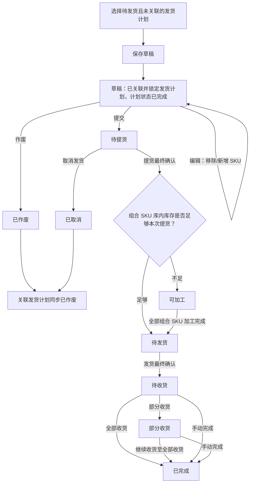
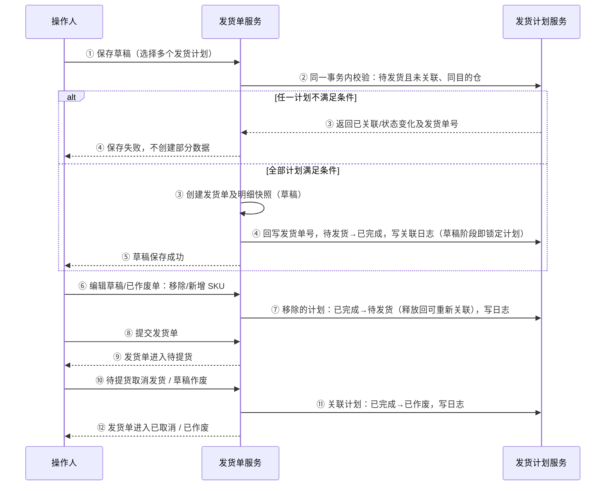

# 发货单全流程管理 PRD

## 一、评审会后改动清单（2026-08-12）

> 以下为 2026-08-12 上午 10:30 需求评审会结束后确认的改动，均已落地到对应章节；开发按下表定位章节查看口径。

| 序号 | 改动内容 | 对应章节 |
|---|---|---|
| 1 | 关联时点提前：草稿创建即关联锁定发货计划（计划→已完成）；草稿作废/待提货取消 → 关联计划同步已作废 | 5.1 主流程、5.2 计划联动、六、7.2（第8条）、7.8、十一、验收标准摘要 |
| 2 | 草稿/已作废可编辑（移除+新增 SKU，移除释放回待发货）；已取消不可编辑 | 六、7.2（第8条） |
| 3 | 物流费用、轨迹信息在草稿/已作废/已取消状态禁用编辑 | 7.9 详情 |
| 4 | 组合 SKU「组合」标签点击弹出子件明细浮窗（子件 SKU、组合数量） | 7.9 详情 |
| 5 | 发货计划页「生成发货单」弹窗复用新建发货单弹窗 | 二、补充说明（第2条） |
| 6 | 新增需求效益 | 三、3.5 |
| 7 | 术语统一：「异仓」→「易仓」 | 全文 |
| 8 | FBA/亚马逊限制：亚马逊发货单由领星生成不在此手动创建；FBA 专属仓、亚马逊平台/店铺选项置灰禁用；候选过滤亚马逊计划 | 7.2（第5条） |
| 9 | 新增 SKU 候选字段：FNSKU→易仓 SKU；申报量→发货量（仅列名，数据口径不变） | 7.2（第6、9条） |
| 10 | 提示文案：「同一发货单仅支持同一目的仓的货物合并发货」 | 7.2 |
| 11 | 组合加工改造：可加工判定（按 SKU+供应商 库内组合品库存≥提货量免加工）、物流加工→组合加工、供应商信息列、供应商多选查询、加工数量上限校验 | 5.1、5.5、六、7.3、7.4 |
| 12 | 收货改自动收货：同步易仓库存自动收货（前提开启库存同步）；手动收货入口隐藏（非删除）；按目的仓类型判定是否开放手动收货 | 7.6 |
| 13 | 手动完成库存扣减：未收部分对应在途库存清掉（目的仓在途、源头在途在发、未提待发释放） | 7.6（第7条） |
| 14 | 其他头程费用分摊弹窗改版：三段式（筛选→批次勾选→费用信息）、多维筛选、勾选即分摊 | 7.11 |

## 二、补充说明

1. 发货单提货成功后，必须触发现有供应商库存提货批次回写逻辑；团队库存及中台库存与易仓、领星等外部系统之间的交互，沿用现有库存流转规则和接口能力。开发时需复用现有逻辑，保证库存、提货批次、外部系统数据的一致性、幂等性和可追溯性。本次不重新定义库存流转规则。
2. 发货计划页面操作列的「生成发货单」入口，弹窗复用发货单页面的「新建发货单」弹窗，字段、校验与交互保持一致（同一套实现，避免两套弹窗不一致）。

## 三、背景、目标与范围

### 3.1 背景

发货计划用于确认单个 SKU 的发货安排；实际履约过程还需经历提货、组合 SKU 加工、发货和收货等动作。系统需要通过发货单承接该过程，并使业务能够查看实际数量、差异、批次、费用和操作历史。

### 3.2 目标

1. 仅允许可执行的发货计划创建发货单，并防止同一计划重复关联。
2. 支持一张发货单包含多个 SKU、不同 SKU 从不同提货仓提货，以及组合 SKU 与普通 SKU 混单履约。
3. 统一计划、申报、提货、发货、收货数量及差异口径。
4. 所有影响状态、数量、库存和计划的动作均可追溯。

### 3.3 本次范围

- 发货单列表、创建、编辑草稿、详情、提货、加工、发货、收货、数量调整、手动完成、草稿作废、取消发货。
- 发货计划与发货单的选择、锁定、回写、取消回写和日志。
- 组合 SKU 加工、子 SKU 库存总量校验及加工批次。
- 提货完成后，将发货单提货明细回写至供应商库存提货批次；具体字段和落库方式沿用现有库存逻辑。
- 易仓/海外仓收货数据的自动拉取与手动刷新；未接入易仓的第三方平台仓不承诺自动收货。
- 物流费用导入、轨迹导入沿用现有能力；其他头程费用分摊保留现有分摊规则与计算逻辑，本次仅升级弹窗交互（多维筛选 + 三段式布局，勾选即分摊），详见 7.11。

### 3.4 非本次范围

- 已提货后的「异常终止 / 撤销发运 / 结单」完整流程及第三方库存回滚；会议纪要提到该能力，但是否纳入 1.0、覆盖哪些状态尚待确认。
- 补提、补发流程；少提和少发均为最终结果。
- 对既有导入、费用分摊、轨迹管理规则的重构。

### 3.5 需求效益

1. **全流程线上化与可追溯**：将发货计划转化为可承接的提货、加工、发货、收货履约单据，全链路状态透明、动作留痕，减少线下沟通与责任扯皮，提升业务协同效率。
2. **差异与费用透明化**：四项差异与差异原因贯穿列表与详情，头程费用查询页支持按发货单、SKU、仓、渠道等维度检索分摊结果，库存与费用对账有据可查，支撑成本归因与复盘。
3. **提效降错**：自动收货、手动刷新、批量加工、手动完成等能力减少人工介入；操作按钮按单据状态收敛，降低误操作风险。
4. **突破单 SKU 限制，支持多 SKU 混单**：原发货单一张单仅支持一个 SKU，单据数量多、操作重复、业务效率低；本次改造后一张发货单可创建多个 SKU（含组合 SKU 加工与混单校验），并结合列表/详情的整体交互重构、页面视觉升级，以及会议新增的差异明细、易仓详情、箱信息、自动收货等能力，全面提升操作体验与业务承载能力。

## 四、核心定义与数据关系

### 4.1 核心对象

| 对象 | 定义与关系 |
|---|---|
| 发货计划 | 当前一个发货计划只对应一个 SKU；发货计划号为唯一业务关联标识。 |
| 发货单 | 一张发货单可包含多个 SKU，因此可关联多个发货计划。 |
| 发货单 SKU 明细 | 每行对应一个发货计划，保存该计划和商品信息的历史快照。 |
| 履约批次 | 每次提货、加工、发货、收货均生成批次与明细。 |
| 数量调整记录 | 仅修正累计数量，不改变既有履约批次。 |
| 操作日志 | 保存动作、前后状态、数量、原因、备注、操作人、时间及关联单号。 |
| 供应商库存提货批次 | 发货单提货完成后，由提货明细回写形成或更新的供应商库存提货批次；必须与发货单、SKU、提货数量和提货批次建立关联。 |
| FBA / 非 FBA 标识 | 用于混单校验、列表筛选和跨系统路由；具体判定字段待确认。 |
| 收货同步记录 | 记录自动拉取、手动刷新或人工收货的来源、时间、批次和同步结果。 |

### 4.2 发货单 SKU 明细快照

发货单创建时必须固化以下字段；后续发货计划或 SKU 主数据变更，不得改写历史单据。

| 字段 | 说明 |
|---|---|
| 发货计划号、发货计划 ID | 明细关联和并发锁定依据。 |
| SKU、产品信息、SKU 类型 | 包含是否为组合 SKU。 |
| 计划发货数量、申报数量 | 数量计算与差异展示依据。 |
| 平台、店铺、团队、目的仓 | 混单规则、查询和历史追溯依据。 |
| 发货计划备注、SKU 明细备注 | 默认带出计划备注；SKU 明细备注可编辑且独立保存。 |
| FBA / 非 FBA 标识、货件单号、Reference ID | 用于发货单类型识别、筛选及领星/易仓关联；来源和回写时点待确认。 |

## 五、业务流程

### 5.1 发货单主流程

### 5.2 发货计划与发货单联动

### 5.3 数量履约与差异口径

> **当前设计口径（待业务最终确认）**：提货数量以**计划发货数量**为绝对上限，申报数量与提货数量之间无量纲硬约束。即允许 `申报数量 < 提货数量 ≤ 计划发货数量` 的场景（如计划建了 300、申报填了 200、实际提了 250）。剩余可提 = 计划发货数量 − 累计提货数量。

### 5.4 1.0 双轨业务边界

| 场景 | 当前已知口径 | 本 PRD 处理方式 |
|---|---|---|
| 海外仓 / 第三方仓 | 发货计划在中台创建，发货单承接提货、加工、发货、收货链路，并按现有能力推送相关系统。 | 纳入本次主流程；推送接口字段和时点见待确认问题。 |
| Amazon FBA | 会议纪要描述为由领星拉取货件/发货单信息并关联中台计划，另有“可由中台生成发货单”的表述。 | 不在本版擅自确定是否需要手工新建发货单；创建入口、关联方式和领星回写时点待确认。 |
| 海外仓转运至 FBA | 当前无实际业务，且会议纪要明确暂不纳入 1.0。 | 不纳入本次范围。 |

### 5.5 履约确认原则

1. 提货、发货均按 SKU 一次性最终确认；每个 SKU 必须明确确认数量，未选择/未确认的 SKU 不允许整单提交。
2. 0 件或少量确认属于最终差异结果，不产生独立的「部分提货」或「部分发货」状态，也不自动进入补提、补发。
3. 提货完成后，只有所有 SKU 均完成最终确认，单据才进入「可加工」或「待发货」：对每个已提货的组合 SKU，按「SKU + 供应商」维度判断库内组合品库存是否 ≥ 提货数量——库存足够则免加工直接进入「待发货」；库存不足则进入「可加工」补足加工。

## 六、状态与可操作规则

| 发货单状态 | 状态含义 | 允许操作 | 不允许操作 |
|---|---|---|---|
| 草稿 | 已保存并关联发货计划，待执行 | 编辑（移除/新增 SKU）、提交、作废、查看日志 | 提货、加工、发货、收货 |
| 待提货 | 已关联计划，待实物提货 | 提货、取消发货、查看日志 | 作废、编辑草稿、发货、收货 |
| 可加工 | 含组合 SKU，且库内组合品库存不足、需要补足加工 | 组合加工、数量调整、查看日志 | 取消发货、直接收货 |
| 待发货 | 提货完成，且组合 SKU 已全部加工完成或无组合 SKU | 发货、数量调整、查看日志 | 取消发货、提货 |
| 待收货 | 已发货，尚未收货 | 收货、数量调整、手动完成、查看日志 | 取消发货、再次发货 |
| 部分收货 | 已收部分货物 | 收货、数量调整、手动完成、查看日志 | 取消发货、再次发货 |
| 已完成 | 收货完成或手动结束 | 查看详情、日志 | 编辑、调整、履约动作 |
| 已作废 | 草稿作废终态（可编辑复活） | 查看、编辑（保存草稿/重新提交）、日志 | 履约动作 |
| 已取消 | 待提货取消终态 | 查看详情、日志 | 编辑、重新提交、履约动作 |

补充规则：发货计划的「已完成」仅表示已成功交接并关联发货单，不代表货物已提货、已发货或已收货。

## 七、功能需求与页面交互

### 7.1 发货单列表

1. 支持按单号、SKU 及其相关编码、发货方式、发货仓、目的仓、物流渠道、运输方式、平台、店铺、团队、创建人、创建日期筛选；单号和编码支持多值输入。
2. 状态页签展示：全部、草稿、待提货、可加工、待发货、待收货、部分收货、已完成、已作废、已取消；支持通过平台/FBA 标识区分 FBA 与非 FBA 数据。
3. 列表展示单号、仓库与渠道、数量汇总、四项差异、发货时间、入库信息、创建与备注、头程费用及状态对应操作。
4. 一级列表的四项差异均可点击，打开按 SKU 展示的差异明细。
5. 展开行及详情页展示每个 SKU 的发货计划、数量、平台、店铺、团队和独立备注。
6. 列表默认按创建时间倒序排列（最新在最上面），分页大小沿用现有逻辑。
7. 列表支持导出为 Excel，详细设计见 7.10。
8. 一级列表「单号」列中，ERP 发货单的「易仓」标签可点击，点击后弹出小弹窗，展示该发货单关联的易仓详情：头程计划单号、订单号、下架单号、入库单号（数据通过接口拉取）。接口失败时保留中台单据可用，并提示“暂无法获取外部系统详情”。
9. 提供「刷新」操作：仅触发已接入收货/WMS链路的数据拉取，不改变人工录入数据；刷新结果需返回成功、无新数据或失败状态，并写入操作日志。

### 7.2 新建发货单与新增 SKU

1. 新建时必须填写发货仓、目的仓、发货方式、头程服务商、运输方式、物流渠道；其余地址、国家、物流单号、单据备注按现有页面填写。
2. 点击「新增 SKU」后，仅查询状态为「待发货」且未关联发货单的发货计划；候选行同时展示计划剩余数量。
3. 候选列表与查询字段使用「发货计划」名称，支持按发货计划号、SKU、平台、店铺、团队查询；平台和店铺下拉支持多选和模糊搜索。
4. 同一张发货单内所有计划必须属于同一目的仓；不满足时阻止选择。
5. 亚马逊相关发货单由领星系统抓取生成，不在中台手动创建：新建发货单弹窗目的仓下拉含置灰不可选的「FBA专属仓」选项并提示「亚马逊相关发货单由领星生成，不在中台手动创建」；新增 SKU 弹窗的平台、店铺下拉中亚马逊相关选项置灰不可选；候选列表过滤亚马逊平台/店铺的发货计划（不可被搜索出来）。
6. 每个候选 SKU 的发货量必填，且不得大于对应发货计划的剩余数量（弹窗展示为「发货量」，数据口径沿用申报数量，差异公式不变）。
7. 候选行备注默认带出发货计划备注，用户可编辑；确认选择后回填至外层 SKU 明细，并在草稿、提交、再次编辑和详情中保留。
8. 保存草稿时即在同一事务内校验并关联发货计划：计划回写发货单号、状态流转「已完成」（草稿阶段即锁定计划，不可被其他发货单再次关联）。草稿与已作废状态支持编辑（移除/新增 SKU），移除的 SKU 对应发货计划释放回「待发货」，可被其他发货单重新关联；编辑后保存草稿回到「草稿」、提交进入「待提货」；已取消为终态不可编辑。
9. 候选列表字段：去掉「FNSKU」，原位置展示「易仓 SKU」（中台已对 SKU 完成易仓映射，创建时自动带出）。

### 7.3 提货

1. 仅待提货状态可操作提货。
2. 顶部汇总展示：累计 SKU 数量、累计发货数量、累计申报数量、累计提货、剩余可提。
3. 明细展示 SKU、产品、发货计划、在库数量、计划发货数量、申报数量、累计提货、剩余可提、提货差异、本次提货数量、提货仓、服务商提货、提货备注、差异原因。
4. 提货数量上限和剩余可提均以计划发货数量计算：`剩余可提=计划发货数量−累计提货数量`。
5. 同一张发货单允许不同 SKU 分别选择不同提货仓；每个提货批次明细必须记录实际提货仓。提货一旦完成，提货仓不可修改。
6. 每个 SKU 的提货为一次性最终确认动作，必须逐行选择并确认；未选择的 SKU 阻止整单提交：
   - 可确认 0 件提货，输入控件允许录入 0；
   - 提货数量小于剩余可提时，必须填写差异原因；
   - 差异原因选择「其他」时，文字备注必填；
   - 少提或 0 件提货不进入补提流程。
7. 全部 SKU 均完成提货最终确认后：组合 SKU 库内库存（按 SKU+供应商 维度）足够本次提货时免加工直接进入待发货；库存不足时进入可加工补足加工；无组合 SKU 时直接进入待发货。

### 7.4 组合加工（原「物流加工」）

1. **可加工判定**：提货完成后，按「SKU + 供应商」维度判断库内组合品库存：组合品库存 ≥ 提货数量 → 免加工，直接进入待发货，不进可加工状态；组合品库存 < 提货数量 → 进入可加工状态补足加工。
2. 仅组合 SKU 出现在加工清单，普通 SKU 不参与加工状态判断。
3. 支持从单张发货单操作，也支持对可加工状态发货单批量操作；批量提交须按单据分别校验并保证单据级幂等。
4. 子 SKU 可用总量：`在库量 + 在库（待发）量 + 在途／在产量`。
5. **加工数量上限**：`min(提货数量−已加工数量，各子 SKU 可用总量÷对应 BOM 配比)`。即：即使子件库存可支撑更多加工数量，本次加工数量也不得超过该组合 SKU 的提货数量；提交时按此上限校验。
6. 加工清单中，组合 SKU 行与子件行均展示「供应商信息」列（供应商、供应商编码、供应商料号），组合 SKU 显示组合品供应商，子件行显示子件供应商。
7. 加工清单支持按「供应商」多选下拉查询（支持模糊搜索），与 SKU、发货单号筛选叠加。
8. 加工成功后扣减对应子 SKU 库存、生成加工批次及子件消耗明细。
9. 只要任一组合 SKU 满足 `已加工数量 < 提货数量`，整张单保持可加工；所有组合 SKU 达标后自动转待发货。

### 7.5 发货

1. 仅待发货状态可操作。
2. 每个 SKU 的发货数量不得超过 `提货数量−累计发货数量`。
3. 发货为一次性最终确认动作，必须逐行选择并确认；未选择的 SKU 阻止整单提交。允许确认 0 件；未发、少发或 0 件均必须填写少发原因，原因枚举为货物丢失、货物损坏、物流扣货、其他，选择「其他」时必须填写文字备注。
4. 发货弹窗实时展示 `申发差异=累计发货数量−申报数量`；该字段用于操作校验和发货批次明细，不替代列表四项差异。
5. 少发不进入补发流程。提交后生成发货批次，单据进入待收货。
6. 发货备注选填，最长 200 字。

### 7.6 收货与手动完成

1. **收货方式改为同步易仓库存自动收货**：系统定时拉取易仓收货/上架结果（前提：开启易仓库存同步），自动更新累计收货、剩余可收与收发差异，并生成收货批次与操作日志（来源=自动收货）；「刷新」按钮可手动触发拉取，拉取必须幂等，不得重复累计收货。
2. 收货后若所有 SKU 剩余可收为 0，单据进入已完成；否则进入部分收货并允许继续收货（部分收货同样由自动收货结果驱动）。
3. **手动收货入口隐藏（非删除）**：待收货、部分收货状态操作列的「收货」按钮（手动收货入口）**始终隐藏**。隐藏为入口隐藏而非功能删除——页面与后端能力完整保留，后续如需重新开放手动收货（如自动收货不可用、未接入自动收货的仓库、异常数据兜底等场景），恢复按钮即可，无需重建功能。
4. 隐藏期间，若库存同步关闭导致自动收货不可用，运营暂无法执行收货（业务方已知悉并接受此过渡期状态）；手动收货能力不进本期验收范围，但代码与接口保留。
5. 未接入易仓的速卖通仓、美客多仓等平台仓不承诺自动收货；后续是否对这类仓库开放手动收货，按发货单的**目的仓类型**判断：目的仓为平台仓（速卖通/美客多）的发货单可开放手动收货入口；目的仓为已接入自动收货的易仓/海外仓则不开放手动收货。具体仓库范围与判定规则待确认。
6. 少收原因沿用既有收货功能，不在本次新增设计范围内。
7. 待收货、部分收货支持手动完成：完结原因必填，枚举为货物丢失、货物损坏、业务取消、其他；备注选填，最长 300 字；未收数量保留为收发差异且不改记为已收数量。**手动完成后，未收部分对应的在途库存必须清掉**：未收数量 = 发货数量 − 累计收货数量；目的仓「在途」−未收数量（该部分货物不再入库）、源头「在途在发」−未收数量（货物终止流转，两端账务冲平）；若源头仍有本单未提的在库（待发）数量，一并扣减释放挂账；生成手动完结批次，记录未收数量、完结原因与备注，保证库存台账无残留挂账。
8. 手动完成只改变中台发货单状态为已完成，不自动把第三方系统单据标记为已完成；是否同步触发易仓/海外仓作废或结单接口，见 10.1 和待确认问题。

### 7.7 数量调整

1. 仅可加工、待发货、待收货、部分收货状态允许数量调整；已完成、已取消、已作废不允许调整。
2. 每次只能调整一种数量：提货数量、发货数量或收货数量。
   - 可加工、待发货：至少提供提货数量调整；是否同时开放下游数量调整，须以后端已有履约数据和状态校验为准。
   - 待收货、部分收货：按已有发货/收货数据提供发货数量或收货数量调整；未发生对应履约动作时不展示无效类型。
3. 调整列表字段：SKU、发货计划、计划发货数量、申报数量、提货数量、发货数量、收货数量、调整后当前类型数量。
4. 校验规则：

| 调整类型 | 调整后下限 | 调整后上限 |
|---|---:|---:|
| 提货数量 | 不低于 max(已加工数量, 已发货数量) | 不高于计划发货数量 |
| 发货数量 | 不低于已收货数量 | 不高于提货数量 |
| 收货数量 | 0 | 不高于发货数量 |

5. 调整原因必填；备注选填；原因选择「其他」时备注必填。
6. 调整只修正累计数量，不新增或修改历史提货、加工、发货、收货批次；必须新增数量调整记录和操作日志。
7. 提交后重算四项差异，并按照调整后的累计数量自动重算单据状态：
   - 提货为 0：待提货；
   - 有提货但发货为 0：组合 SKU 未加工完为可加工，否则待发货；
   - 有发货、收货为 0：待收货；
   - `0 < 收货 < 发货`：部分收货；
   - `收货 ≥ 发货`：已完成。
   - 状态重算不会自动解除发货单与发货计划的关联，也不会反向修改发货计划状态；如需逆向回写，必须另行确认流程和权限。

### 7.8 草稿作废与取消发货

1. 草稿仅允许作废；由于草稿创建时已关联并锁定发货计划，作废后全部关联发货计划同步流转「已作废」，发货计划与发货单两侧均写入日志。
2. 待提货仅允许取消发货；取消原因输入框为选填，最长 200 字。
3. 取消成功后：发货单转已取消；全部关联发货计划从已完成转已作废；发货计划和发货单均写入日志。
4. 当前基线仅允许待提货取消发货；可加工、待发货及其后续状态不展示普通「取消发货」入口，也不允许调用该接口。
5. 会议纪要另有“结单/异常撤单”描述，若要覆盖已提货或已发货状态，必须单独定义终止原因、货物去向、库存/费用回滚、第三方系统同步和发货计划后续状态，不能复用普通取消发货。

### 7.9 详情、批次与日志

详情页至少包含：发货单信息、SKU 明细、提货明细、加工明细、收货明细、物流费用、轨迹信息、箱信息。

- 提货明细展示提货差异：`计划发货数量−提货数量`，并展示差异原因、提货仓、服务商提货和备注。
- 发货明细须额外展示 `申发差异=累计发货数量−申报数量`；差异明细展示计划发货数量、申报数量、提货数量、发货数量、收货数量、待收货数量及列表四项差异。
- 批次须记录批次号、类型、时间、SKU 明细、数量、仓库、操作人、来源和状态；自动收货批次必须记录外部单号或接口批次号，人工刷新不得重复生成批次。
- 箱信息沿用现有箱规能力：系统按 SKU 箱规自动计算整箱数量；若允许手动调整，必须记录调整前后值、原因和操作日志。箱规来源、字段和接口待确认。
- 组合 SKU 在列表展开行、详情 SKU 明细、加工清单中均带「组合」标签；点击「组合」标签弹出子件明细浮窗，展示子件 SKU 与组合数量（配比），点击标签外区域关闭。
- 物流费用、轨迹信息在「草稿、已作废、已取消」状态下不允许编辑（详情页编辑按钮禁用），仅可查看；其余状态可编辑/导入。原因：上述 3 个状态不属于有效发货单，无需维护物流费用与轨迹信息。
- 日志须记录创建、提交、提货、加工、发货、收货、自动收货、手动刷新、手动完成、数量调整、作废、取消发货、导入/费用相关动作及外部接口同步结果。

### 7.10 导出

1. 列表顶部「导出」按钮改为**下拉按钮**，包含两个选项：
   - **发货单信息**：以单号为维度，每行一条发货单
   - **发货 SKU 明细**：以 SKU 为维度，每行一个 SKU（一张发货单含多个 SKU 时拆为多行）

2. 导出范围：受筛选条件和状态页签限制，导出当前列表中的**全部记录（不分页）**。

3. 文件名格式：`发货单信息_YYYYMMDD_HHmmss.xlsx` / `发货SKU明细_YYYYMMDD_HHmmss.xlsx`。

4. 导出操作记录到操作日志，类型为「导出」。

#### 导出 A：发货单信息

以发货单为维度，字段与一级列表一致：

| 序号 | 列名 | 说明 |
|---|---|---|
| 1 | 发货单号 | 中台发货单号 |
| 2 | ERP 发货单号 | 易仓单号或领星单号 |
| 3 | 关联货件单号 | |
| 4 | Reference ID | |
| 5 | 状态 | |
| 6 | 发货方式 | 仓库发货 / 工厂直发 / 供应商直发 |
| 7 | 发货仓 | |
| 8 | 收货仓 | |
| 9 | 头程服务商 | |
| 10 | 物流渠道 | |
| 11 | 运输方式 | |
| 12 | SKU 个数 | |
| 13 | 计划数量 | |
| 14 | 申报数量 | |
| 15 | 提货数量 | |
| 16 | 发货数量 | |
| 17 | 申提差异 | |
| 18 | 提发差异 | |
| 19 | 收发差异 | |
| 20 | 申收差异 | |
| 21 | 预计发货日期 | |
| 22 | 预计物流时长 | |
| 23 | 预计到港时间 | |
| 24 | 预计到货日期 | |
| 25 | 海外仓入库单号 | |
| 26 | 物流单号 | |
| 27 | 已收货数量 | |
| 28 | 待收货数量 | |
| 29 | 创建人 | |
| 30 | 创建时间 | |
| 31 | 备注 | |
| 32 | 头程物流费 | |
| 33 | 清关税费 | |
| 34 | 其他物流费 | |
| 35 | 总辅料成本 | |
| 36 | 头程费用合计 | |

#### 导出 B：发货 SKU 明细

以 SKU 为维度，每行对应一个发货单内的一个 SKU，同时带上发货单的关键上下文：

| 序号 | 列名 | 说明 |
|---|---|---|
| 1 | 发货单号 | 中台发货单号 |
| 2 | ERP 发货单号 | 易仓单号或领星单号 |
| 3 | 状态 | 发货单当前状态 |
| 4 | 发货仓 | |
| 5 | 目的仓 | |
| 6 | 头程服务商 | |
| 7 | 物流渠道 | |
| 8 | 运输方式 | |
| 9 | SKU | |
| 10 | 产品名称 | |
| 11 | SKU 类型 | 普通 / 组合 |
| 12 | 计划号 | |
| 13 | 海外仓 SKU | |
| 14 | FNSKU | |
| 15 | 计划发货量 | |
| 16 | 申报量 | |
| 17 | 提货量 | |
| 18 | 发货量 | |
| 19 | 收货量 | |
| 20 | 平台 | |
| 21 | 店铺 | |
| 22 | 团队 | |
| 23 | 备注 | SKU 明细备注 |

### 7.11 其他头程费用分摊弹窗（改版）

1. 弹窗采用**三段式布局**：分摊批次筛选 → 分摊批次列表（勾选） → 费用信息。
2. **分摊批次筛选**：支持按发货单号（中台 / ERP）、团队（多选）、提货批次号、费用周期（日期范围）精细筛选；**费用周期属于分摊批次信息**，作为筛选条件与批次列表列展示。
3. **分摊批次列表**：筛选结果直接展示（批次号、费用周期、发货单号、计划号、SKU、品名、团队、提货数量、费用信息），**勾选即加入分摊**，取消勾选即移除；已选批次按费用类型、费用金额、分摊规则实时重算每批分摊金额；底部汇总已选批次数 / SKU 数 / 件数 / 分摊合计。
4. **费用信息**：费用类型、费用金额、分摊规则（按数量 / 按金额）、负责人、上传附件（非必填）、备注；费用周期不再在费用信息区录入（归批次维度）。
5. 原「按费用周期添加未分摊提货批次」二级弹窗**合并进主弹窗**，由筛选 + 勾选替代，减少弹窗层级。
6. 分摊规则与计算逻辑沿用现有能力，本 PRD 不重构分摊算法。

## 八、数量与差异规则

| 字段 | 计算公式 | 含义 |
|---|---|---|
| 提货差异 | `计划发货数量−提货数量` | 提货环节相对计划的差异。 |
| 申提差异 | `申报数量−提货数量` | 正数为少提；当计划量大于申报量且提货超过申报量时允许为负数。 |
| 申发差异 | `发货数量−申报数量` | 发货操作过程展示实际发货相对申报的差异；不纳入列表四项差异。 |
| 提发差异 | `发货数量−提货数量` | 0 为一致，负数为少发；正数不允许。 |
| 收发差异 | `收货数量−发货数量` | 0 为一致，负数为少收；正数不允许。 |
| 申收差异 | `收货数量−申报数量` | 反映最终收货相对申报的差异。 |

提货差异和列表四项差异在一级列表展示为可点击值，问号提示只展示计算公式；申发差异仅在发货弹窗及发货批次明细展示。差异明细按 SKU 展示完整计算过程，不对差异取绝对值。

## 九、异常与边界处理

| 场景 | 系统处理 |
|---|---|
| 发货计划非待发货或已有关联发货单 | 不在候选列表展示；提交时再次校验并阻止整单提交。 |
| 两人同时提交同一发货计划 | 以后端事务和唯一关联约束为准；后提交者提示计划已关联的发货单号。 |
| 同单目的仓不同 | 阻止确认选择，并提示必须同一目的仓。 |
| 亚马逊与非亚马逊平台 SKU 混选 | 阻止确认选择，并提示 FBA 与非 FBA 货物不可混装。 |
| 0 件提货/发货、未提/未发、少提/少发 | 必须填写差异原因；原因为其他时备注必填；确认后不可补提或补发。 |
| 提货、发货、收货、调整超过上限 | 阻止提交并展示该 SKU 的上限和错误原因。 |
| 调整低于下游已使用数量 | 阻止提交，防止加工大于提货、收货大于发货等数量倒挂。 |
| 自动收货接口超时、失败或返回重复数据 | 不改变当前累计收货；提示同步结果；允许用户稍后刷新；按外部单号/批次号幂等。 |
| 目的仓未接入自动收货 | 不显示自动收货成功状态；是否允许人工收货按仓库配置和现有能力处理。 |
| 箱规缺失或整箱计算结果异常 | 阻止自动确认并提示补充箱规；若业务允许手动调整，必须记录调整原因。 |
| 外部系统详情或同步接口失败 | 中台主流程不回滚已成功落库的数据；提示外部同步失败并记录重试/人工处理状态。 |
| 终态单据操作 | 已完成、已取消、已作废均只读；禁止编辑、重新提交、调整和履约操作。 |
| 提交或跨单据回写失败 | 整体回滚；保留用户填写内容并提示失败原因，不产生部分数据。 |

## 十、系统影响、数据一致性、权限与审计

### 10.1 系统边界与影响

| 系统 / 模块 | 影响内容 | 本次处理 | 待确认点 |
|---|---|---|---|
| 发货计划 | 候选计划查询、提交锁定、发货单号回写、取消回写、关联日志 | 处理主流程 | FBA 计划是否走同一关联链路；取消/结单后的计划状态 |
| 库存 / 供应商库存 | 提货扣减、组合品子 SKU 消耗、收货/调整数量及库存台账一致性 | 依赖既有库存能力并补充事务、幂等约束 | 提货、加工、手动完成、异常结单的库存回滚口径 |
| 易仓 / 海外仓 WMS | 发货推送、收货回传、手动刷新、自动收货批次 | 依赖接口；本 PRD 定义中台侧处理 | 接口字段、回传时点、失败重试和结单接口/RPA |
| 领星 | FBA 货件/发货单数据拉取、计划关联或回写 | 当前只保留字段和边界，不写死流程 | 是否允许中台新建 FBA 发货单、拉取/推送时点、去重键 |
| 易仓 / ERP | ERP 单号展示、详情查询、可能的发货/结单同步 | 保留现有详情查询能力 | 发货单推送时机、接口失败后的补偿机制 |
| 费用与成本 | 物流费、清关税费、其他头程费、加工/服务费关联发货单或提货批次 | 沿用现有导入和分摊能力，不重构规则 | 箱规/批次变化是否影响费用分摊 |
| 权限与操作日志 | 页面、按钮、数据范围、外部同步和导出的权限与留痕 | 本 PRD 补充控制点和日志字段 | 角色—操作矩阵、团队/仓库数据范围 |

### 10.2 数据一致性要求

1. 发货单提交、发货计划状态更新、发货单号回写、关联日志写入必须在同一事务中完成。
2. 待提货取消、发货单状态更新、发货计划作废、取消日志写入必须在同一事务中完成。
3. 提货、加工、发货、收货、数量调整提交时均以后端最新状态和最新累计数量校验，不信任前端缓存。
4. 所有数量变更动作需具备幂等控制，重复点击或网络重试不得重复扣减库存、重复新增批次或重复回写计划。

### 10.3 审计要求

- 关键日志字段：业务单号、关联发货计划号、操作类型、前后状态、SKU、前后数量、差异原因、备注、操作人、操作时间、来源批次。
- 数量调整记录与履约批次分开存储；详情中需同时可追溯。
- 发货单 SKU 明细、批次明细和日志均保留历史快照。
- 自动收货、手动刷新、外部接口失败/重试和人工补偿均需留痕，不能只记录最终状态。

### 10.4 权限与数据范围（待确认）

系统需基于既有权限体系控制列表查看、新建/编辑草稿、提交、提货、加工、发货、收货、数量调整、手动完成、取消、作废、刷新、导入、费用分摊与导出操作，并按团队、仓库或组织限定数据范围。

| 权限控制点 | 需要明确的内容 | 当前状态 |
|---|---|---|
| 查看与导出 | 是否按团队、仓库、组织、平台或目的仓过滤；导出是否与列表权限一致 | 待确认 |
| 单据创建与草稿 | 谁可新建、编辑、提交、作废；是否允许跨团队混单 | 待确认 |
| 履约操作 | 谁可提货、加工、发货、收货、数量调整、手动完成 | 待确认 |
| 取消与异常结单 | 谁可取消；已提货后的结单是否需要更高权限或审批 | 待确认 |
| 外部同步与刷新 | 谁可手动刷新、重试接口或执行人工补偿 | 待确认 |

## 十一、验收标准摘要

- [ ] 新增 SKU 仅能查询和选择待发货、未关联发货单的发货计划。
- [ ] 草稿保存（创建）即回写发货单号并锁定计划，关联计划流转已完成；任一回写失败则整单无数据落库。
- [ ] 草稿/已作废支持编辑（移除/新增 SKU），移除的 SKU 对应计划释放回待发货；已取消不可编辑。
- [ ] 草稿作废、待提货取消后，关联发货计划均同步流转已作废，两侧写入日志。
- [ ] 草稿/已作废/已取消状态，详情页「物流费用」「轨迹信息」编辑按钮禁用，其余状态可编辑。
- [ ] 待提货取消发货后，发货单为已取消，关联计划均为已作废，双方均可查看取消日志与选填原因。
- [ ] 不同目的仓、亚马逊与非亚马逊平台 SKU 混选均无法创建同一发货单。
- [ ] 提货以计划发货数量为上限，支持不同 SKU 选择不同提货仓，支持 0 件和少提最终确认并校验原因/其他备注。
- [ ] 混单中任一组合 SKU 未加工完成时，发货单保持可加工；普通 SKU 不影响该判断。
- [ ] 提货后按 SKU+供应商 判断组合品库内库存：≥ 提货数量直接进入待发货（免加工），不足进入可加工。
- [ ] 组合加工清单展示「供应商信息」列（供应商/供应商编码/供应商料号），支持按供应商多选筛选（模糊搜索）。
- [ ] 加工数量上限 = min(提货数量−已加工数量，子件可用总量÷BOM 配比)，超过提货数量的输入被阻止。
- [ ] 加工可用量按子 SKU 总量和 BOM 配比校验，成功后生成加工批次和子件消耗记录。
- [ ] 组合 SKU 带「组合」标签，点击弹出子件明细浮窗（子件 SKU、组合数量），点击外部关闭。
- [ ] 发货支持 0 件/少发最终确认并校验原因；少发后不可补发。
- [ ] 发货弹窗中的申发差异按 `累计发货数量−申报数量` 实时计算，并与发货批次明细一致。
- [ ] 收货、部分收货、自动收货、手动刷新和手动完成的状态及未收差异计算正确；重复刷新不重复累计收货。
- [ ] 数量调整满足上下游约束、保留批次、生成调整记录，并自动重算差异和状态。
- [ ] 已完成、已取消、已作废单据均不可编辑、重新提交、调整或履约。
- [ ] 四项差异及提货差异的计算公式、问号提示、列表与详情展示一致。
- [ ] 导出仅包含筛选条件下的全部记录、不受分页影响，字段与导出定义一致，且导出动作写入日志并受数据权限控制。
- [ ] 外部系统接口失败时不会产生部分成功的中台数据；失败、重试和人工补偿均可在日志中追溯。
- [ ] 箱规自动计算、手动调整（如业务确认允许）及箱信息展示口径一致。

## 十二、待确认问题

| 问题 | 影响范围 | 建议确认对象 |
|---|---|---|
| P0：FBA 发货单是由中台新建，还是由领星拉取后关联中台计划；领星与中台的拉取/推送时点、去重键和失败补偿是什么？ | 5.4、7.2、10.1；影响创建入口、接口、状态和验收 | 业务负责人、领星/研发负责人 |
| P0：已提货或已发货后的“结单/异常撤单”是否纳入 1.0；允许哪些状态；是否需要同步易仓/海外仓作废和库存释放？ | 3.4、7.8、10.1；影响状态机、库存、费用、接口、权限和审计 | 业务负责人、库存/仓储负责人、研发负责人 |
| P0：各动作对应的具体角色、审批关系和团队/仓库数据范围是什么？ | 10.4；影响页面权限、接口鉴权、导出和验收 | 业务负责人、权限平台主管 |
| P0：提货数量在「申报 < 计划」场景下是否可以超过申报数量，仍以计划数量为上限？ | 5.3、7.3、八；影响数量校验、差异口径和测试 | 业务负责人 |
| P1：FBA 的判定字段是什么；是否允许同一平台下按仓库/团队再细分 FBA 与非 FBA？ | 4.1、7.1、7.2；影响混单校验和筛选 | 业务负责人、数据负责人 |
| P1：自动收货覆盖哪些仓库；WMS 回传字段、回传时点、外部单号/批次号和失败重试规则是什么？未接入平台仓是否允许人工收货？ | 7.6、九、10.1；影响接口、状态和验收 | 仓储/研发负责人 |
| P1：箱规字段从哪里取；整箱数量是否允许手动调整；手动调整是否需要审批？ | 7.9、九、十一；影响页面字段、接口、箱信息和审计 | 物流团队、业务负责人 |
| P1：少提、少发、少收以及“其他”原因的最终枚举值和备注长度是否统一？ | 7.3、7.5、7.6、验收 | 业务负责人、测试负责人 |
| P1：数量调整后是否允许状态回退到待提货；若允许，发货计划关联关系是否保持不变？ | 7.7、计划联动、状态验收 | 业务负责人、研发负责人 |
| P1：已按评审确认「编辑移除释放回待发货、取消/作废计划同步作废」；后续结单/异常撤单场景下的计划逆向状态是否沿用同规则？ | 7.8、10.1；影响计划数据和逆向流程 | 业务负责人、计划负责人 |
| P2：导出是否需要按团队、仓库、组织等维度控制数据范围；导出是否采用同步下载还是异步任务？ | 7.10、10.4；影响权限、性能和验收 | 权限平台主管、研发负责人 |
| P2：发货单是否需要审核/手动推单；若需要，审核节点及推单失败后的状态是什么？ | 状态机、权限、系统对接和验收 | 业务负责人、研发负责人 |
