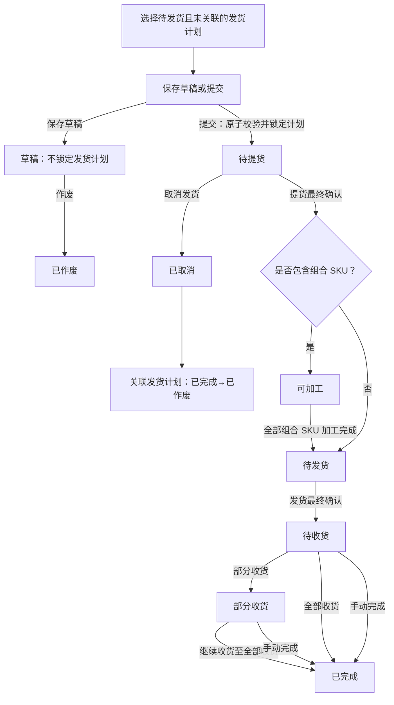
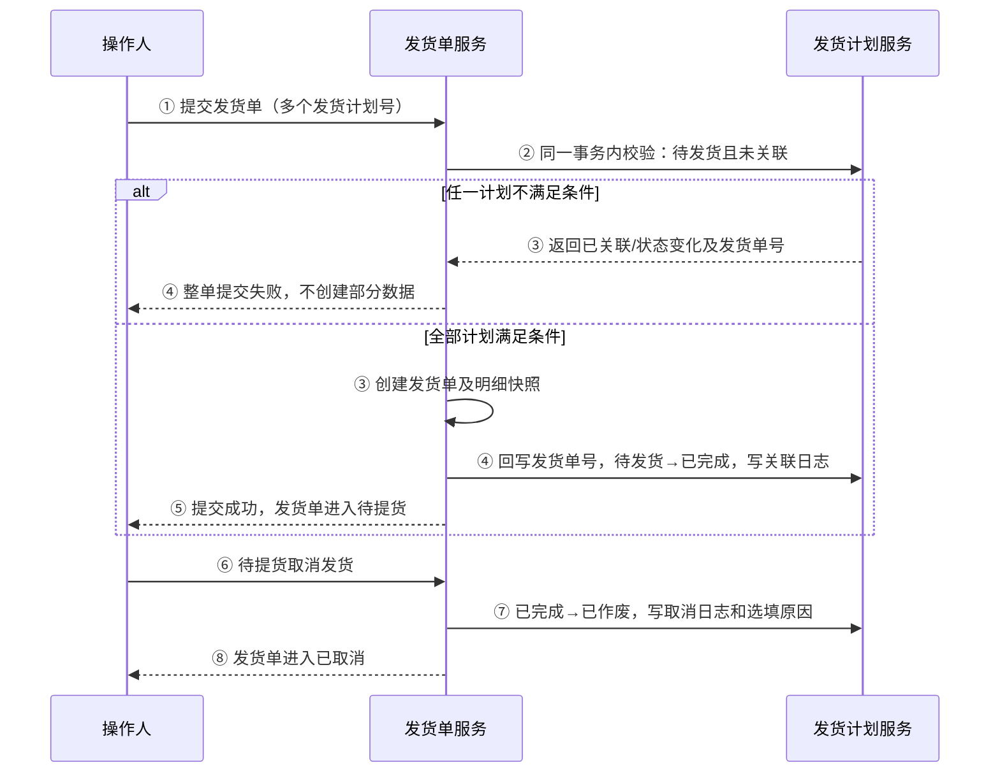

# 发货单全流程管理 PRD

## 一、文档信息

| 项目 | 内容 |
|---|---|
| 需求名称 | 发货单全流程管理 |
| 需求模式 | 复杂 |
| PRD 版本 | v0.1（评审草案） |
| 适用模块 | 发货单、发货计划、组合 SKU 加工、库存、物流履约、操作日志 |
| 需求目标 | 将发货计划转化为可追溯的提货、加工、发货、收货履约单据，并保证跨单据状态、数量与日志一致。 |

## 二、背景、目标与范围

### 2.1 背景

发货计划用于确认单个 SKU 的发货安排；实际履约过程还需经历提货、组合 SKU 加工、发货和收货等动作。系统需要通过发货单承接该过程，并使业务能够查看实际数量、差异、批次、费用和操作历史。

### 2.2 目标

1. 仅允许可执行的发货计划创建发货单，并防止同一计划重复关联。
2. 支持一张发货单包含多个 SKU、不同 SKU 从不同提货仓提货，以及组合 SKU 与普通 SKU 混单履约。
3. 统一计划、申报、提货、发货、收货数量及差异口径。
4. 所有影响状态、数量、库存和计划的动作均可追溯。

### 2.3 本次范围

- 发货单列表、创建、编辑草稿、详情、提货、加工、发货、收货、数量调整、手动完成、草稿作废、取消发货。
- 发货计划与发货单的选择、锁定、回写、取消回写和日志。
- 组合 SKU 加工、子 SKU 库存总量校验及加工批次。
- 物流费用导入、轨迹导入、其他头程费用分摊保留现有能力，本 PRD 不重新设计其页面与规则。

### 2.4 非本次范围

- 已提货后的「异常终止 / 撤销发运」流程。
- 补提、补发流程；少提和少发均为最终结果。
- 对既有导入、费用分摊、轨迹管理规则的重构。

## 三、核心定义与数据关系

### 3.1 核心对象

| 对象 | 定义与关系 |
|---|---|
| 发货计划 | 当前一个发货计划只对应一个 SKU；发货计划号为唯一业务关联标识。 |
| 发货单 | 一张发货单可包含多个 SKU，因此可关联多个发货计划。 |
| 发货单 SKU 明细 | 每行对应一个发货计划，保存该计划和商品信息的历史快照。 |
| 履约批次 | 每次提货、加工、发货、收货均生成批次与明细。 |
| 数量调整记录 | 仅修正累计数量，不改变既有履约批次。 |
| 操作日志 | 保存动作、前后状态、数量、原因、备注、操作人、时间及关联单号。 |

### 3.2 发货单 SKU 明细快照

发货单创建时必须固化以下字段；后续发货计划或 SKU 主数据变更，不得改写历史单据。

| 字段 | 说明 |
|---|---|
| 发货计划号、发货计划 ID | 明细关联和并发锁定依据。 |
| SKU、产品信息、SKU 类型 | 包含是否为组合 SKU。 |
| 计划发货数量、申报数量 | 数量计算与差异展示依据。 |
| 平台、店铺、团队、目的仓 | 混单规则、查询和历史追溯依据。 |
| 发货计划备注、SKU 明细备注 | 默认带出计划备注；SKU 明细备注可编辑且独立保存。 |

## 四、业务流程

### 4.1 发货单主流程



### 4.2 发货计划与发货单联动



### 4.3 数量履约与差异口径


> **提货数量约束**：提货数量以**计划发货数量**为绝对上限，申报数量与提货数量之间无量纲硬约束。即允许 `申报数量 < 提货数量 ≤ 计划发货数量` 的场景（如计划建了 300、申报填了 200、实际提了 250）。剩余可提 = 计划发货数量 − 累计提货数量。```


## 五、状态与可操作规则

| 发货单状态 | 状态含义 | 允许操作 | 不允许操作 |
|---|---|---|---|
| 草稿 | 已保存但未执行 | 编辑、提交、作废、查看日志 | 锁定计划、提货、加工、发货、收货 |
| 待提货 | 已关联计划，待实物提货 | 提货、取消发货、查看日志 | 作废、编辑草稿、发货、收货 |
| 可加工 | 含组合 SKU，且至少一个组合 SKU 未完成加工 | 加工、数量调整、查看日志 | 取消发货、直接收货 |
| 待发货 | 提货完成，且组合 SKU 已全部加工完成或无组合 SKU | 发货、数量调整、查看日志 | 取消发货、提货 |
| 待收货 | 已发货，尚未收货 | 收货、数量调整、手动完成、查看日志 | 取消发货、再次发货 |
| 部分收货 | 已收部分货物 | 收货、数量调整、手动完成、查看日志 | 取消发货、再次发货 |
| 已完成 | 收货完成或手动结束 | 查看详情、日志 | 编辑、调整、履约动作 |
| 已作废 | 草稿作废终态 | 查看详情、日志 | 编辑、重新提交、履约动作 |
| 已取消 | 待提货取消终态 | 查看详情、日志 | 编辑、重新提交、履约动作 |

补充规则：发货计划的「已完成」仅表示已成功交接并关联发货单，不代表货物已提货、已发货或已收货。

## 六、功能需求与页面交互

### 6.1 发货单列表

1. 支持按单号、SKU 及其相关编码、发货方式、发货仓、目的仓、物流渠道、运输方式、平台、店铺、团队、创建人、创建日期筛选；单号和编码支持多值输入。
2. 状态页签展示：全部、草稿、待提货、可加工、待发货、待收货、部分收货、已完成、已作废、已取消。
3. 列表展示单号、仓库与渠道、数量汇总、四项差异、发货时间、入库信息、创建与备注、头程费用及状态对应操作。
4. 一级列表的四项差异均可点击，打开按 SKU 展示的差异明细。
5. 展开行及详情页展示每个 SKU 的发货计划、数量、平台、店铺、团队和独立备注。
6. 列表默认按创建时间倒序排列（最新在最上面），分页大小沿用现有逻辑。
7. 列表支持导出为 Excel，详细设计见 6.10。
8. 一级列表「单号」列中，ERP 发货单的「易仓」标签可点击，点击后弹出小弹窗，展示该发货单关联的易仓详情：头程计划单号、订单号、下架单号、入库单号（数据通过接口拉取）。

### 6.2 新建发货单与新增 SKU

1. 新建时必须填写发货仓、目的仓、发货方式、头程服务商、运输方式、物流渠道；其余地址、国家、物流单号、单据备注按现有页面填写。
2. 点击「新增 SKU」后，仅查询状态为「待发货」且未关联发货单的发货计划。
3. 候选列表与查询字段使用「发货计划」名称，支持按发货计划号、SKU、平台、店铺、团队查询；平台和店铺下拉支持多选和模糊搜索。
4. 同一张发货单内所有计划必须属于同一目的仓；不满足时阻止选择。
5. 平台为亚马逊的货物视为 FBA；亚马逊平台货物不可与非亚马逊平台货物合并至同一张发货单。
6. 每个候选 SKU 的申报数量必填，且不得大于对应发货计划的剩余数量。
7. 候选行备注默认带出发货计划备注，用户可编辑；确认选择后回填至外层 SKU 明细，并在草稿、提交、再次编辑和详情中保留。
8. 草稿保存时不锁定、不回写发货计划。提交时执行 4.2 的原子关联流程。

### 6.3 提货

1. 仅待提货状态可操作提货。
2. 顶部汇总展示：累计 SKU 数量、累计发货数量、累计申报数量、累计提货、剩余可提。
3. 明细展示 SKU、产品、发货计划、在库数量、计划发货数量、申报数量、累计提货、剩余可提、提货差异、本次提货数量、提货仓、服务商提货、提货备注、差异原因。
4. 提货数量上限和剩余可提均以计划发货数量计算：`剩余可提=计划发货数量−累计提货数量`。
5. 同一张发货单允许不同 SKU 分别选择不同提货仓；每个提货批次明细必须记录实际提货仓。提货一旦完成，提货仓不可修改。
6. 每个 SKU 的提货为一次性最终确认动作：
   - 可确认 0 件提货；
   - 提货数量小于剩余可提时，必须填写差异原因；
   - 差异原因选择「其他」时，文字备注必填；
   - 少提或 0 件提货不进入补提流程。
7. 全部 SKU 均完成提货最终确认后：存在组合 SKU 时进入可加工；无组合 SKU 时进入待发货。

### 6.4 物流加工

1. 仅组合 SKU 出现在加工清单，普通 SKU 不参与加工状态判断。
2. 支持从单张发货单操作，也支持对可加工状态发货单批量操作。
3. 子 SKU 可用总量：`在库量 + 在库（待发）量 + 在途／在产量`。
4. 组合 SKU 可加工数量：

   `min(提货数量−已加工数量，各子 SKU 可用总量÷对应 BOM 配比)`

5. 加工成功后扣减对应子 SKU 库存、生成加工批次及子件消耗明细。
6. 只要任一组合 SKU 满足 `已加工数量 < 提货数量`，整张单保持可加工；所有组合 SKU 达标后自动转待发货。

### 6.5 发货

1. 仅待发货状态可操作。
2. 每个 SKU 的发货数量不得超过 `提货数量−累计发货数量`。
3. 发货为一次性最终确认动作。允许确认 0 件；未发、少发或 0 件均必须填写少发原因，选择「其他」时必须填写文字备注。
4. 少发不进入补发流程。提交后生成发货批次，单据进入待收货。
5. 发货备注选填，最长 200 字。

### 6.6 收货与手动完成

1. 待收货、部分收货状态可进行收货；本次收货数量不得超过 `发货数量−累计收货数量`。
2. 收货后若所有 SKU 剩余可收为 0，单据进入已完成；否则进入部分收货并允许继续收货。
3. 少收原因沿用既有收货功能，不在本次新增设计范围内。
4. 待收货、部分收货支持手动完成：完结原因必填，备注选填，未收数量保留为收发差异且不改记为已收数量。

### 6.7 数量调整

1. 仅可加工、待发货、待收货、部分收货状态允许数量调整；已完成、已取消、已作废不允许调整。
2. 每次只能调整一种数量：提货数量、发货数量或收货数量。
3. 调整列表字段：SKU、发货计划、计划发货数量、申报数量、提货数量、发货数量、收货数量、调整后当前类型数量。
4. 校验规则：

| 调整类型 | 调整后下限 | 调整后上限 |
|---|---:|---:|
| 提货数量 | 不低于 max(已加工数量, 已发货数量) | 不高于计划发货数量 |
| 发货数量 | 不低于已收货数量 | 不高于提货数量 |
| 收货数量 | 0 | 不高于发货数量 |

5. 调整原因必填；备注选填；原因选择「其他」时备注必填。
6. 调整只修正累计数量，不新增或修改历史提货、加工、发货、收货批次；必须新增数量调整记录和操作日志。
7. 提交后重算四项差异，并按照调整后的累计数量自动重算单据状态：
   - 提货为 0：待提货；
   - 有提货但发货为 0：组合 SKU 未加工完为可加工，否则待发货；
   - 有发货、收货为 0：待收货；
   - `0 < 收货 < 发货`：部分收货；
   - `收货 ≥ 发货`：已完成。

### 6.8 草稿作废与取消发货

1. 草稿仅允许作废；作废不影响发货计划，因为草稿未锁定计划。
2. 待提货仅允许取消发货；取消原因输入框为选填，最长 200 字。
3. 取消成功后：发货单转已取消；全部关联发货计划从已完成转已作废；发货计划和发货单均写入日志。
4. 可加工、待发货及其后续状态均不展示、也不允许调用取消发货。

### 6.9 详情、批次与日志

详情页至少包含：发货单信息、SKU 明细、提货明细、加工明细、收货明细、物流费用、轨迹信息、箱信息。

- 提货明细展示提货差异：`计划发货数量−提货数量`，并展示差异原因、提货仓、服务商提货和备注。
- 差异明细展示计划发货数量、申报数量、提货数量、发货数量、收货数量、待收货数量及四项差异。
- 批次须记录批次号、类型、时间、SKU 明细、数量、仓库、操作人、来源和状态。
- 日志须记录创建、提交、提货、加工、发货、收货、手动完成、数量调整、作废、取消发货、导入/费用相关动作。

### 6.10 导出

1. 列表顶部「导出」按钮改为**下拉按钮**，包含两个选项：
   - **发货单信息**：以单号为维度，每行一条发货单
   - **发货 SKU 明细**：以 SKU 为维度，每行一个 SKU（一张发货单含多个 SKU 时拆为多行）

2. 导出范围：受筛选条件和状态页签限制，导出当前列表中的**全部记录（不分页）**。

3. 文件名格式：`发货单信息_YYYYMMDD_HHmmss.xlsx` / `发货SKU明细_YYYYMMDD_HHmmss.xlsx`。

4. 导出操作记录到操作日志，类型为「导出」。

#### 导出 A：发货单信息

以发货单为维度，字段与一级列表一致：

| 序号 | 列名 | 说明 |
|---|---|---|
| 1 | 发货单号 | 中台发货单号 |
| 2 | ERP 发货单号 | 易仓单号或领星单号 |
| 3 | 关联货件单号 | |
| 4 | Reference ID | |
| 5 | 状态 | |
| 6 | 发货方式 | 仓库发货 / 工厂直发 / 供应商直发 |
| 7 | 发货仓 | |
| 8 | 收货仓 | |
| 9 | 头程服务商 | |
| 10 | 物流渠道 | |
| 11 | 运输方式 | |
| 12 | SKU 个数 | |
| 13 | 计划数量 | |
| 14 | 申报数量 | |
| 15 | 提货数量 | |
| 16 | 发货数量 | |
| 17 | 申提差异 | |
| 18 | 提发差异 | |
| 19 | 收发差异 | |
| 20 | 申收差异 | |
| 21 | 预计发货日期 | |
| 22 | 预计物流时长 | |
| 23 | 预计到港时间 | |
| 24 | 预计到货日期 | |
| 25 | 海外仓入库单号 | |
| 26 | 物流单号 | |
| 27 | 已收货数量 | |
| 28 | 待收货数量 | |
| 29 | 创建人 | |
| 30 | 创建时间 | |
| 31 | 备注 | |
| 32 | 头程物流费 | |
| 33 | 清关税费 | |
| 34 | 其他物流费 | |
| 35 | 总辅料成本 | |
| 36 | 头程费用合计 | |

#### 导出 B：发货 SKU 明细

以 SKU 为维度，每行对应一个发货单内的一个 SKU，同时带上发货单的关键上下文：

| 序号 | 列名 | 说明 |
|---|---|---|
| 1 | 发货单号 | 中台发货单号 |
| 2 | ERP 发货单号 | 易仓单号或领星单号 |
| 3 | 状态 | 发货单当前状态 |
| 4 | 发货仓 | |
| 5 | 目的仓 | |
| 6 | 头程服务商 | |
| 7 | 物流渠道 | |
| 8 | 运输方式 | |
| 9 | SKU | |
| 10 | 产品名称 | |
| 11 | SKU 类型 | 普通 / 组合 |
| 12 | 计划号 | |
| 13 | 海外仓 SKU | |
| 14 | FNSKU | |
| 15 | 计划发货量 | |
| 16 | 申报量 | |
| 17 | 提货量 | |
| 18 | 发货量 | |
| 19 | 收货量 | |
| 20 | 平台 | |
| 21 | 店铺 | |
| 22 | 团队 | |
| 23 | 备注 | SKU 明细备注 |

## 七、数量与差异规则

| 字段 | 计算公式 | 含义 |
|---|---|---|
| 提货差异 | `计划发货数量−提货数量` | 提货环节相对计划的差异。 |
| 申提差异 | `申报数量−提货数量` | 正数为少提；当计划量大于申报量且提货超过申报量时允许为负数。 |
| 提发差异 | `发货数量−提货数量` | 0 为一致，负数为少发；正数不允许。 |
| 收发差异 | `收货数量−发货数量` | 0 为一致，负数为少收；正数不允许。 |
| 申收差异 | `收货数量−申报数量` | 反映最终收货相对申报的差异。 |

差异在一级列表展示为可点击值，问号提示只展示计算公式；差异明细按 SKU 展示完整计算过程，不对差异取绝对值。

## 八、异常与边界处理

| 场景 | 系统处理 |
|---|---|
| 发货计划非待发货或已有关联发货单 | 不在候选列表展示；提交时再次校验并阻止整单提交。 |
| 两人同时提交同一发货计划 | 以后端事务和唯一关联约束为准；后提交者提示计划已关联的发货单号。 |
| 同单目的仓不同 | 阻止确认选择，并提示必须同一目的仓。 |
| 亚马逊与非亚马逊平台 SKU 混选 | 阻止确认选择，并提示 FBA 与非 FBA 货物不可混装。 |
| 0 件提货/发货、未提/未发、少提/少发 | 必须填写差异原因；原因为其他时备注必填；确认后不可补提或补发。 |
| 提货、发货、收货、调整超过上限 | 阻止提交并展示该 SKU 的上限和错误原因。 |
| 调整低于下游已使用数量 | 阻止提交，防止加工大于提货、收货大于发货等数量倒挂。 |
| 终态单据操作 | 已完成、已取消、已作废均只读；禁止编辑、重新提交、调整和履约操作。 |
| 提交或跨单据回写失败 | 整体回滚；保留用户填写内容并提示失败原因，不产生部分数据。 |

## 九、数据一致性、权限与审计

### 9.1 一致性要求

1. 发货单提交、发货计划状态更新、发货单号回写、关联日志写入必须在同一事务中完成。
2. 待提货取消、发货单状态更新、发货计划作废、取消日志写入必须在同一事务中完成。
3. 提货、加工、发货、收货、数量调整提交时均以后端最新状态和最新累计数量校验，不信任前端缓存。
4. 所有数量变更动作需具备幂等控制，重复点击或网络重试不得重复扣减库存、重复新增批次或重复回写计划。

### 9.2 审计要求

- 关键日志字段：业务单号、关联发货计划号、操作类型、前后状态、SKU、前后数量、差异原因、备注、操作人、操作时间、来源批次。
- 数量调整记录与履约批次分开存储；详情中需同时可追溯。
- 发货单 SKU 明细、批次明细和日志均保留历史快照。

### 9.3 权限与数据范围（待确认）

系统需基于既有权限体系控制列表查看、新建/编辑草稿、提货、加工、发货、收货、数量调整、手动完成、取消、作废、导入、费用分摊与导出操作，并按团队、仓库或组织限定数据范围。具体角色—操作矩阵待业务确认后补充。

## 十、验收标准摘要

- [ ] 新增 SKU 仅能查询和选择待发货、未关联发货单的发货计划。
- [ ] 草稿保存、编辑和作废均不改变发货计划状态和关联关系。
- [ ] 同一发货计划被两个用户同时提交时，仅允许一张发货单提交成功，另一张获得明确冲突提示。
- [ ] 提交成功后，所有关联计划回写发货单号并从待发货变为已完成；任一回写失败则整单无数据落库。
- [ ] 待提货取消发货后，发货单为已取消，关联计划均为已作废，双方均可查看取消日志与选填原因。
- [ ] 不同目的仓、亚马逊与非亚马逊平台 SKU 混选均无法创建同一发货单。
- [ ] 提货以计划发货数量为上限，支持不同 SKU 选择不同提货仓，支持 0 件和少提最终确认并校验原因/其他备注。
- [ ] 混单中任一组合 SKU 未加工完成时，发货单保持可加工；普通 SKU 不影响该判断。
- [ ] 加工可用量按子 SKU 总量和 BOM 配比校验，成功后生成加工批次和子件消耗记录。
- [ ] 发货支持 0 件/少发最终确认并校验原因；少发后不可补发。
- [ ] 收货、部分收货、手动完成的状态和未收差异计算正确。
- [ ] 数量调整满足上下游约束、保留批次、生成调整记录，并自动重算差异和状态。
- [ ] 已完成、已取消、已作废单据均不可编辑、重新提交、调整或履约。
- [ ] 四项差异及提货差异的计算公式、问号提示、列表与详情展示一致。

## 十一、待确认问题

| 问题 | 影响范围 | 建议确认对象 |
|---|---|---|---|
| 各动作对应的具体角色、审批关系和团队/仓库数据范围 | 权限设计、接口鉴权、验收 | 业务负责人、权限平台主管 |
| 提货数量在「申报 < 计划」场景下的约束：提货是否可以超过申报、以计划为上限？ | 6.3 提货校验、4.3 差异口径 | 业务负责人 |
| 数量调整在已加工和已发货同时存在时的下限取值：是否取 max？ | 6.7 调整校验 | 技术负责人 |
| 导出是否需要支持按团队/仓库等维度控制数据范围？ | 6.10 导出 | 权限平台主管 |

