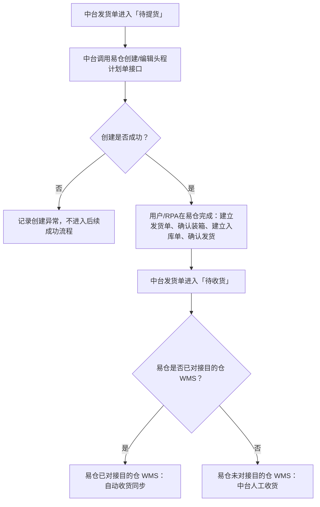
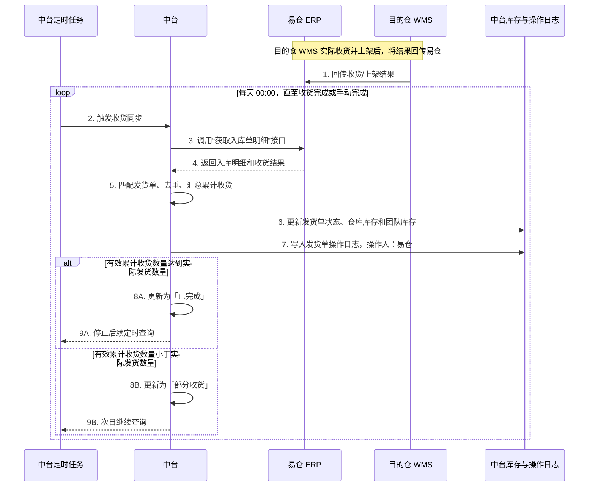
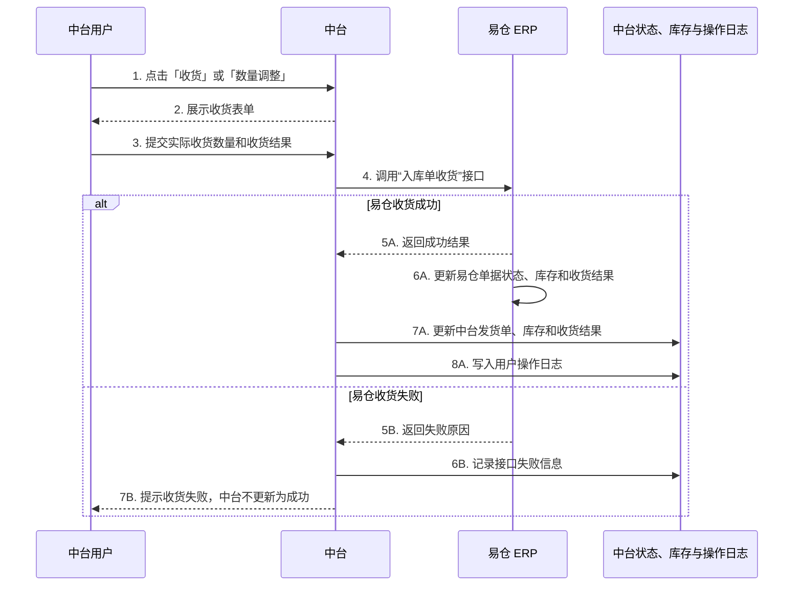

# 自动收货-发货单全流程管理 V2.1PRD

## 一、需求概述

### 2.1 背景

中台发货单进入「待提货」后，需要在易仓创建对应的头程计划单，并由用户或 RPA 在易仓完成后续操作。根据**易仓是否已对接目的仓 WMS**，分别采用易仓自动收货同步或中台人工收货，再将单据状态、库存和收货结果保持一致。

### 2.2 需求目标

1. 中台发货单进入「待提货」后，创建易仓头程计划单。
2. **易仓已对接目的仓 WMS** 的收货结果由易仓同步，中台获取后更新本地数据。
3. **易仓未对接目的仓 WMS** 的，由中台人工收货，并将收货结果回传易仓。
4. 发货单详情弹窗能够查询并展示易仓装箱明细。
5. 中台取消发货时，同步取消易仓对应单据。

### 2.3 业务范围

本次涉及中台发货单、发货计划、团队库存、易仓头程计划、收货同步、装箱明细查询和取消发货同步。

## 二、需求效益

1. 减少海外仓收货过程中的人工查询和手动录入，提高收货处理效率。
2. 打通中台与易仓的头程计划、收货明细和库存数据，减少重复操作。
3. 以中台实际发货数量为收货上限，降低超收、少收和库存数据不一致的风险。
4. 支持分批上架、重复查询和上架数量调整，避免重复增加库存，并能够自动修正库存差异。
5. 同一 SKU 关联多个团队时，按发货计划建立顺序自动分配团队库存，减少人工判断。
6. 收货、库存、状态和接口调用结果均保留同步记录，便于问题追踪和异常处理。

## 三、业务流程

### 3.1 公共流程

| 步骤 | 操作角色   | 操作/系统处理                                                                                                  | 输出结果               |
| -- | ------ | -------------------------------------------------------------------------------------------------------- | ------------------ |
| 1  | 中台系统   | 发货单进入「待提货」                                                                                               | 触发创建易仓头程计划单        |
| 2  | 中台系统   | 调用[创建/编辑头程计划单接口](https://open.eccang.com/#/documentCenter?docId=1282\&catId=0-178-178,0-177)，并传入海外仓服务商代码 | 易仓生成头程计划单，中台保存易仓单号 |
| 3  | 用户/RPA | 在易仓建立发货单                                                                                                 | 易仓生成发货单            |
| 4  | 用户/RPA | 在易仓确认装箱数据                                                                                                | 易仓生成/确认装箱数据        |
| 5  | 用户/RPA | 在易仓建立入库单                                                                                                 | 易仓生成入库单            |
| 6  | 用户/RPA | 在易仓确认发货                                                                                                  | 货物进入目的仓收货流程        |

#### 发货单整体业务流程图



### 3.2 易仓已对接目的仓 WMS

```text
中台发货单进入「待收货」
        ↓
每天 00:00 中台自动获取易仓入库明细
        ↓
易仓已对接的三方仓 WMS 收货并上架
        ↓
易仓自动同步上架结果
        ↓
中台更新发货单状态、库存和收货结果
```

中台发货单进入「待收货」后纳入定时查询范围；如果当天尚未产生易仓入库明细，单据保持当前状态，次日继续查询。**收货完成后停止定时查询；部分收货继续每天 00:00 查询。页面不提供「立即同步」按钮。**

#### 自动收货时序图



### 3.3 易仓未对接目的仓 WMS

```text
中台展示「收货」入口
        ↓
用户在中台录入实际收货结果
        ↓
中台调用易仓入库单收货接口
        ↓
易仓更新单据状态、库存和收货结果
        ↓
中台更新本地发货单状态、库存和收货结果
```

#### 人工收货时序图



### 3.4 部分收货后手动完成

当实际收货数量未达到**中台实际发货数量**，但业务确认不再等待剩余货物时：

1. 中台将发货单更新为「已完成（部分收货）」；
2. 中台按实际已收货数量处理本地已收货库存；
3. 清除剩余海外在途库存，未收部分不增加目的仓库存；
4. 当前没有易仓「出货单卸载」接口，中台不调用接口；
5. 中台提示用户前往易仓手动卸载剩余出货单；
6. **手动完成后立即停止该发货单的常规定时查询**，不再提供人工修改库存入口；
7. 如果后续通过易仓结果回传或补偿同步获取到新的累计收货数量，中台仍自动更新收货数量、库存和收货结果；不得通过人工修改完成。达到实际发货量时，按最新结果更新为完整收货。

### 3.5 待提货取消发货

```text
中台发货单处于「待提货」
        ↓
用户点击「取消发货」
        ↓
中台调用易仓取消头程计划接口
        ↓
易仓取消成功
        ↓
中台发货单更新为「已取消」
```

## 四、功能需求

### 4.1 创建易仓头程计划单

| 项目    | 规则                                                                                       |
| ----- | ---------------------------------------------------------------------------------------- |
| 触发条件  | 中台发货单进入「待提货」                                                                             |
| 调用接口  | [创建/编辑头程计划单](https://open.eccang.com/#/documentCenter?docId=1282\&catId=0-178-178,0-177) |
| 目的仓处理 | 中台根据目的仓匹配「海外仓服务商代码」，传给易仓                                                                 |
| 成功处理  | 保存易仓头程计划单号，允许继续执行后续流程                                                                    |
| 失败处理  | 不进入后续成功流程，记录失败原因并提示异常                                                                    |

### 4.2 易仓/RPA 前置操作

中台创建头程计划单后，不负责替代用户/RPA 执行以下易仓操作：

1. 建立发货单；
2. 装箱数据确认；
3. 建立入库单；
4. 确认发货。

### 4.3 易仓已对接目的仓 WMS 自动收货

| 项目   | 规则                                                                                         |
| ---- | ------------------------------------------------------------------------------------------ |
| 适用仓库 | 目的仓属于已确认由**易仓对接 WMS** 的仓库                                                                       |
| 页面操作 | **不展示「收货」入口**、**部分收货状态下不展示「数量调整」入口**，也**不提供「立即同步」按钮**                                                                     |
| 调用接口 | [获取入库单明细](https://open.eccang.com/#/documentCenter?docId=339\&catId=0-188-188,0-undefined) |
| 查询对象 | 仅查询处于**「待收货」或「部分收货」**且目的仓属于已确认由易仓对接 WMS 的发货单；**「已完成」「已取消」及手动完成后的单据排除**                                |
| 查询触发 | 发货单进入「待收货」后，**每天 00:00 自动查询一次**，执行时区为**中国时区**                                                      |
| 失败重试 | **当天发生接口失败时进行重试**；具体重试次数、间隔和当天重试仍失败后的补偿方式待确认                                                   |
| 查询停止 | **收货完成后停止查询；部分收货继续每天 00:00 查询；手动完成后立即停止该单据的常规定时查询**                                            |
| 处理数据 | 根据易仓返回的入库单、目的仓、SKU 和收货数量匹配中台发货单，并汇总同一 SKU 的有效上架明细                                          |
| 本地更新 | 更新发货单收货数量、状态、SKU+仓库库存、SKU+仓库+团队库存及收货结果                                                     |
| 收货上限 | 以中台发货单的**实际发货数量**为上限，**不以发货计划数量作为收货上限**                                                            |
| 完成判断 | 有效累计收货数量小于实际发货数量为**「部分收货」**；达到实际发货数量为**「已完成」**                                                     |
| 日志记录 | 成功同步并处理易仓收货结果后，在发货单操作日志新增**「收货同步」**记录；**操作人显示为「易仓」**，记录同步的收货数量、累计有效收货数量和单据状态等信息 |

目前已确认由易仓对接 WMS 的目的仓：

- 万易通海外仓 V2、Amazon FBA 仓、千象盒子海外仓、跨越猫；

- 海晨 HTC 德国仓、速卖通优选仓、沃尔玛 WFS 仓、美客多官方仓（跨境）；

- 斯德克俄罗斯海外仓、九方通逊海外仓、运去哪海外仓。

### 4.4 易仓未对接目的仓 WMS 人工收货

| 项目   | 规则                                                                                  |
| ---- | ----------------------------------------------------------------------------------- |
| 适用仓库 | 目的仓不属于已确认由易仓对接 WMS 的仓库                                                               |
| 页面操作 | **展示「收货」入口**；处于「部分收货」状态时**展示「数量调整」入口**                                                                            |
| 用户输入 | 实际收货数量、问题数量等收货结果                                                                    |
| 调用接口 | [入库单收货](https://open.eccang.com/#/documentCenter?docId=1481\&catId=0-188-188,0-177) |
| 收货上限 | 以中台发货单的**实际发货数量**为上限，**不得超过实际发货数量**                                                         |
| 调用成功 | 易仓自动更新对应单据状态、库存和收货结果；中台更新本地数据                                                       |
| 调用失败 | **中台不得将本次收货视为成功**，保留失败信息并支持后续补偿                                                         |

### 4.5 团队库存分配

适用于同一发货单中，同一 SKU 关联多个团队，且易仓收货结果不返回团队信息的场景。

1. 分配组为「发货单 + 目的仓 + SKU」，汇总该组下各团队发货计划的计划数量。**计划数量仅用于团队库存分配的上限和顺序计算，不作为发货单收货数量或完成判断依据**；团队分配总量不得超过中台该 SKU 的实际发货数量。
2. **按中台发货计划建立时间升序分配**；建立时间相同时，按发货计划 ID 升序。该顺序仅用于系统分配，不代表团队业务优先级。
3. 先按“易仓入库单号 + SKU + 上架明细唯一标识”对明细**去重**，再汇总同一 SKU 当前所有有效上架明细，得到易仓累计实收数量；**不将重复查询结果直接累加**。
4. **中台有效累计收货数量 = `min(易仓累计实收数量，中台实际发货数量)`**，以有效累计收货数量作为团队分配依据。
5. 按排序依次分配：当前团队分配数量取“当前剩余可分配数量”和“该团队计划数量”中的较小值；分配后扣减剩余数量。
6. 各团队分配数量不得超过对应计划数量和中台实际发货数量。
7. 易仓累计实收数量超过中台实际发货数量时，超出部分记录为**「超收异常」**，**不自动归属任何团队**。
8. **中台不提供人工调整入口**。易仓上架明细数量发生变化时，系统**按最新有效累计数量重新计算团队目标分配数量，并通过库存调整记录修正差额**。
9. **本次库存变更 = 最新有效累计收货数量 − 上次有效累计收货数量**；正数增加库存，负数反向冲减库存。
10. 重复同步同一收货结果时，**不得重复增加团队库存**。
11. 数量修正导致团队库存不足以冲减时，记录库存修正并标记「收货同步异常」，不得继续扩大负库存。

示例：团队 A 的发货计划先建立，计划 60 件；团队 B 后建立，计划 40 件；中台该 SKU 实际发货 80 件。易仓累计实收 50 件时，分配为 A 50 件、B 0 件；累计实收 80 件时，分配为 A 60 件、B 20 件；累计实收 100 件时，有效累计收货仍按 80 件计算，A 60 件、B 20 件，超出的 20 件记录为超收异常。

同一 SKU 分批上架时，例如第一次上架 30 件、第二次上架 20 件，易仓累计实收为 50 件；如果易仓将第一次上架明细从 30 件调整为 25 件，最新累计实收变为 45 件，中台按差额 -5 件反向修正库存。

### 4.6 发货单详情弹窗装箱明细

| 项目    | 规则                                                                                        |
| ----- | ----------------------------------------------------------------------------------------- |
| 数据来源  | 易仓接口，不以中台本地装箱数据作为数据来源                                                                     |
| 调用接口  | [装箱单管理（Old）列表](https://open.eccang.com/#/documentCenter?docId=318\&catId=0-176-176,0-171) |
| 接口方法  | `POST`，`transferProductPackingList`                                                       |
| 查询条件  | `operationType=spo_code`；`operationCode=易仓发货计划总单号`                                        |
| 分页处理  | `pageSize` 最大 500；根据分页信息获取全部数据                                                            |
| 无数据处理 | 易仓尚未完成建立发货单或装箱确认时，展示「暂无装箱明细」                                                              |

装箱明细展示字段：

| 中台字段    | 易仓字段                                  |
| ------- | ------------------------------------- |
| 箱号/箱编码  | `tpp_code`                            |
| 箱商品数    | `tpp_quantity`                        |
| 长、宽、高   | `tpp_length`、`tpp_width`、`tpp_height` |
| 毛重、净重   | `tpp_weight`、`tpp_net_weight`         |
| 箱体积、体积重 | `volume`、`volume_weight`              |
| SKU     | `product_barcode`                     |
| 海外仓 SKU | `wh_product_barcode`                  |
| 数量      | `tppd_quantity`                       |

### 4.7 待提货取消发货

1. 仅中台发货单处于「待提货」状态时展示「取消发货」入口。
2. 中台已成功创建易仓头程计划单后，用户取消发货时必须同步调用易仓取消头程计划接口。
3. **易仓取消成功后，中台才将发货单更新为「已取消」**，并将关联发货计划更新为「已作废」。
4. **易仓取消失败时，中台不得更新为「已取消」**；保持「待提货」或进入「取消同步异常」状态，具体状态待确认。
5. 用户/RPA 已开始易仓第三步至第六步后是否仍允许取消，按待确认规则处理。

### 4.8 易仓收货结果同步日志

1. 适用场景：中台通过「获取入库单明细」接口获取易仓收货结果，并成功更新中台发货单、库存或收货状态。
2. 日志位置：在对应中台发货单的操作日志中新增记录。
3. 操作类型：显示为**「收货同步」**。
4. 操作人：固定显示为**「易仓」**，不显示为执行定时任务的系统账号或中台用户。
5. 日志内容：至少记录易仓入库单号、SKU、本次同步收货数量、累计有效收货数量、发货单状态和同步结果。

## 五、页面与交互说明

### 5.1 发货单详情弹窗

1. 展示发货单基础信息、发货计划、团队、SKU、计划数量、收货数量和收货状态。
2. 「装箱明细」区域通过易仓接口查询并展示箱级及 SKU 级数据。
3. 查询中展示加载状态；无数据展示「暂无装箱明细」；接口失败展示失败提示，不影响发货单其他信息查看。
4. 易仓已对接目的仓 WMS **不展示「立即同步」按钮**，收货明细由系统定时任务自动查询。

### 5.2 收货入口

1. 易仓已对接目的仓 WMS：**隐藏「收货」入口**；处于「部分收货」状态时，**同时隐藏「数量调整」入口**。
2. 易仓未对接目的仓 WMS：**展示「收货」入口**，允许用户录入实际收货结果；处于「部分收货」状态时**保留「数量调整」入口**。
3. 团队库存分配由系统自动完成，不展示编辑或人工调整入口。

### 5.3 取消发货

1. 「待提货」状态展示「取消发货」操作。
2. 用户点击后展示二次确认。
3. 易仓取消成功后更新中台状态；失败时展示失败原因，并保留可追踪的同步结果。

## 六、异常与边界场景

| 场景           | 系统处理                                          | 用户提示/结果             |
| ------------ | --------------------------------------------- | ------------------- |
| 创建头程计划失败     | 不进入后续成功流程，记录接口错误                              | 提示创建失败原因            |
| 海外仓服务商代码匹配不到 | 不调用或不确认创建成功                                   | 提示目的仓配置异常           |
| 易仓入库明细无关联发货单 | 不更新业务单据，记录异常                                  | 提示无法匹配中台发货单         |
| 入库明细重复返回     | 依据明细唯一标识/已同步记录去重                              | 不重复增加库存             |
| 入库明细超过一页     | 按分页获取全部数据                                     | 不遗漏收货数据             |
| 接口超时或失败      | 记录请求结果，按重试/补偿规则处理                             | **不更新为成功**，展示同步异常       |
| 易仓实收少于实际发货数量 | 按规则分配，单据为**部分收货**                                 | 继续等待或由业务手动完成        |
| 易仓实收超过实际发货数量 | 有效收货最多按**实际发货数量**计算                               | 超出部分记录为**超收异常**，不分配团队库存 |
| 易仓累计实收数量被调整  | 按最新累计数量重新计算并生成库存修正记录                          | 异常时标记收货同步异常         |
| 中台部分收货后手动完成  | 清除剩余海外在途，**停止该单据常规定时查询**；后续收到易仓新收货结果时仍自动更新收货数量和库存 | 提示用户去易仓手动卸载剩余出货单    |
| 易仓取消失败       | 中台不得更新为已取消                                    | 保持待提货或进入取消同步异常      |
| 易仓暂无装箱数据     | 返回空结果时正常展示空状态                                 | 展示「暂无装箱明细」          |
| 装箱接口返回结构异常   | 记录解析错误，不展示错误数据                                | 提示装箱数据获取失败          |

## 七、系统影响

| 系统/模块   | 影响内容                        | 本次处理           |
| ------- | --------------------------- | -------------- |
| 中台发货单   | 新增易仓单号、收货同步、取消同步、装箱明细展示     | 本次实现           |
| 中台库存    | 更新 SKU+仓库及 SKU+仓库+团队库存      | 本次实现           |
| 中台团队库存  | 按发货计划建立顺序自动分配和修正            | 本次实现           |
| 易仓 ERP  | 创建头程计划、查询入库明细、人工收货回传、取消头程计划 | 本次对接，取消接口待确认   |
| 海外仓 WMS | 由易仓负责对接目的仓 WMS 并同步上架结果              | 中台不直接对接        |
| RPA     | 执行易仓第三步至第六步及必要的人工卸载         | 操作衔接，具体失败补偿待确认 |

## 八、合规与审计要求

本需求涉及库存变更，需要保留以下操作留痕：

1. 记录每次易仓接口调用时间、接口名称、业务单号、请求结果和失败原因。
2. 记录收货前库存、收货后库存、团队分配前后数量及库存修正原因。
3. 记录自动分配使用的发货计划顺序，确保重复同步结果一致、可追溯。
4. **团队库存不提供人工调整入口**；所有数量变更由易仓累计实收变化触发系统修正。
5. 接口密钥、签名和敏感请求参数不得写入普通业务日志。

## 九、验收标准

- [ ] 发货单进入「待提货」后，能够创建易仓头程计划单并保存易仓头程计划单号。

- [ ] 中台能够根据目的仓匹配并传入正确的海外仓服务商代码。

- [ ] 用户/RPA 能够继续完成易仓建立发货单、确认装箱、建立入库单、确认发货四个步骤。

- [ ] 易仓已对接目的仓 WMS **不展示「收货」入口**；处于「部分收货」状态时**不展示「数量调整」入口**，也**不提供「立即同步」按钮**。

- [ ] 发货单进入「待收货」或「部分收货」后，系统按**中国时区每天 00:00 查询一次**易仓入库明细；**当天失败时按重试规则重试**；**收货完成后停止查询，部分收货继续查询**。

- [ ] 收货数量和完成判断以中台**实际发货数量**为上限，**不以发货计划数量作为收货上限**。

- [ ] **已完成、已取消及手动完成后的单据不进入常规定时查询**，页面**不提供「立即同步」按钮**。

- [ ] 易仓已对接目的仓 WMS 上架后，中台能够获取易仓入库明细并更新本地状态、库存和收货结果。

- [ ] 中台成功同步易仓收货结果后，对应发货单操作日志新增**「收货同步」记录**，**操作人为「易仓」**，并记录收货数量、累计有效收货数量、单据状态和同步结果。

- [ ] 易仓未对接目的仓 WMS **展示「收货」入口**，处于「部分收货」状态时**保留「数量调整」入口**，中台收货成功后能够调用易仓收货接口。

- [ ] 易仓收货接口失败时，中台不得将本次收货更新为成功。

- [ ] 同一发货单中同一 SKU 关联多个团队时，能够按发货计划建立顺序分配收货数量。

- [ ] 同一 SKU 多次上架时，中台能够按上架明细**去重**并汇总当前有效累计实收数量；重复查询**不重复增加库存**，数量调整能够**按差额修正库存**。

- [ ] 易仓累计实收超过中台实际发货数量时，超出部分进入**超收异常**，**不分配团队库存**。

- [ ] 团队分配数量**不超过各团队计划数量和中台实际发货数量**。

- [ ] 重复同步不会重复增加库存，易仓累计实收数量变化时能够自动修正团队库存。

- [ ] 中台不提供团队库存分配的人工调整入口。

- [ ] 发货单详情弹窗能够通过易仓装箱接口展示箱级和 SKU 级装箱明细。

- [ ] 装箱明细分页超过单页数量时，能够获取并展示完整数据。

- [ ] 易仓暂无装箱数据时，页面展示「暂无装箱明细」，不报错。

- [ ] 中台部分收货后手动完成时，清除剩余海外在途库存，**不调用出货单卸载接口**，并提示用户前往易仓处理。

- [ ] 手动完成后，后续通过易仓结果回传或补偿同步获取到新收货数量时，中台能够自动更新收货数量、库存和收货结果，不提供人工修改库存入口。

- [ ] 待提货取消发货时，**易仓取消成功后中台才更新为「已取消」**。

- [ ] 易仓取消失败时，中台不得更新为「已取消」。

- [ ] 库存变更和接口同步结果均有可追溯日志。

## 十、待确认问题

| 待确认问题                                          | 影响范围      |
| ---------------------------------------------- | --------- |
| 易仓取消头程计划单的具体接口名称、请求参数和可取消状态是什么？                | 取消发货      |
| 易仓头程计划单号与易仓入库单号之间使用哪个关联字段？                     | 收货同步、装箱查询 |
| 易仓/RPA 第三步至第六步的实际操作人、触发方式和失败补偿机制是什么？           | 前置操作      |
| 如何避免同一条入库明细重复同步？                               | 库存准确性     |
| 入库明细接口分页如何处理？                                  | 数据完整性     |
| 如何识别本次入库明细属于哪一张中台发货单？                          | 单据匹配      |
| 易仓上架数量被调整后，中台如何修正已同步的收货数量和库存？                  | 库存修正      |
| 易仓入库上架明细是否提供稳定唯一标识；若没有，复合去重键应使用哪些字段？           | 收货同步、幂等   |
| 当天接口调用失败时，重试次数、间隔以及当天重试仍失败后的人工补偿方式如何定义？        | 异常处理      |
| 手动完成后已停止常规定时查询，后续易仓新收货结果通过何种回传或补偿同步机制传入中台？     | 收货同步      |
| 中台处于「待提货」，但用户/RPA 已开始易仓第三步至第六步时，是否仍允许取消？       | 取消发货      |
| 接口超时但易仓实际取消成功时，如何判断和避免重复取消？                    | 取消发货      |
| 易仓取消成功但中台更新失败时，如何补偿？                           | 状态一致性     |
| 易仓不允许取消时，中台保持「待提货」还是进入「取消失败/取消同步异常」？           | 状态流转      |
| 装箱接口文档标注为 Old，是否确认正式环境可用且已授权？                  | 装箱明细      |
| 装箱接口返回的 `detailList` 在定义和示例中的结构不一致，实际返回数组还是对象？ | 接口解析      |
| 截图中的「物流属性」字段是否通过其他接口或字段获取？                     | 装箱明细展示    |
