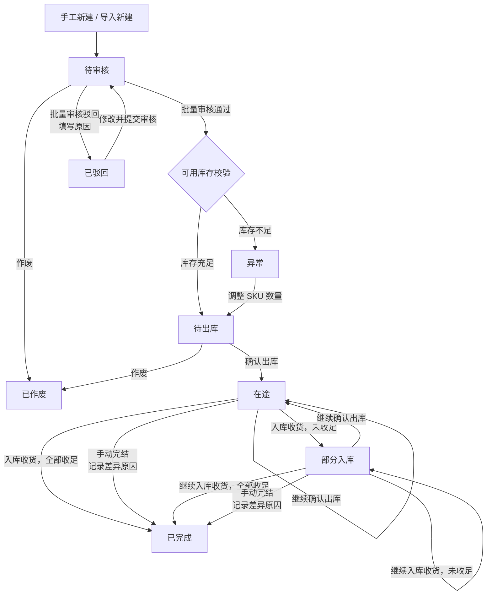
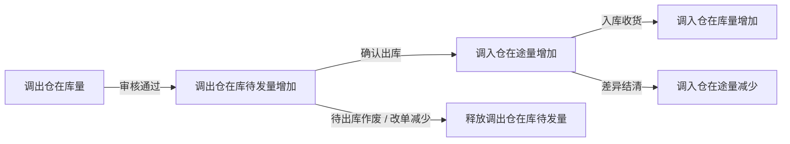

# 跨仓调拨单全流程管理 PRD

> 本文件沉淀当前已确认的调拨单方案；“待确认”内容不作为研发实现依据。

## 一、需求背景与目标

### 1.1 背景

现有跨仓移货依赖线下表格与人工库存调整，无法完整记录谁发起、谁审核、实际发出多少、到货多少、运输中剩余多少及费用归属。发生分批出库、分批入库、短少或破损时，库存位置和差异责任难以追溯。

### 1.2 目标

1. 以调拨单承接跨仓实物迁移，形成统一业务入口。
2. 分别记录申请、实际出库、实际入库、在途和差异数量。
3. 支持审核、出库、入库与异常处理的状态闭环。
4. 支持调拨运费、其他费用、明细调拨金额及调拨总金额查看。
5. 为在库待发锁定、库存流水、批次与库龄继承提供明确的业务口径。
6. 保留操作人、时间、理由与前后数据，满足库存对账和审计追溯。

---

## 二、需求收益

| 收益维度 | 具体收益 |
|---|---|
| 库存准确性 | 记录锁定、出库、在途和入库，保证库存可追溯。 |
| 履约效率 | 仓库、物流和运营围绕同一张单据协作。 |
| 异常可控 | 记录出入库差异，支持短少、破损等异常闭环。 |
| 成本可见 | 汇总 SKU 调拨成本、运费和其他费用。 |
| 审计与责任追溯 | 关键操作保留操作人、时间和日志。 |
| 系统扩展性 | 为后续库存和关联单据能力扩展提供基础。 |

---

## 三、业务流程

### 3.1 主流程图

### 3.2 库存流转口径

调拨只改变实物所在仓库，不改变团队、货主和货权归属。本节只描述库存数量的增减及状态约束。

| 基础口径 | 规则 |
|---|---|
| 库存维度 | `SKU + 仓库 + 团队/货主`；库存校验、锁定和扣减均按此维度执行。 |
| 库存状态 | 仅使用在库量、在库待发量、在途量。 |
| 可用库存 | `在库量 - 在库待发量`。 |
| 扣减顺序 | 确认出库时，按该维度下的库存批次先进先出扣减。 |
| 团队/货主 | 调拨全程继承调出仓的团队/货主；调入后不改变团队、货主或货权归属。 |

#### 3.2.1 库存状态说明

| 状态 | 所在仓库 | 含义 | 是否计入在库量 |
|---|---|---|---|
| 在库量 | 当前实际存放仓库 | 已完成入库、实际存放的数量。 | 是 |
| 在库待发量 | 调出仓 | 审核通过后已锁定、尚未实际出库的数量。 | 是，属于在库量中的受限部分。 |
| 在途量 | 调入仓 | 已从调出仓实际出库、尚未完成调入收货的数量。 | 否 |

#### 3.2.2 库存流转表

| 动作 | 触发条件 | 扣减什么 | 增加什么 | 数据流向 | 数量口径与状态结果 |
|---|---|---|---|---|---|
| 新建、导入新建 | 保存或提交调拨单 | — | — | 仅创建单据 | 不产生库存变化，单据进入待审核。 |
| 审核驳回、待审核作废 | 单据未通过审核或在待审核状态作废 | — | — | 不发生库存流转 | 未锁定库存，不产生库存变化。 |
| 审核通过 | 每个 SKU 的申请数量不大于调出仓可用库存 | — | 调出仓在库待发量 | 调出仓在库量内锁定 | `申请调拨数量 ≤ 在库量 - 在库待发量`；锁定后进入待出库，在库量与调入仓在途量不变。 |
| 确认出库 | 待出库、在途或部分入库状态，且本次数量不大于剩余在库待发量 | 调出仓在库量、调出仓在库待发量 | 调入仓在途量 | 调出仓 → 调入仓在途 | 按实际出库数量和 FIFO 执行；可分批出库，未出库部分继续保留在库待发量。 |
| 入库收货 | 在途或部分入库状态，且本次数量不大于调入仓在途量 | 调入仓在途量 | 调入仓在库量 | 调入仓在途 → 调入仓在库 | 按实际收货数量流转；未收足进入部分入库，收足后完成。团队/货主继承调出仓；库龄按本单“是否继承库龄”的批次规则处理。 |
| 待出库作废 | 待出库状态作废 | 调出仓在库待发量 | — | 调出仓锁定 → 释放 | 释放全部尚未出库数量，不减少调出仓在库量。 |
| 待出库修改数量减少 | 修改后申请数量低于已锁定数量 | 调出仓在库待发量 | — | 调出仓锁定 → 释放 | 释放减少部分，不减少调出仓在库量。 |
| 待出库修改数量增加 | 修改后申请数量增加 | — | 调出仓在库待发量 | 调出仓在库量内追加锁定 | 须重新校验可用库存，校验通过后按增加量锁定。 |
| 待出库修改调出仓、团队/货主或 SKU | 修改影响库存维度 | 原维度的在库待发量 | 新维度的在库待发量 | 原锁定释放 → 新维度锁定 | 先释放原锁定，再按新维度重新校验并锁定。 |
| 手动完结：未出库部分终止履约 | 在途或部分入库状态，剩余待发货物不再履约 | 调出仓在库待发量 | — | 调出仓锁定 → 释放 | 释放未出库且终止履约数量，不减少调出仓在库量。 |
| 手动完结：在途差异 | 在途或部分入库状态，剩余在途货物短少、破损、丢失等无法收货 | 调入仓在途量 | — | 调入仓在途 → 差异结清 | 不增加调入仓在库量，也不恢复调出仓在库量；必须记录差异原因、数量和处理说明。 |
| 已出库后取消或退回 | 已发生实际出库 | — | — | 另行处理 | 不允许直接作废；应完成收货、差异结清，或创建逆向调拨处理。 |

#### 3.2.3 并发、幂等与追溯

| 控制项 | 规则 |
|---|---|
| 原子提交 | 审核锁定、确认出库、入库收货、释放在库待发量和差异结清必须由库存服务原子提交，页面不得直接修改库存余额。 |
| 幂等控制 | 每次库存操作使用唯一幂等键，例如“调拨单号 + 明细行 + 操作类型 + 操作批次号”；重复提交不得重复扣减、入库或释放。 |
| 追溯信息 | 每个节点记录库存余额变动、出入库/差异流水、来源批次、操作人、操作时间和关联调拨单号。 |
| 结清校验 | 单据完成时，本单据关联的在库待发量和在途量必须全部结清为 0。 |

#### 3.2.4 库龄继承规则

**业务背景**：跨仓调拨需要明确“库存年龄是否因换仓而重置”。若没有该规则，老库存可在每次调拨后被按调入日期重新计龄，造成库龄报表失真、呆滞库存被掩盖，并可能破坏临期预警和 FIFO/FEFO 的出库顺序。

| 选择 | 适用业务场景 | 调入仓处理规则 | 业务作用 |
|---|---|---|---|
| 继承库龄 | 仅发生物理搬运、货物身份没有变化：总仓与区域仓调拨、仓库搬迁、库区调整、委外仓与自营仓之间移货，以及未发生重新质检、返工、重包装或重新入库的场景。 | 调入库存必须按实际出库批次逐批建立在库记录，保留原始入库日期、批次号、生产日期、效期等库龄来源字段；不得合并为一条重新计龄的库存。 | 保持库存真实年龄，确保 FIFO/FEFO、呆滞分析和临期预警不因调拨被“洗白”。 |
| 不继承库龄 | 调入仓业务上被视为重新入库：退货重新验收、返工/翻新/重包装后重新入库、质检隔离库存转合格库存且制度规定以放行日重新计龄、特殊业务仓按新规则建档，或历史批次信息不可信。 | 调入仓以实际收货完成时间作为新的库龄起算点；但仍须保留原始来源批次、原库龄来源、关联调拨单和操作记录，保证可追溯。 | 使新的库存生命周期与重新验收、加工或业务制度一致。 |

**多批次扣减与继承示例**：调拨 100 个 SKU，调出仓按 FIFO 从批次 A 扣减 40 个、批次 B 扣减 60 个。选择“继承库龄”时，调入仓必须接收两条库存批次记录：`批次 A / 40 个 / 原库龄起算日` 与 `批次 B / 60 个 / 原库龄起算日`；不得计算平均库龄，也不得将 100 个统一按调入日期重新计龄。

**系统控制规则**：

1. “是否继承库龄”默认值为“是”。
2. 仅当业务明确属于重新入库场景时允许选择“否”；选择“否”时必须填写原因，并在调拨单操作日志中记录选择人、选择时间、原因、原值和新值。
3. 单据审核通过后不得直接变更该字段；如确需修改，应先按库存冲销/逆向调拨规则处理已发生库存，再重新发起或重新审核单据。
4. 无论选择“是”或“否”，库存流水均必须记录来源批次、调拨单号、出库批次分摊数量和调入批次标识。

### 3.3 库存流转图

---

## 四、角色与权限

| 角色 | 查看权限 | 操作权限 | 数据范围 | 备注 |
|---|---|---|---|---|
| 创建人 | 查看本人创建的单据 | 新建、导入、编辑待审核/已驳回单据、提交审核 | 本人及被授权仓库 | 当前原型默认创建人为当前账号。 |
| 审核人 | 查看待审核单据及详情 | 批量审核通过、批量驳回 | 被授权组织/仓库 | 驳回必须填写原因。是否允许创建人自审待确认。 |
| 调出仓操作人 | 查看本人负责调出仓的待出库单据 | 确认出库、填写物流信息 | 调出仓 | 应校验实际出库数量。 |
| 调入仓操作人 | 查看本人负责调入仓的在途单据 | 入库收货 | 调入仓 | 应校验累计入库不超过在途。 |
| 库存管理员 | 查看所有授权单据、日志、差异 | 异常处理、手动完结、库存对账辅助 | 全部授权仓库 | 手动完结需要记录原因和处理备注。 |
| 管理员 | 全部 | 查询、导出及角色配置 | 全部 | 不应绕过关键库存留痕。 |

---

## 五、功能需求

| 功能模块 | 功能说明 | 关键规则 |
|---|---|---|
| 查询与状态筛选 | 支持按调拨单号/物流单号、SKU/产品名称、调出仓、调入仓、调出团队、物流渠道、创建人、是否有差异、创建时间查询。 | 多选筛选支持；创建人默认当前账号；开始和结束日期必须成对填写，开始时间不得晚于结束时间。 |
| 列表与展开明细 | 一级列表展示调拨单核心信息；展开后展示 SKU 明细。 | 一级列表单号可点击查看详情；不在操作列重复放置“查看”。二级列表支持横向滚动，前 4 列固定。 |
| 新建调拨单 | 手工录入调拨单基础信息与多个 SKU 明细，提交后进入待审核。 | 调出仓与调入仓必填且不可相同；至少 1 个 SKU；数量为大于 0 的整数且不超过可用量。 |
| 导入新建 | 通过模板批量导入一张多 SKU 调拨单。 | 上传后自动校验表头、必填项、数量、日期、费用和物流字段配对；校验不通过不可提交。 |
| 编辑调拨单 | 待审核、已驳回、已作废、异常状态均提供“编辑”，且复用同一个编辑调拨单弹窗。 | 待审核、已驳回、已作废编辑后提交审核；异常单编辑后校验通过即重新流转待出库。修改调出仓时应清空已选 SKU 并重新选择；数量增加须重新校验可用量。 |
| 审核 | 列表顶部提供绿色“审核”按钮。 | 仅待审核单据可勾选审核；通过意见可空，驳回原因必填。审核弹窗复用统一审核弹窗规范。 |
| 作废 | 列表顶部提供红色“作废”按钮。 | 当前允许待审核、待出库状态作废；作废后不可继续履约。待出库作废时必须同步释放在库待发量。 |
| 确认出库 | 按 SKU 填写实际出库数量与物流信息。 | 物流渠道和物流单号必须同时填写或同时为空；数量不超过该 SKU 允许出库数量。 |
| 入库收货 | 按 SKU 填写本次实际入库数量，支持多次入库。 | 累计入库数量不得超过累计实际出库数量；未收足时保持部分入库。 |
| 手动完结 | 对未入库的在途数量进行差异结清。 | 必填差异处理原因；应记录剩余在途、处理说明和操作人。 |
| 详情与日志 | 单号点击展示只读详情；日志独立弹窗查看。 | 详情无输入框、无底部操作按钮，仅保留关闭入口。日志按钮统一灰色，并固定为操作列最后一个按钮。 |
| 导出 | 导出当前权限范围内的查询结果。 | 导出字段、是否导出 SKU 明细及最大导出量待确认。 |

---

## 六、页面与交互说明

### 6.1 页面结构

页面由查询区、操作按钮区、状态标签栏、一级列表、展开二级列表和分页组成。

### 6.2 操作按钮区

| 按钮 | 样式 | 说明 |
|---|---|---|
| 新建调拨单 | 蓝色主按钮 | 打开新建调拨单弹窗。 |
| 导入新建 | 默认按钮 | 打开三步骤导入弹窗。 |
| 导出 | 默认按钮 | 导出当前查询结果。 |
| 审核 | 绿色 Success 按钮 | 仅处理选中的待审核单据。 |
| 作废 | 红色 Danger 按钮 | 仅处理可作废状态的选中单据。 |

### 6.3 一级列表

| 列 | 展示内容 | 交互说明 |
|---|---|---|
| 勾选框 | 单据选择 | 支持当前页全选；审核、作废使用。 |
| 展开 | 统一展开三角图标 | 展开/收起 SKU 二级列表。 |
| 调拨单号 | 单号 + 同行状态标签 | 点击单号打开只读详情；单号与状态标签不可换行分离。 |
| 调拨方向 | 调出仓 → 调入仓 | 当前页面使用纵向箭头样式展示。 |
| 调拨进度 | 出库数量、入库数量、在途数量、差异数量 | 字段和值均不加粗，不附加数量单位。 |
| 费用信息 | 运费、其他费用、调拨总金额 | 金额保留 `¥` 符号。调拨总金额 = `Σ 明细调拨金额 + 运费 + 其他费用`。 |
| 物流信息 | 物流渠道、物流单号、预计到仓 | 物流渠道和物流单号同时为空时均展示 `—`。 |
| 备注 | 单据备注 | 是否允许在列表直接编辑待确认；建议仅详情/修改弹窗编辑并记录日志。 |
| 创建信息 | 创建人、创建时间 | 用于追溯。 |
| 操作 | 依据状态显示操作链接 | 操作竖向排列；日志固定最后且使用灰色；作废使用红色。 |

固定列规则：勾选框、展开、调拨单号、调拨方向固定在左侧；操作列固定在右侧。固定列边缘复用采购单样式的轻量阴影，以清晰区分横向滚动区域。

### 6.4 二级列表 / 调拨明细

二级列表字段统一为：SKU、产品名称、调出团队、调拨数量、调拨金额、已出库数量、已入库数量、在途数量、差异数量、SKU 备注。“调拨金额”固定紧跟“调拨数量”展示，金额保留 `¥` 符号。

> 当前原型中存在“调入团队”列。根据“货权转移独立单据”的已确认边界，该字段应从调拨单新建、导入、查询、二级列表及详情中移除；调入后库存所属团队自动继承调出团队。

二级列表支持横向滚动，前 4 列固定，不参与横向滚动。

### 6.5 详情弹窗

- 单击调拨单号进入只读详情。
- 顶部展示“调拨单详情”、单号及调拨方向；右上角提供关闭按钮。
- 基础信息采用同一行的“字段名：字段值”展示，不使用输入框、表格横竖线或底部操作日志区。
- 调拨明细字段与二级列表一致；表头颜色与一级列表表头一致。
- 调拨单号字段排在单据状态之前。

### 6.6 审核弹窗

审核弹窗统一使用全局审核规范：

- 标题：`审核调拨单`；副标题：`已选择 X 张待审核调拨单`。
- 不展示单据卡片、单号胶囊、调拨方向或数量汇总。
- 内容区为浅灰背景，内部为无彩色边框的白色“审核意见”卡片。
- 文本框 placeholder：`审核通过可留空，驳回时请填写原因`，最多 500 字。
- 底部按钮顺序固定为：取消、驳回、通过；驳回红色、通过绿色。

### 6.7 导入弹窗

- 标题：`导入新建调拨单`。
- 三步骤：下载模板 → 选择文件 → 确认导入。
- 弹窗尺寸复用发货单导入弹窗，不使用过大的近全屏尺寸。
- 下载模板说明区展示模板填写规则和下载按钮；上传区支持点击选择和拖拽上传。
- 支持 `.xls`、`.xlsx`、`.csv`；提交时自动校验并提示具体错误。

---

## 七、数据与字段规则

### 7.1 调拨单头字段

| 字段 | 类型 | 必填 | 规则 / 口径 |
|---|---|---|---|
| 调拨单号 | 系统生成 | 是 | 规则：`TF + YYMMDD + 4位顺序号`，例如 `TF2609280001`；顺序号每天从 `0001` 重新开始。 |
| 调拨类型 | 枚举 | 否 | 当前默认“仓间调拨”；不在一级列表展示。 |
| 调出仓库 | 仓库 | 是 | 必须为已启用的物理仓库。 |
| 调入仓库 | 仓库 | 是 | 必须为已启用的物理仓库，且不可与调出仓库相同。 |
| 预计到仓 | 日期 | 否 | 推荐格式 `YYYY-MM-DD`；展示名称统一为“预计到仓”。 |
| 是否继承库龄 | 是/否 | 是 | 默认“是”。选择“是”时按实际出库批次逐批继承原始库龄来源；选择“否”时以调入仓实际收货完成时间重新起算库龄，且必须填写原因并留存日志。详见 3.2.4。 |
| 物流渠道 | 文本/枚举 | 否 | 与物流单号成对填写；无值展示 `—`。 |
| 物流单号 | 文本 | 否 | 与物流渠道成对填写；无值展示 `—`。 |
| 运费 | 金额 | 否 | 大于等于 0，最多两位小数，展示保留 `¥`。 |
| 其他费用 | 金额 | 否 | 大于等于 0，最多两位小数，展示保留 `¥`。 |
| 调拨总金额 | 金额 | 系统计算 | 单据级金额：`Σ 明细调拨金额 + 运费 + 其他费用`。明细级金额按实际/预估批次成本分摊计算，详见 7.2。 |
| 调拨备注 | 文本 | 否 | 最多 500 字。 |
| 创建人 / 创建时间 | 系统字段 | 是 | 创建时写入。 |
| 更新时间 | 系统字段 | 是 | 每次影响业务数据的操作后更新。 |

### 7.2 调拨 SKU 明细字段

| 字段 | 必填 | 规则 / 口径 |
|---|---|---|
| SKU | 是 | 必须存在于调出仓可用库存中。 |
| 产品名称 | 系统带出 | 由 SKU 主数据带出。 |
| 调出团队 | 是 | 从库存归属带出，是库存校验维度之一。 |
| 调拨数量 | 是 | 大于 0 的整数，不超过可用量。 |
| 调拨金额 | 系统计算 | 紧跟“调拨数量”展示，只读、保留 `¥`。新建/编辑时，按当前 FIFO 可分配批次计算预估金额：`Σ（批次分配数量 × 该批次库存成本价）`；调拨数量变化时实时刷新。审核锁定或实际确认出库后，应以最终实际扣减批次及其成本价重新计算并固化，不得按单一 SKU 均价或平均成本替代。 |
| 已出库数量 | 系统累计 | 各次确认出库数量之和。 |
| 已入库数量 | 系统累计 | 各次确认入库数量之和。 |
| 在途数量 | 系统计算 | 记录在调入仓维度，`已出库数量 - 已入库数量 - 已确认差异结清数量`。 |
| 差异数量 | 系统计算 | 当前展示口径：`已出库数量 - 已入库数量`；正式库存结算需区分“未收在途”和“已确认差异”。 |
| SKU 备注 | 否 | 单 SKU 备注，最多 120 字。 |
| 批次库存成本价 / 成本分摊快照 | 系统字段 | 每个实际扣减批次保留批次标识、分摊数量、库存成本价及金额；用于固化调拨金额、目标库存批次成本和审计追溯。 |

### 7.3 导入模板字段及顺序

| 顺序 | 字段 | 必填 | 第二行填写说明 |
|---:|---|---|---|
| 1 | SKU | 是 | 填写有效 SKU；SKU 必须存在且在调出仓、调出团队下有可用库存。 |
| 2 | 调出仓库 | 是 | 填写系统已启用的调出仓库名称。 |
| 3 | 调入仓库 | 是 | 填写系统已启用的调入仓库名称，不能与调出仓库相同。 |
| 4 | 调出团队 | 是 | 填写 SKU 当前所属团队，必须与库存归属一致。 |
| 5 | 调拨数量 | 是 | 填写大于 0 的整数，不能超过该 SKU 在调出仓、调出团队下的可用量。 |
| 6 | 预计到仓 | 否 | 填写日期，格式 `YYYY-MM-DD`。 |
| 7 | 是否继承库龄 | 是 | 只能填写“是”或“否”。 |
| 8 | 物流渠道 | 否 | 填写物流渠道名称；如填写物流单号，本字段必须同时填写。 |
| 9 | 物流单号 | 否 | 填写物流单号；如填写物流渠道，本字段必须同时填写。 |
| 10 | 运费 | 否 | 填写大于等于 0 的数字，最多两位小数。 |
| 11 | 其他费用 | 否 | 填写大于等于 0 的数字，最多两位小数。 |
| 12 | SKU备注 | 否 | 填写当前 SKU 的备注，最多 120 个字符。 |

导入规则：单次导入默认生成一张调拨单。所有明细的调出仓库、调入仓库、预计到仓、是否继承库龄、物流渠道、物流单号、运费、其他费用应保持一致；如不一致，系统应阻止导入或明确拆分为多张单据，具体策略待确认。

---

## 八、状态与业务规则

### 8.1 当前状态机

| 状态 | 含义 | 可执行操作 | 下一状态 |
|---|---|---|---|
| 待审核 | 新建或编辑后等待审核 | 编辑、单条作废、审核、作废、日志 | 待出库 / 已驳回 / 已作废 / 异常 |
| 待出库 | 审核通过，调出仓已增加在库待发量，等待首次实际出库 | 确认出库、作废、日志 | 在途 / 已作废 |
| 在途 | 已至少确认一笔出库，调入仓存在在途量，可能仍有剩余待出库数量 | 确认出库、入库收货、手动完结、日志 | 在途 / 部分入库 / 已完成 |
| 部分入库 | 已部分收货，仍存在调入仓在途量，可能仍有剩余待出库数量 | 确认出库、入库收货、手动完结、日志 | 在途 / 部分入库 / 已完成 |
| 已完成 | 所有数量已入库或差异已处理完结 | 日志 | 终态 |
| 已驳回 | 审核未通过 | 编辑、日志 | 待审核 |
| 已作废 | 未履约单据已取消 | 编辑、日志 | 待审核 |
| 异常 | 当前库存不足等原因导致无法继续按原数量履约 | 编辑、日志 | 待出库 |

### 8.2 状态规则

1. 新建和导入新建后直接进入“待审核”；当前页面不提供草稿保存。
2. 批量审核只允许选择“待审核”状态的单据。
3. 审核通过时应再次校验可用库存。当前原型中，库存不足的单据进入“异常”，由用户调整数量后重新流转“待出库”。
4. 待审核、已驳回、已作废单据均通过同一个编辑弹窗编辑，提交后进入“待审核”；已驳回单据需保留此前驳回意见与审核日志。
5. 待审核、待出库单据允许作废；已出库后不允许直接作废。
6. 确认出库时，单据记录本次实际出库数量，并按先进先出扣减调出仓在库量、减少在库待发量、增加调入仓在途量；支持分批出库，未出库数量继续保留在库待发量中。
7. 入库收货支持多次操作；累计入库数量达到累计出库数量时单据完成，否则为“部分入库”。
8. 手动完结只适用于在途、部分入库状态，必须填写差异处理原因；系统应释放未出库部分的在库待发量、结清剩余在途数量并写操作日志。
9. 审核通过后，“是否继承库龄”属于库存口径字段，不允许直接修改；选择“不继承库龄”必须在提交审核前填写原因。
10. 新建/编辑调拨单时，SKU 明细“调拨金额”按当前 FIFO 可分配批次成本预估；审核锁定或确认出库后，系统必须按最终实际扣减批次重新计算并固化。多批次成本必须逐批相乘后汇总，不允许使用 SKU 单一均价替代。

### 8.3 作废、冲销与反向调拨边界

| 场景 | 处理方式 |
|---|---|
| 待审核、待出库 | 可直接作废；待出库作废时必须释放剩余在库待发量。 |
| 已出库、未入库 | 不允许直接作废；应通过撤销出库/在途退回的库存冲销流程处理。 |
| 已部分入库 | 已入库部分应创建反向调拨；剩余在途部分应退回或按差异处理。 |
| 已完成 | 不允许删除或直接撤销原单；需创建与原单关联的反向调拨单。 |

> “撤销出库、在途退回、反向调拨”的页面、审批及库存规则暂不在本次原型范围内，后续需单独确认。

---

## 九、异常与边界场景

| 场景 | 系统处理 | 用户提示 / 留痕 |
|---|---|---|
| 调出仓与调入仓相同 | 阻止提交和导入。 | 提示“调入仓库不能与调出仓库相同”。 |
| 同仓不同团队转移 | 禁止创建调拨单。 | 提示“同仓团队归属调整请使用货权调整单”。 |
| 无 SKU 明细 | 阻止提交。 | 提示至少添加一个 SKU。 |
| 数量非法 | 阻止提交。 | 提示数量须为大于 0 的整数且不超过可用量。 |
| 可用库存不足 | 审核/提交时校验；当前原型进入异常并支持调低数量。 | 记录 SKU、申请量、可用量和不足数量。 |
| 选择不继承库龄但未填写原因 | 阻止提交审核。 | 提示“选择不继承库龄时，请填写重新计龄原因”。 |
| 已审核或已发生库存流转后修改库龄继承方式 | 阻止直接修改。 | 提示“库龄继承方式已生效，请通过冲销/逆向调拨后重新发起”。 |
| 物流渠道与单号仅填一项 | 阻止保存/导入/出库。 | 提示两项需同时填写。 |
| 无物流信息 | 允许保存，渠道和单号均展示 `—`。 | 后续是否允许在途补录物流待确认。 |
| 入库数量大于在途 | 阻止收货。 | 提示不能超过该 SKU 当前在途量。 |
| 驳回未填原因 | 阻止驳回。 | 审核意见输入框显示必填错误。 |
| 批量操作混入非目标状态 | 阻止整批操作。 | 提示仅支持对应状态的单据。 |
| 重复提交 / 网络失败 | 服务端以单据版本、操作幂等键处理。 | 提示操作结果，失败不应产生半笔库存流水。 |
| 已出库后请求作废 | 阻止直接作废。 | 提示需走冲销、退回或反向调拨流程。 |

---

## 十、数据、审计与合规要求

### 10.1 库存与金额口径

1. 调拨单涉及库存位置变化，在库量、在库待发量、在途量、批次和成本变动必须可追溯。
2. 调拨总金额和明细调拨金额仅作为调拨成本展示口径，不代表采购应付、供应商结算或开票金额。
3. 运费和其他费用应保留原始录入值、修改记录、币种及后续分摊结果；当前默认币种为 CNY，展示使用 `¥`。
4. 费用、数量、状态和库存变更不得通过覆盖历史数据的方式修改；应保留事件或流水记录。

### 10.2 操作日志

每张调拨单至少记录：

- 创建、导入、修改、提交审核、审核通过、审核驳回、作废；
- 确认出库、入库收货、补录/变更物流、手动完结、异常编辑；
- 操作人、操作时间、操作类型、操作原因、修改前值、修改后值；
- 关联库存流水号、关联来源单据号及后续反向调拨单号。

日志应为追加式记录，普通用户不可删除或覆盖。

### 10.3 数据权限

- 查询、导出、审核、出库、入库均受仓库和组织数据权限控制。
- 用户不具备调出仓或调入仓权限时，不应看到或操作相应单据。
- 权限不足时不返回敏感库存数量、成本金额和其他团队数据。

---

## 十一、系统影响

| 系统 / 模块 | 影响内容 | 本次处理情况 |
|---|---|---|
| 库存管理底座 | 可用库存校验、在库待发锁定、在库、在途、入库及库存流水。 | 需要联动；当前原型为展示与交互模拟。 |
| 仓库主数据 | 调出/调入仓的候选范围、仓库类型和启停状态。 | 需要读取主数据。 |
| SKU / 成本主数据 | SKU 名称、可用库存、所属团队、调拨成本单价。 | 需要读取并在关键节点锁定快照。 |
| 发货计划 / 发货单 | 由发货需求生成调拨单，以及调拨数量、在途量、到仓量的回写。 | 已规划，尚未形成当前页面入口。 |
| 采购单 / 采购收货 | 区分采购货权取得与普通跨仓调拨。 | 需要建立边界校验。 |
| 货权调整单 | 承接同仓团队归属调整。 | 独立后续需求，不与调拨单混用。 |
| 消息通知 | 审核、驳回、待出库、到仓及异常提醒。 | 是否本期实现待确认。 |

---

## 十二、验收标准摘要

1. 新建单据号符合 `TF + YYMMDD + 4位日顺序号`，每日从 `0001` 重新计数。
2. 调出仓与调入仓相同不能保存、提交或导入。
3. 调拨单不提供调入团队字段；调入后的团队归属继承调出团队。
4. 调拨类型为非必填，且不在一级列表展示。
5. 单号和状态标签同一行展示；点击单号打开只读详情。
6. 详情基础信息采用“字段名：字段值”同一行展示，无输入框、无底部操作按钮和操作日志区。
7. 一级列表左侧固定调拨单号、调拨方向等关键列，右侧固定操作列，并有固定列边缘阴影。
8. 二级列表可横向滚动，前 4 列固定。
9. 二级列表和详情明细字段一致，均展示调拨、出库、入库、在途、差异数量。
10. 待审核、已驳回、已作废、异常状态的操作列均展示“编辑”，且复用同一个编辑调拨单弹窗；审核不在操作列提供单条“审核”按钮。
11. 审核弹窗通过可不填意见，驳回必须填写原因；通过为绿色、驳回为红色。
12. 操作列不展示“查看”；日志固定为最后一个灰色按钮；作废为红色按钮。
13. 物流渠道和物流单号必须同时有值或同时为空；为空时均展示 `—`。
14. 调拨进度展示出库、入库、在途、差异数量；费用信息展示运费、其他费用、调拨总金额。
15. 调拨总金额按 `Σ 明细调拨金额 + 运费 + 其他费用` 计算；明细调拨金额紧跟调拨数量展示，按 FIFO 分配的每个库存批次分别以“分摊数量 × 批次库存成本价”计算后汇总，金额保留 `¥`。
16. 导入模板字段顺序与第 7.3 节一致，第二行包含逐字段填写说明。
17. 导入校验失败时，明确提示行号、字段及失败原因，不创建调拨单。
18. 审核、出库、入库、作废、手动完结和异常编辑均产生可查询的日志。
19. 待审核作废不产生库存变化；待出库作废后释放在库待发量；已出库单据不能直接作废。
20. 同仓团队归属调整被拦截并引导至后续货权调整单，不创建调拨单。

---

## 十三、待确认问题

| 问题 | 为什么重要 | 影响范围 | 建议确认对象 |
|---|---|---|---|
| 是否恢复“草稿”状态？ | 当前页面新建即待审核，但版本规划中包含草稿。 | 新建、编辑、权限、状态流转。 | 产品 / 业务负责人 |
| 一张调拨单是否允许多个物流批次？ | 分批出库可能对应不同运单。 | 物流字段模型、出库弹窗、列表展示。 | 仓库 / 物流负责人 |
| 差异的正式分类与审批规则？ | 短少、破损、错货、多收的库存和成本处理不同。 | 手动完结、异常、库存、财务。 | 库存 / 财务 / 仓库负责人 |
| 运费和其他费用是否需要分摊至调入批次成本？ | 当前仅展示单据费用；是否进入存货成本会影响目标批次成本和财务分析。 | 成本、库存、报表。 | 财务 / 成本负责人 |
| 是否允许在途状态补录或变更物流？ | 物流信息可能在出库后才取得。 | 操作权限、日志、物流追踪。 | 物流负责人 |
| 反向调拨与在途退回流程如何审批？ | 已出库后不能简单作废，必须保证库存反向一致。 | 状态、库存流水、审计。 | 库存 / 财务 / 业务负责人 |
| 导入明细头字段不一致时的处理策略？ | 一次导入可能包含多个调拨业务。 | 导入校验、自动拆单、费用归属。 | 产品 / 业务负责人 |
| 是否允许创建人审核自己创建的单据？ | 影响审批独立性与审计风险。 | 权限、审核日志。 | 管理层 / 内控负责人 |
| 导出字段和导出范围如何定义？ | 涉及成本、团队和库存数据权限。 | 导出、权限、数据安全。 | 产品 / 数据权限负责人 |

---

## 十四、关联依据

- [中台 2.0 版本规划：跨仓调拨](/Users/kafeiyang/我的项目（焊捷）/Middle-Platform-Pages/docs/中台2.0版本规划.md:323)
- [库存管理底座方案评审稿：库存状态与占用规则](/Users/kafeiyang/我的项目（焊捷）/Middle-Platform-Pages/docs/库存管理底座方案评审稿.md:90)
- [UI/UX 交互规范：调拨单固定列、展开与审核弹窗](/Users/kafeiyang/我的项目（焊捷）/Middle-Platform-Pages/docs/UI_SPEC.md:45)
