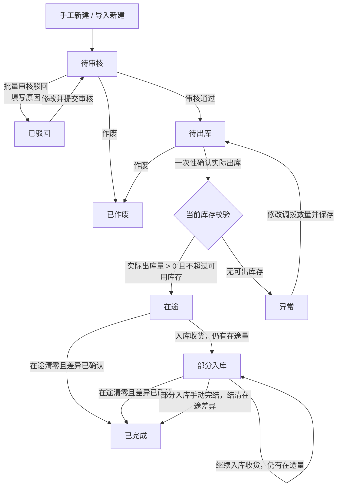
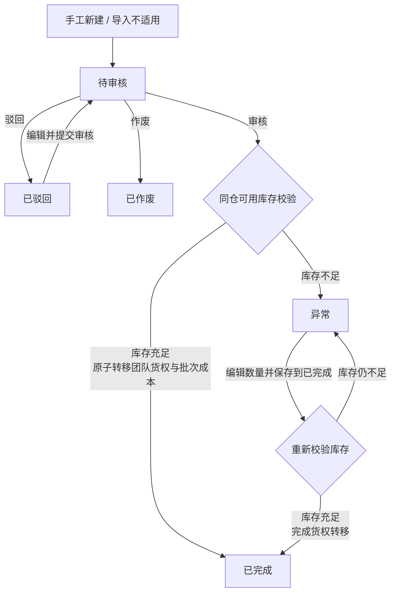

# 调拨单全流程管理 PRD

> 本文件沉淀当前已确认的调拨单方案；“待确认”内容不作为研发实现依据。

## 一、需求背景与目标

### 1.1 背景

现有跨仓移货依赖线下表格与人工库存调整，无法完整记录谁发起、谁审核、实际发出多少、到货多少、运输中剩余多少及费用归属。发生一次性出库少于申请量、分批入库、短少或破损时，库存位置和差异责任难以追溯。

### 1.2 目标

1. 以调拨单承接跨仓实物迁移及同仓团队货权转移，形成统一业务入口。
2. 分别记录申请、实际出库、实际入库、在途和差异数量。
3. 支持审核、出库、入库与异常处理的状态闭环。
4. 支持调拨运费、其他费用、明细调拨金额及调拨总金额查看。
5. 为一次性实际出库、库存流水、批次与库龄继承提供明确的业务口径。
6. 保留操作人、时间、理由与前后数据，满足库存对账和审计追溯。

---

## 二、需求收益

| 收益维度 | 具体收益 |
|---|---|
| 库存准确性 | 记录实际出库、在途、入库及同仓货权转移，保证库存与归属可追溯。 |
| 履约效率 | 仓库、物流和运营围绕同一张单据协作。 |
| 异常可控 | 记录出入库差异，支持短少、破损等异常闭环。 |
| 成本可见 | 汇总 SKU 调拨成本、运费和其他费用。 |
| 审计与责任追溯 | 关键操作保留操作人、时间和日志。 |

---

## 三、业务流程

### 3.1 主流程图

#### 3.1.1 仓间调拨流程

#### 3.1.2 货权调拨流程

### 3.2 库存流转口径

调拨分为“仓间调拨”和“货权调拨”两类，均使用同一张调拨单，但库存动作、字段和状态分支不同。

| 基础口径 | 规则 |
|---|---|
| 库存维度 | `SKU + 仓库 + 团队/货主`；库存校验和扣减均按此维度执行。 |
| 库存状态 | 仅使用在库量、在途量；本方案不引入库存锁定或在库待发量。 |
| 可用库存 | 当前库存服务返回的可用在库量。 |
| 扣减顺序 | 确认出库时，按该维度下的库存批次先进先出扣减。 |
| 仓间调拨 | 货物发生跨仓物理移动；调入后继承调出团队/货主，不改变货权归属。 |
| 货权调拨 | 货物不发生空间移动；在同一仓库内将库存从调出团队/货主原子转移给调入团队/货主，批次与成本快照随数量转移。 |

#### 3.2.1 仓间调拨库存流转表

| 动作 | 触发条件 | 扣减什么 | 增加什么 | 数据流向 | 数量口径与状态结果 |
|---|---|---|---|---|---|
| 新建、导入新建 | 保存或提交调拨单 | — | — | 仅创建单据 | 不产生库存变化，单据进入待审核。 |
| 审核驳回、待审核作废 | 单据未通过审核或在待审核状态作废 | — | — | 不发生库存流转 | 不产生库存变化。 |
| 审核通过 | 单据基础信息、SKU 和调拨数量校验通过 | — | — | 仅改变单据状态 | 不扣减库存、不锁定库存，单据进入待出库。 |
| 确认出库 | 待出库状态，一次性填写实际出库数量 | 调出仓在库量 | 调入仓在途量 | 调出仓 → 调入仓在途 | 实际出库数量必须大于 0，且不超过 `申请调拨数量` 和确认时的实际可用库存；可以小于申请数量，差额记录为未出库差异，本单不再支持第二次出库。按 FIFO 扣减批次。 |
| 入库收货 | 在途或部分入库状态 | 调入仓在途量 | 调入仓在库量 | 调入仓在途 → 调入仓在库 | 累计入库数量不得超过累计实际出库数量；入库完成后若仍有未入库在途量则保持部分入库，全部在途清零且差异已确认后完成。 |
| 待出库作废 | 待出库状态作废 | — | — | 不发生库存流转 | 单据作废后不可继续出库。 |
| 手动完结：在途差异 | 部分入库状态下，剩余在途货物短少、破损、丢失等无法收货 | 调入仓在途量 | — | 调入仓在途 → 差异结清 | 仅处理当前剩余在途数量；不恢复调出仓库存，必须记录差异原因、数量和处理说明。在途状态不提供手动完结入口。 |
| 手动完结：完成判定 | 在途差异已结清，且未出库差异已记录 | — | — | 仅结清本单在途余额 | 手动完结只展示和处理“在途差异数量”，不处理未出库差异；在途清零后进入已完成。 |
| 已出库后取消或退回 | 已发生实际出库，用户反悔不再需要调拨 | — | — | 继续完成原单入库 | 原单不允许直接作废或撤销；先完成原调拨入库，再新建调入仓 → 调出仓的反向调拨单。本期不做在途撤销、物流拦截或原单冲销。 |

#### 3.2.2 货权调拨库存口径

货权调拨仅允许同一物理仓库内的团队/货主之间转移库存。它不创建在途量、物流记录，也不触发预计到仓和库龄重新计算。

| 节点 | 库存与成本动作 | 单据状态 |
|---|---|---|
| 新建 / 编辑 | 仅校验“所在仓库 + 调出团队 + SKU”的可用库存，并选择调入团队；不产生库存变化。 | 待审核 |
| 审核通过 | 在单个库存事务内，按 FIFO 扣减调出团队的在库批次，同时向调入团队写入相同批次标识、原始库龄来源、成本价与分摊数量；总量和仓库位置不变。 | 已完成 |
| 审核库存不足 | 不发生任何转移；记录不足 SKU、申请量和可用量。 | 异常 |
| 异常编辑保存 | 异常状态下调整调拨数量等异常处理字段，点击“保存到已完成”。 | 保存时重新校验调出团队可用库存；校验通过后在同一库存事务内完成团队货权、批次来源和成本快照转移，进入已完成；仍不足则保持异常，不触发二次审核。 |
| 驳回 / 待审核作废 | 不发生库存变化。 | 已驳回 / 已作废 |

货权调拨的明细转出数量和转入数量必须相等，且等于已审核完成的调拨数量。系统必须为该动作写入成对的团队库存流水，并使用同一幂等键保证重复提交不会重复转移。

#### 3.2.3 并发、幂等与追溯

| 控制项 | 规则 |
|---|---|
| 原子提交 | 确认出库、入库收货、货权转移和差异结清必须由库存服务原子提交，页面不得直接修改库存余额。确认出库时必须在同一事务内重新读取并扣减可用库存。 |
| 并发控制 | 不使用库存锁定；多个单据同时出库时，以库存服务原子扣减结果为准，后提交单据只能按当时剩余库存实际出库，不能超卖。 |
| 幂等控制 | 每次库存操作使用唯一幂等键，例如“调拨单号 + 明细行 + 操作类型”；重复提交不得重复扣减、入库或结清差异。 |
| 追溯信息 | 每个节点记录库存余额变动、出入库/差异流水、来源批次、操作人、操作时间和关联调拨单号。 |
| 结清校验 | 单据完成的必要条件是：本单据每个明细的在途量为 0，且数量关系满足 `申请数量 = 累计已出库数量 + 未出库差异数量`、`累计已出库数量 = 累计已入库数量 + 已确认在途差异数量`。 |

#### 3.2.4 库龄继承规则

**业务背景**：跨仓调拨需要明确“库存年龄是否因换仓而重置”。若没有该规则，老库存可在每次调拨后被按调入日期重新计龄，造成库龄报表失真、呆滞库存被掩盖，并可能破坏临期预警和 FIFO/FEFO 的出库顺序。

| 选择 | 适用业务场景 | 调入仓处理规则 | 业务作用 |
|---|---|---|---|
| 继承库龄 | 仅发生物理搬运、货物身份没有变化：总仓与区域仓调拨、仓库搬迁、库区调整、委外仓与自营仓之间移货，以及未发生重新质检、返工、重包装或重新入库的场景。 | 调入库存必须按实际出库批次逐批建立在库记录，保留原始入库日期、批次号、生产日期、效期等库龄来源字段；不得合并为一条重新计龄的库存。 | 保持库存真实年龄，确保 FIFO/FEFO、呆滞分析和临期预警不因调拨被“洗白”。 |
| 不继承库龄 | 调入仓业务上被视为重新入库：退货重新验收、返工/翻新/重包装后重新入库、质检隔离库存转合格库存且制度规定以放行日重新计龄、特殊业务仓按新规则建档，或历史批次信息不可信。 | 调入仓以实际收货完成时间作为新的库龄起算点；但仍须保留原始来源批次、原库龄来源、关联调拨单和操作记录，保证可追溯。 | 使新的库存生命周期与重新验收、加工或业务制度一致。 |

**多批次扣减与继承示例**：调拨 100 个 SKU，调出仓按 FIFO 从批次 A 扣减 40 个、批次 B 扣减 60 个。选择“继承库龄”时，调入仓必须接收两条库存批次记录：`批次 A / 40 个 / 原库龄起算日` 与 `批次 B / 60 个 / 原库龄起算日`；不得计算平均库龄，也不得将 100 个统一按调入日期重新计龄。

**系统控制规则**：

1. “是否继承库龄”默认值为“是”。
2. 仅当业务明确属于重新入库场景时允许选择“否”。系统记录该字段的选择结果与选择人、选择时间，但不要求填写原因。
3. 单据审核通过后不得直接变更该字段；如确需修改，应先按库存冲销/逆向调拨规则处理已发生库存，再重新发起或重新审核单据。
4. 无论选择“是”或“否”，库存流水均必须记录来源批次、调拨单号、出库批次分摊数量和调入批次标识。

## 四、状态与业务规则

### 4.1 当前状态机

| 状态 | 含义 | 可执行操作 | 下一状态 |
|---|---|---|---|
| 待审核 | 新建或编辑后等待审核 | 编辑、单条作废、审核、作废、日志 | 仓间调拨：待出库 / 已驳回 / 已作废；货权调拨：已完成 / 已驳回 / 已作废 / 异常 |
| 待出库 | 审核通过，等待一次性确认实际出库 | 确认出库、作废、日志 | 在途 / 异常 / 已作废 |
| 在途 | 已完成一次实际出库，存在尚未收货的在途量；不允许再次确认出库 | 入库收货、日志 | 部分入库 / 已完成 |
| 部分入库 | 已部分收货，仍存在调入仓在途量；不允许再次确认出库 | 入库收货、手动完结、日志 | 部分入库 / 已完成 |
| 已完成 | 在途量已清零，未出库差异和在途差异均已记录或结清 | 日志 | 终态 |
| 已驳回 | 审核未通过 | 编辑、日志 | 待审核 |
| 已作废 | 未履约单据已取消 | 编辑、日志 | 待审核 |
| 异常 | 仓间调拨确认出库时无可用库存，或货权调拨审核时库存不足 | 编辑、日志 | 仓间调拨：待出库；货权调拨：已完成（保存时库存仍不足则继续保持异常） |

### 4.2 状态规则

1. 新建和导入新建后直接进入“待审核”；当前页面不提供草稿保存。
2. 批量审核只允许选择“待审核”状态的单据。
3. 审核通过时，仓间调拨只校验单据和明细数据，不扣减、不锁定库存，直接进入待出库；货权调拨需在同一库存事务内校验并完成团队库存、成本和批次来源转移。库存不足不影响仓间调拨进入待出库，实际库存校验在一次性确认出库时执行。
4. 待审核、已驳回、已作废单据均通过同一个编辑弹窗编辑，提交后进入“待审核”；已驳回单据需保留此前驳回意见与审核日志。异常单也复用同一个编辑弹窗：仓间调拨异常编辑保存并校验通过后直接进入“待出库”；货权调拨异常编辑主按钮为“保存到已完成”，保存时重新校验库存，校验通过后直接完成货权转移，仍不足则继续保持“异常”；两类异常编辑均不再提交审核或触发二次审批。
5. 待审核、待出库单据允许作废；已出库后不允许直接作废。
6. 确认出库是一次性动作。系统在提交时重新读取调出仓当前可用库存，实际出库数量必须大于 0，且不超过申请数量和当前可用库存；实际出库少于申请数量时记录未出库差异，本单不再支持第二次出库。按 FIFO 扣减调出仓在库量，并增加调入仓在途量。
7. 入库收货支持多次操作，但每次累计入库数量不得超过累计实际出库数量。收货后仍有在途量时保持“部分入库”；在途量清零且差异已确认后进入“已完成”。
8. 手动完结仅适用于部分入库状态，仅处理剩余在途数量的短少、破损、丢失等差异；在途状态不展示手动完结按钮。必须填写差异处理原因和说明，不处理未出库差异。所有处理均写入操作日志和库存流水。
9. 审核通过后，“是否继承库龄”属于库存口径字段，不允许直接修改；选择“不继承库龄”不要求填写原因。
10. 新建/编辑调拨单时，SKU 明细“调拨金额”按当前 FIFO 批次成本预估；确认出库后，系统必须按最终实际扣减批次重新计算并固化。多批次成本必须逐批相乘后汇总，不允许使用 SKU 单一均价替代。

### 4.3 作废、冲销与反向调拨边界

| 场景 | 处理方式 |
|---|---|
| 待审核、待出库 | 可直接作废；不发生库存扣减。 |
| 已出库、未入库 | 不允许直接作废或撤销；继续完成原调拨入库，完成后新建调入仓 → 调出仓的反向调拨单。本期不做在途撤销或物流拦截。 |
| 已部分入库 | 继续完成原调拨剩余入库；原单完成后，按实际已入库数量新建调入仓 → 调出仓的反向调拨单。本期不在原单上增加撤销状态。 |
| 已完成 | 不允许删除或直接撤销原单；需创建与原单关联的反向调拨单。 |

> 本期不做原单撤销、在途退回或物流拦截；反向调拨沿用新建调拨单流程，原单关联、专用入口和审批规则后续再补充。

---

## 五、角色与权限

| 角色 | 查看权限 | 操作权限 | 数据范围 | 备注 |
|---|---|---|---|---|
| 创建人 | 查看本人创建的单据 | 新建、导入、编辑待审核/已驳回/已作废/异常单据、提交审核 | 本人及被授权仓库 | 查询区创建人筛选默认不选中任何账号，避免无意缩小查询结果；用户可按需多选。 |
| 审核人 | 查看待审核单据及详情 | 审核通过、批量驳回 | 被授权组织/仓库 | 驳回必须填写原因；是否允许创建人自审待确认。 |
| 调出仓操作人 | 查看本人负责调出仓的待出库单据 | 一次性确认出库、填写物流信息 | 调出仓 | 应在提交时重新校验实际可用库存。 |
| 调入仓操作人 | 查看本人负责调入仓的在途单据 | 入库收货 | 调入仓 | 应校验累计入库不超过在途。 |
| 库存管理员 | 查看所有授权单据、日志、差异 | 异常处理、手动完结、库存对账辅助 | 全部授权仓库 | 手动完结需要记录原因和处理备注。 |
| 管理员 | 全部 | 查询、导出及角色配置 | 全部 | 不应绕过关键库存留痕。 |

### 5.1 页面按钮权限矩阵

页面按钮必须同时满足“功能权限”和“数据权限”。无功能权限时不展示按钮；有功能权限但不满足当前状态或仓库数据范围时，按钮置灰并提示原因。权限校验以后端为准，前端仅负责展示控制。

| 页面按钮 / 入口 | 建议权限编码 | 可操作状态 / 范围 | 关键控制 |
|---|---|---|---|
| 新建调拨单 | `transfer.create` | 用户有权限的调出仓范围 | 创建仓间调拨或货权调拨；提交前校验字段和 SKU。 |
| 导入新建 | `transfer.import` | 仅允许导入仓间调拨，且用户有对应调出仓权限 | 文件校验、按单据头分组、组内 SKU 合并、重复库存维度汇总校验、仓库和团队数据权限校验。 |
| 导出 | `transfer.export` | 当前用户可见的数据范围 | 导出结果不得超出仓库、组织和成本字段权限。 |
| 审核 | `transfer.audit` | 待审核单据，且审核人有对应组织/仓库权限 | 批量操作只能处理待审核单据；创建人自审规则待确认。 |
| 作废 | `transfer.void` | 待审核、待出库单据，且用户有单据所属仓库权限 | 作废后不可继续履约，且不发生库存扣减。 |
| 编辑 | `transfer.edit` | 待审核、已驳回、已作废、异常单据 | 待审核/已驳回/已作废编辑后提交审核；仓间调拨异常编辑保存到待出库，货权调拨异常编辑保存到已完成，均不再触发二次审核，并记录变更前后值。 |
| 确认出库 | `transfer.outbound` | 待出库单据，用户有调出仓操作权限 | 仅允许一次；后端原子校验并扣减实际可用库存。 |
| 入库收货 | `transfer.inbound` | 在途、部分入库单据，用户有调入仓操作权限 | 累计入库不得超过累计实际出库。 |
| 手动完结 | `transfer.complete` | 仅部分入库单据，库存管理员或被授权角色 | 仅结清在途差异，必须填写原因和说明；在途状态不展示该按钮。 |
| 操作日志 | `transfer.log.read` | 用户对单据有查看权限 | 日志追加写入，不得删除或覆盖。 |

---

## 六、功能需求

| 功能模块 | 功能说明 | 关键规则 |
|---|---|---|
| 查询与状态筛选 | 支持按调拨单号/物流单号、SKU/产品名称、调出仓、调入仓、调出团队、物流渠道、创建人、是否有入库差异、创建时间查询。 | 创建人筛选默认不选中任何账号，表示不限制创建人；“是否有入库差异”枚举为“是/否”，默认不限制；“是”仅匹配已完成且入库差异数量不为 0 的单据，“否”匹配其余单据；开始和结束日期必须成对填写，开始时间不得晚于结束时间。 |
| 列表与展开明细 | 一级列表展示调拨单核心信息；展开后展示 SKU 明细。 | 一级列表单号可点击查看详情；不在操作列重复放置“查看”。二级列表支持横向滚动，前 4 列固定。 |
| 新建调拨单 | 选择“仓间调拨”或“货权调拨”，录入基础信息与多个 SKU 明细，提交后进入待审核。 | 两类调拨均保持同一套表单布局。切换调拨类型时，无论当前是否已有明细，均直接清空已选 SKU 明细，避免将不适用的仓库、团队和数量带入另一种业务；仓间调拨的调出/调入仓由用户填写且不可相同，是否继承库龄默认“是”；货权调拨的调出仓由用户填写、调入仓自动同步为调出仓并置灰，预计到仓、库龄继承、物流及费用字段保留原位置但置灰；货权调拨每行调入团队不得等于调出团队；至少 1 个 SKU；点击“添加 SKU”时先校验基础必填项，缺项不打开选品弹窗，并在对应字段下方显示红色提示；数量为大于 0 的整数且不超过可用量。 |
| 导入新建 | 通过模板批量导入仓间调拨明细，并按规则拆分、合并生成一张或多张调拨单。 | 当前导入仅支持仓间调拨；按“调出仓库 + 调入仓库 + 预计到仓 + 是否继承库龄 + 物流渠道 + 物流单号 + 运费 + 其他费用”分组；同组内按“SKU + 调出团队 + 调入团队 + SKU备注”合并明细并累加数量，SKU备注不同则保留为独立明细；按“SKU + 调出仓库 + 调出团队”汇总校验可用库存；一份文件可生成多张待审核调拨单，预览展示预计生成的单据数和 SKU 明细行数；任意行校验失败则整份文件不可提交且不创建部分单据；导入预校验不产生库存占用，确认出库时仍需原子复核。 |
| 编辑调拨单 | 待审核、已驳回、已作废、异常状态均提供“编辑”，且复用同一个编辑调拨单弹窗。 | 待审核、已驳回、已作废编辑后提交审核；仓间调拨异常编辑弹窗右下角主按钮文案为“保存到待出库”，保存并校验通过后直接流转待出库；货权调拨异常编辑弹窗主按钮文案为“保存到已完成”，保存时重新校验库存，校验通过后直接完成货权转移；两类异常编辑均不再触发二次审核。异常编辑仅允许修改调拨数量等异常处理字段；数量增加须重新校验可用量。 |
| 审核 | 列表顶部提供绿色“审核”按钮。 | 仅待审核单据可勾选审核；通过意见可空，驳回原因必填。审核弹窗复用统一审核弹窗规范。 |
| 作废 | 列表顶部提供红色“作废”按钮。 | 当前允许待审核、待出库状态作废；作废后不可继续履约，且不发生库存扣减。 |
| 确认出库 | 按 SKU 一次性填写实际出库数量与物流信息。 | 物流渠道和物流单号必须同时填写或同时为空；实际出库数量必须大于 0，且不超过申请数量和确认时的实际可用库存；实际少于申请数量时记录未出库差异，本单不再支持第二次出库。 |
| 入库收货 | 按 SKU 填写本次实际入库数量，支持多次入库。 | 累计入库数量不得超过累计实际出库数量；未收足时保持部分入库。 |
| 手动完结 | 对部分入库单据未入库的在途数量进行差异结清。 | 仅部分入库状态提供入口；仅展示和处理在途差异数量；必须填写差异处理原因和说明，并记录操作人。未出库数量不通过手动完结处理，而是在一次性确认出库时记录为未出库差异。 |
| 详情与日志 | 单号点击展示只读详情；日志独立弹窗查看。 | 详情无输入框、无底部操作按钮，仅保留关闭入口。日志按钮统一灰色，并固定为操作列最后一个按钮。 |
| 导出 | 按当前查询条件导出调拨单明细。 | 采用“一行一个 SKU”的明细导出方式；导出当前查询结果，不受当前分页限制；单据头字段在同一调拨单的多行中重复展示；导出内容必须遵守仓库、组织和成本字段权限。 |

---

## 七、页面与交互说明

### 7.1 一级列表

| 列 | 展示内容 | 交互说明 |
|---|---|---|
| 勾选框 | 单据选择 | 支持当前页全选；审核、作废使用。 |
| 展开 | 统一展开三角图标 | 展开/收起 SKU 二级列表。 |
| 调拨单号 | 单号 + 同行状态标签 | 点击单号打开只读详情；单号与状态标签不可换行分离。 |
| 调拨方向 | 调出仓 → 调入仓 | 当前页面使用纵向箭头样式展示。 |
| 调拨进度 | 出库数量、入库数量、在途数量、入库差异数量 | 入库差异数量仅在已完成状态统计，其他状态展示 `—`；字段和值均不加粗，不附加数量单位。 |
| 费用信息 | 运费、其他费用、调拨总金额 | 金额保留 `¥` 符号。调拨总金额 = `Σ 明细调拨金额 + 运费 + 其他费用`。 |
| 物流信息 | 物流渠道、物流单号、预计到仓 | 物流渠道和物流单号同时为空时均展示 `—`。 |
| 备注 | 单据备注 | 是否允许在列表直接编辑待确认；建议仅详情/修改弹窗编辑并记录日志。 |
| 出入库时间 | 出库时间、入库时间分行展示 | 两个时间均取该调拨单对应操作记录的最早时间；未发生对应操作时显示 `—`。表头右侧展示统一问号图标。 |
| 创建信息 | 创建人、创建时间 | 用于追溯。 |
| 操作 | 依据状态显示操作链接 | 操作竖向排列；日志固定最后且使用灰色；作废使用红色。 |

固定列规则：勾选框、展开、调拨单号、调拨方向固定在左侧；操作列固定在右侧。固定列边缘复用采购单样式的轻量阴影，以清晰区分横向滚动区域。

“出入库时间”问号提示文案：

> 出入库时间表示该调拨单实际发生出库和入库的时间。 
> 出库时间取该单最早出库时间，入库时间取该单最早入库时间；未发生对应操作时显示“—”。

时间口径：出库时间从该单全部实际出库操作记录中取最早时间，入库时间从该单全部实际入库操作记录中取最早时间；时间仅用于列表展示和查询辅助，不改变状态流转或数量计算。

### 7.2 二级列表 / 调拨明细

一级、二级列表及详情明细均固定采用仓间调拨字段：SKU、产品名称、调出团队、调入团队、调拨数量、调拨金额、已出库数量、已入库数量、在途数量、入库差异数量、SKU 备注。“调拨金额”固定紧跟“调拨数量”展示，金额保留 `¥` 符号；不得因调拨类型而改变字段、表头或列顺序。入库差异数量右侧展示统一问号图标，说明其含义和计算公式。

货权调拨在这套固定字段中的展示口径：调拨方向为“调出仓库 → 调入仓库”（两者相同），运费/其他费用为 `¥0.00`，物流渠道/物流单号/预计到仓为 `—`，已出库数量、已入库数量、在途数量和入库差异数量均为 `0`。实际货权转移数量以调拨数量、调拨金额、调出团队和调入团队表达，单号下方的“货权调拨”类型标签负责区分业务含义。

二级列表支持横向滚动，前 4 列固定，不参与横向滚动。

### 7.3 详情弹窗

- 单击调拨单号进入只读详情。
- 顶部展示“调拨单详情”、单号及调拨方向；右上角提供关闭按钮。
- 基础信息采用同一行的“字段名：字段值”展示，不使用输入框、表格横竖线或底部操作日志区。
- 调拨明细字段与二级列表一致；表头颜色与一级列表表头一致。
- 调拨单号字段排在单据状态之前。

### 7.4 审核弹窗

审核弹窗统一使用全局审核规范：

- 标题：`审核调拨单`；副标题：`已选择 X 张待审核调拨单`。
- 不展示单据卡片、单号胶囊、调拨方向或数量汇总。
- 内容区为浅灰背景，内部为无彩色边框的白色“审核意见”卡片。
- 文本框 placeholder：`审核通过可留空，驳回时请填写原因`，最多 500 字。
- 底部按钮顺序固定为：取消、驳回、通过；驳回红色、通过绿色。

### 7.5 导入弹窗

- 标题：`导入新建调拨单`。
- 三步骤：下载模板 → 选择文件 → 确认导入。
- 弹窗尺寸复用发货单导入弹窗，不使用过大的近全屏尺寸。
- 下载模板说明区展示模板填写规则和下载按钮；上传区支持点击选择和拖拽上传。
- 支持 `.xls`、`.xlsx`、`.csv`；提交时自动校验并提示具体错误。
- 文件校验通过后，预览区展示预计生成的调拨单数量和 SKU 明细行数；调拨单按单据头字段分组，并按文件中各分组首次出现的顺序生成。
- 任意一行校验失败时，确认导入按钮不可用并提示行号、字段和失败原因；整份文件不得创建部分调拨单。

### 7.6 导出字段与口径

导出采用“一行一个 SKU”的明细模式。同一调拨单包含多个 SKU 时，单据字段在每个 SKU 明细行中重复展示；导出范围为当前查询条件下的全部结果，不受当前分页限制。

| 顺序 | 字段 | 字段层级 | 导出口径 |
|---:|---|---|---|
| 1 | 调拨单号 | 单据 | 系统生成的调拨单号。 |
| 2 | 单据状态 | 单据 | 当前单据状态。 |
| 3 | 调拨类型 | 单据 | 仓间调拨 / 货权调拨。 |
| 4 | 调出仓库 | 单据 | 仓间调拨的调出仓；货权调拨为所在仓库。 |
| 5 | 调入仓库 | 单据 | 仓间调拨的调入仓；货权调拨与调出仓相同。 |
| 6 | 预计到仓 | 单据 | 预计到仓日期；不适用时导出 `—`。 |
| 7 | 是否继承库龄 | 单据 | 是 / 否；货权调拨不适用时按页面口径导出 `—`。 |
| 8 | 物流渠道 | 单据 | 物流渠道；无值或货权调拨导出 `—`。 |
| 9 | 物流单号 | 单据 | 物流单号；无值或货权调拨导出 `—`。 |
| 10 | 运费 | 单据 | 单据运费，保留金额格式。 |
| 11 | 其他费用 | 单据 | 单据其他费用，保留金额格式。 |
| 12 | 调拨总金额 | 单据 | `Σ 明细调拨金额 + 运费 + 其他费用`。 |
| 13 | 调拨备注 | 单据 | 单据级备注。 |
| 14 | 出库时间 | 单据 | 取该调拨单实际出库操作记录的最早时间；未发生时导出 `—`。 |
| 15 | 入库时间 | 单据 | 取该调拨单实际入库操作记录的最早时间；未发生时导出 `—`。 |
| 16 | 创建人 | 单据 | 创建该调拨单的用户。 |
| 17 | 创建时间 | 单据 | 调拨单创建时间。 |
| 18 | SKU | SKU 明细 | 当前明细的 SKU 编码。 |
| 19 | 产品名称 | SKU 明细 | SKU 对应的产品名称。 |
| 20 | 调出团队 | SKU 明细 | 当前明细的调出团队。 |
| 21 | 调入团队 | SKU 明细 | 当前明细的调入团队。 |
| 22 | 调拨数量 | SKU 明细 | 当前明细申请的调拨数量。 |
| 23 | 调拨金额 | SKU 明细 | 当前明细调拨金额，按批次成本分摊后汇总。 |
| 24 | 已出库数量 | SKU 明细 | 当前明细累计实际出库数量。 |
| 25 | 已入库数量 | SKU 明细 | 当前明细累计实际入库数量。 |
| 26 | 在途数量 | SKU 明细 | 当前明细剩余在途数量。 |
| 27 | 入库差异数量 | SKU 明细 | 仅已完成状态统计，公式为 `累计入库数量 − 累计出库数量`；其他状态导出 `—`。 |
| 28 | SKU 备注 | SKU 明细 | 当前明细备注。 |

导出不包含“未出库差异数量”和“更新时间”字段。导出文件格式、文件命名和最大导出量沿用平台导出规范；若用户无成本字段权限，调拨金额和调拨总金额按权限策略脱敏或不导出。

---

## 八、数据与字段规则

### 8.1 调拨单头字段

| 字段 | 类型 | 必填 | 规则 / 口径 |
|---|---|---|---|
| 调拨单号 | 系统生成 | 是 | 规则：`TF + YYMMDD + 4位顺序号`，例如 `TF2609280001`；顺序号每天从 `0001` 重新开始。 |
| 调拨类型 | 枚举 | 是 | `仓间调拨`或`货权调拨`；创建时选择，单据创建后不得变更。一级列表在单号下方展示类型。 |
| 调出仓库 | 仓库 | 是 | 两类调拨均填写，必须为已启用的物理仓库。 |
| 调入仓库 | 仓库 | 是 | 仓间调拨由用户填写，且不可与调出仓库相同；货权调拨保留字段原位置但置灰，由系统自动同步为调出仓库，不允许编辑。 |
| 预计到仓 | 日期 | 条件必填 | 仓间调拨可填写，推荐格式 `YYYY-MM-DD`；展示名称统一为“预计到仓”。货权调拨保留字段原位置但置灰，不允许填写。 |
| 是否继承库龄 | 是/否 | 条件必填 | 仓间调拨填写，默认“是”。选择“是”时按实际出库批次逐批继承原始库龄来源；选择“否”时以调入仓实际收货完成时间重新起算库龄，无需填写原因。详见 3.2.4。货权调拨保留字段原位置但置灰，不允许填写，批次库龄随货权直接转移。 |
| 物流渠道 | 文本/枚举 | 条件必填 | 仓间调拨可填写，与物流单号成对填写；无值展示 `—`。新建/编辑及确认出库中的下拉组件均支持“＋ 新增渠道”，新增后应立即选中并作为共享枚举保留。货权调拨保留字段原位置但置灰，不允许填写，列表固定展示 `—`。 |
| 物流单号 | 文本 | 条件必填 | 仓间调拨可填写，与物流渠道成对填写；无值展示 `—`。货权调拨保留字段原位置但置灰，不允许填写，列表固定展示 `—`。 |
| 运费 | 金额 | 条件必填 | 仓间调拨可填写，大于等于 0，最多两位小数，展示保留 `¥`；货权调拨保留字段原位置但置灰，不允许填写，金额为 `0`。 |
| 其他费用 | 金额 | 条件必填 | 仓间调拨可填写，大于等于 0，最多两位小数，展示保留 `¥`；货权调拨保留字段原位置但置灰，不允许填写，金额为 `0`。 |
| 调拨总金额 | 金额 | 系统计算 | 单据级金额：`Σ 明细调拨金额 + 运费 + 其他费用`。明细级金额按实际/预估批次成本分摊计算，详见 8.2。 |
| 调拨备注 | 文本 | 否 | 最多 500 字。 |
| 创建人 / 创建时间 | 系统字段 | 是 | 创建时写入。 |
| 更新时间 | 系统字段 | 是 | 每次影响业务数据的操作后更新。 |

### 8.2 调拨 SKU 明细字段

| 字段 | 必填 | 规则 / 口径 |
|---|---|---|
| SKU | 是 | “添加调拨 SKU”弹窗仅展示当前调出仓有可用库存的 SKU；未选择调出仓时不可打开选品弹窗。切换调出仓时，已选明细必须清空后重新选择。 |
| 产品名称 | 系统带出 | 由 SKU 主数据带出。 |
| 调出团队 | 是 | 从库存归属带出，是库存校验维度之一。 |
| 调入团队 | 是 | 仓间调拨添加 SKU 时，系统默认自动带入与该行调出团队相同的团队，用户可按业务需要修改；货权调拨必填，且不可与调出团队相同。 |
| 调拨数量 | 是 | 大于 0 的整数，不超过可用量。 |
| 调拨金额 | 系统计算 | 紧跟“调拨数量”展示，只读、保留 `¥`。按最终实际出库扣减的批次成本计算并固化；新建时可展示预估金额，不得按单一 SKU 均价或平均成本替代。 |
| 已出库数量 | 系统累计 | 仓间调拨仅允许一次确认出库，记录本次实际出库数量；该数量可以小于申请调拨数量。货权调拨固定展示为 `0`。 |
| 未出库差异数量 | 系统计算 | `申请调拨数量 - 实际出库数量`；在一次性确认出库时记录，表示因库存不足等原因未能出库的数量，不产生库存扣减，也不支持再次出库。 |
| 已入库数量 | 系统累计 | 仓间调拨记录各次确认入库数量之和，累计不得超过已出库数量；货权调拨固定展示为 `0`。 |
| 在途数量 | 系统计算 | `已出库数量 - 已入库数量 - 已确认在途差异数量`；货权调拨固定展示为 `0`。 |
| 入库差异数量 | 系统计算 | 仅在单据已完成状态统计，计算公式为 `累计入库数量 − 累计出库数量`；入库少于出库时以负数展示，其他状态展示 `—`。 |
| 货权转移完成数量 | 隐藏系统字段 | 仅货权调拨使用，库存校验通过并完成货权转移后等于调拨数量，用于库存流水、批次成本追溯和审计；不在固定列表与详情明细中替代仓间调拨字段。 |
| SKU 备注 | 否 | 单 SKU 备注，最多 120 字。 |
| 批次库存成本价 / 成本分摊快照 | 系统字段 | 每个实际扣减批次保留批次标识、分摊数量、库存成本价及金额；用于固化调拨金额、目标库存批次成本和审计追溯。 |

### 8.3 导入模板字段及顺序

| 顺序 | 字段 | 必填 | 第二行填写说明 |
|---:|---|---|---|
| 1 | SKU | 是 | 填写有效 SKU；SKU 必须存在且在调出仓、调出团队下有可用库存。相同库存维度重复出现时，系统按合计数量校验，不得超出可用库存。 |
| 2 | 调出仓库 | 是 | 填写系统已启用的调出仓库名称。 |
| 3 | 调入仓库 | 是 | 填写系统已启用的调入仓库名称，不能与调出仓库相同。 |
| 4 | 调出团队 | 是 | 填写 SKU 当前所属团队，必须与库存归属一致。 |
| 5 | 调入团队 | 是 | 填写本次调拨的目标团队。 |
| 6 | 调拨数量 | 是 | 填写大于 0 的整数；同一单据头分组内按“SKU + 调出仓库 + 调出团队”汇总数量，不得超过确认导入时的可用库存。 |
| 7 | 预计到仓 | 否 | 填写日期，格式 `YYYY-MM-DD`。 |
| 8 | 是否继承库龄 | 是 | 只能填写“是”或“否”。 |
| 9 | 物流渠道 | 否 | 填写物流渠道名称；如填写物流单号，本字段必须同时填写。 |
| 10 | 物流单号 | 否 | 填写物流单号；如填写物流渠道，本字段必须同时填写。 |
| 11 | 运费 | 否 | 填写大于等于 0 的数字，最多两位小数。 |
| 12 | 其他费用 | 否 | 填写大于等于 0 的数字，最多两位小数。 |
| 13 | SKU备注 | 否 | 填写当前 SKU 的备注，最多 120 个字符。 |

导入规则：

1. 一份文件可以生成一张或多张调拨单。系统先将空值和“—”统一视为空，运费、其他费用空值统一按 0 处理，再按“调出仓库、调入仓库、预计到仓、是否继承库龄、物流渠道、物流单号、运费、其他费用”组成的单据头字段分组。只要上述任一字段不同，就自动拆分为不同调拨单，不因组间字段不同阻断整份文件导入。
2. 同一单据头分组内，只有“SKU、调出团队、调入团队、SKU备注”全部一致时才合并为一条明细，合并时仅累加调拨数量；SKU备注不同的行不得合并，须保留为独立明细，避免覆盖备注内容。
3. 库存校验仍按“SKU + 调出仓库 + 调出团队”汇总，不受调入团队是否不同影响；同组内不同调入团队消耗同一库存时，必须合计校验，不能通过拆分明细绕过库存限制。
4. 按各分组在文件中的首次出现顺序生成调拨单，并在预览中展示预计生成的调拨单数量和 SKU 明细行数。任意一行校验失败，整份文件均不可提交，不创建部分调拨单。
5. 导入完成只创建待审核单据，不锁定或占用库存；多个待审核/待出库单据可能同时通过预校验，最终以确认出库时库存服务的原子扣减结果为准。

---

## 九、异常与边界场景

| 场景 | 系统处理 | 用户提示 / 留痕 |
|---|---|---|
| 仓间调拨的调出仓与调入仓相同 | 阻止提交和导入。 | 提示“调入仓库不能与调出仓库相同”。 |
| 货权调拨的调入团队与调出团队相同 | 阻止提交。 | 提示“货权调拨的调入团队不能与调出团队相同”。 |
| 货权调拨的物流、预计到仓或库龄继承 | 保留字段原位置但置灰，不允许填写；接口按不适用值处理。 | 物流与预计到仓展示 `—`，费用为 `0`。 |
| 无 SKU 明细 | 阻止提交。 | 提示至少添加一个 SKU。 |
| 数量非法 | 阻止提交。 | 提示数量须为大于 0 的整数且不超过可用量。 |
| 确认出库时可用库存少于申请数量 | 允许一次性按实际库存出库，但实际出库数量不得大于当前可用库存；不足部分不再支持第二次出库。 | 自动记录申请数量、实际出库数量、未出库差异数量和确认时库存快照。 |
| 确认出库时无可用库存 | 仓间调拨阻止确认出库并进入异常；异常编辑数量并校验通过后直接回到待出库，不需要二次审核。 | 提示当前无可用库存，并记录校验结果；不得产生库存扣减或在途量。 |
| 货权调拨审核时库存不足 | 不发生货权转移并进入异常；异常编辑后点击“保存到已完成”，系统重新校验库存，校验通过后直接完成货权转移，仍不足则继续保持异常。 | 记录不足 SKU、申请量、可用量及保存时的库存校验结果；不触发二次审核。 |
| 已审核或已发生库存流转后修改库龄继承方式 | 阻止直接修改。 | 提示“库龄继承方式已生效，请通过冲销/逆向调拨后重新发起”。 |
| 物流渠道与单号仅填一项 | 阻止保存/导入/出库。 | 提示两项需同时填写。 |
| 无物流信息 | 允许保存，渠道和单号均展示 `—`。 | 后续是否允许在途补录物流待确认。 |
| 入库数量大于在途 | 阻止收货。 | 提示不能超过该 SKU 当前在途量。 |
| 导入同一库存维度重复 SKU | 按“SKU + 调出仓库 + 调出团队”汇总后校验；合计数量超过可用库存时阻止整批导入。 | 提示重复维度、合计申请量、可用库存和超出数量。 |
| 导入文件包含多组单据头字段 | 按单据头字段分组，自动生成多张待审核调拨单，不因组间字段不同阻止导入；每组内再按 SKU、团队和备注合并明细。 | 预览展示预计生成的调拨单数量和 SKU 明细行数，并按文件中首次出现顺序生成单据。 |
| 导入 SKU 不属于调出仓或团队 | 阻止导入。 | 提示具体行号、SKU、调出仓库和调出团队。 |
| 驳回未填原因 | 阻止驳回。 | 审核意见输入框显示必填错误。 |
| 批量操作混入非目标状态 | 阻止整批操作。 | 提示仅支持对应状态的单据。 |
| 重复提交 / 网络失败 | 服务端以单据版本、操作幂等键处理。 | 提示操作结果，失败不应产生半笔库存流水。 |
| 已出库后请求作废 | 阻止直接作废。 | 提示需先完成原单入库，再新建反向调拨单。 |

---

## 十、数据、审计与合规要求

### 10.1 库存与金额口径

1. 调拨单涉及库存位置变化，在库量、在途量、批次和成本变动必须可追溯。
2. 调拨总金额和明细调拨金额仅作为调拨成本展示口径，不代表采购应付、供应商结算或开票金额。
3. 运费和其他费用应保留原始录入值、修改记录、币种及后续分摊结果；当前默认币种为 CNY，展示使用 `¥`。
4. 费用、数量、状态和库存变更不得通过覆盖历史数据的方式修改；应保留事件或流水记录。

### 10.2 操作日志

每张调拨单至少记录：

- 创建、导入、修改、提交审核、审核通过、审核驳回、作废；
- 确认出库、入库收货、补录/变更物流、手动完结、异常编辑；
- 操作人、操作时间、操作类型、操作原因、修改前值、修改后值；
- 关联库存流水号、关联来源单据号及后续反向调拨单号。

日志应为追加式记录，普通用户不可删除或覆盖。

### 10.3 数据权限

- 查询、导出、审核、出库、入库均受仓库和组织数据权限控制。
- 用户不具备调出仓或调入仓权限时，不应看到或操作相应单据。
- 权限不足时不返回敏感库存数量、成本金额和其他团队数据。

---

## 十一、验收标准摘要

1. 新建单据号符合 `TF + YYMMDD + 4位日顺序号`，每日从 `0001` 重新计数。
2. 支持仓间调拨和货权调拨；调拨类型创建后不可变更。仓间调拨的调出仓与调入仓不能相同；货权调拨的调入仓自动同步为调出仓并置灰，调入团队不得等于调出团队。
3. 切换调拨类型时清空已选 SKU；添加 SKU 前校验对应必填字段，缺项显示红色边框和就地提示；选品弹窗只展示调出仓有可用库存的 SKU，仓间调拨的调入团队默认等于调出团队。
4. 两级列表和详情使用固定字段；二级列表支持横向滚动且前 4 列固定，货权调拨不改变表头，仅按既定口径展示。
5. 新建和导入进入待审核；待审核、已驳回、已作废、异常均使用同一编辑弹窗。仓间异常保存到待出库，货权异常保存到已完成；异常处理不触发二次审核。
6. 审核、作废、出库、入库和手动完结只能在规定状态执行；已出库单据不可直接作废，在途不显示手动完结；审核驳回必须填写原因，日志按钮统一灰色、作废按钮为红色。
7. 仓间调拨确认出库仅允许一次，实际出库量不得超过申请量和确认时可用库存；少于申请量时记录未出库差异且不能再次出库。累计入库不得超过累计出库，在途清零且差异已记录或结清后才完成。
8. 物流渠道与物流单号必须同时填写或同时为空；货权调拨不产生在途和物流记录。费用和调拨总金额按 PRD 规定的金额公式计算，明细金额按实际 FIFO 批次成本分摊。
9. 仓间调拨库龄继承默认“是”；按批次逐批继承或按实际收货时间重新起算，选择“不继承库龄”不要求填写原因。
10. 导入模板按第 8.3 节执行：按单据头字段分组生成一张或多张单据，组内按 SKU、团队和 SKU 备注合并数量，按“SKU + 调出仓库 + 调出团队”汇总库存校验；预览显示单据数和明细行数，任意行失败则整份拒绝且不生成部分单据。
11. 导出采用一行一个 SKU，字段和范围按第 7.6 节执行；出入库时间取对应操作记录的最早时间，未发生时展示 `—`。
12. 查询区创建人默认不选中；“是否有入库差异”提供“是/否”且默认不限制。审核、出库、入库、作废、手动完结、异常编辑和导入均产生追加式日志，并受仓库、组织和成本权限控制。
13. 货权调拨审核或异常保存时，在同一库存事务内完成团队货权、批次来源和成本快照的转移；库存总量和仓库位置不变且可审计。

---

## 十二、待确认问题

| 问题 | 为什么重要 | 影响范围 | 建议确认对象 |
|---|---|---|---|
| 是否恢复“草稿”状态？ | 当前页面新建即待审核，但版本规划中包含草稿。 | 新建、编辑、权限、状态流转。 | 产品 / 业务负责人 |
| 确认出库前是否允许补录或变更物流？ | 当前确认出库只发生一次，需要明确物流信息最晚填写节点。 | 出库弹窗、物流追踪、操作权限。 | 物流负责人 |
| 差异的正式分类与审批规则？ | 短少、破损、错货、多收的库存和成本处理不同。 | 手动完结、异常、库存、财务。 | 库存 / 财务 / 仓库负责人 |
| 未出库差异是否在确认出库时自动确认？ | 实际出库少于申请数量时，本单不再支持第二次出库，需要明确是否自动以“库存不足”结案，还是需要人工确认。 | 出库、完成判定、差异审批。 | 产品 / 仓库负责人 |
| 运费和其他费用是否需要分摊至调入批次成本？ | 当前仅展示单据费用；是否进入存货成本会影响目标批次成本和财务分析。 | 成本、库存、报表。 | 财务 / 成本负责人 |
| 是否允许在途状态补录或变更物流？ | 物流信息可能在出库后才取得。 | 操作权限、日志、物流追踪。 | 物流负责人 |
| 反向调拨单的字段与审批规则？ | 本期用户反悔时先完成原调拨，再新建反向调拨；不做原单在途撤销、物流拦截或冲销状态。 | 反向调拨、库存流水、审计。 | 库存 / 财务 / 业务负责人 |
| 是否允许创建人审核自己创建的单据？ | 影响审批独立性与审计风险。 | 权限、审核日志。 | 管理层 / 内控负责人 |

---
