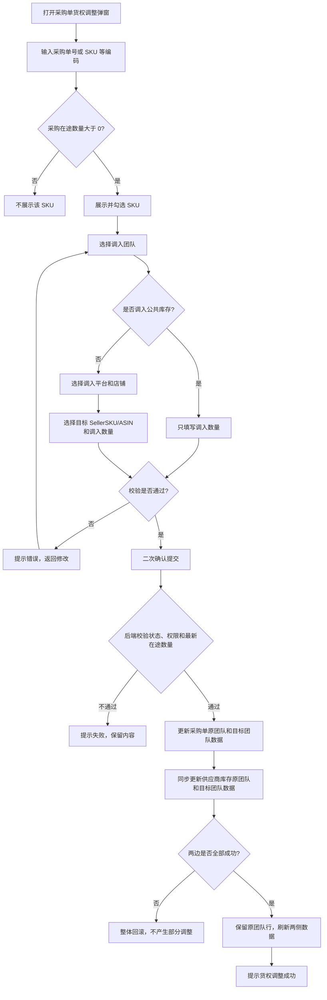

# 采购单（在途数量）货权调整弹窗 PRD

## 一、需求目标与范围

采购单下同一个 SKU 可能归属于不同团队。本功能用于将采购在途数量从原团队调整到目标团队。

本次只处理“采购在途数量货权”，不改变采购数量、仓库位置、采购价格，也不生成采购单或发货单。

数据更新范围：

```text
采购单在途数据 + 供应商库存团队在途数据
```

供应商库存页面本身不改版，只要求调整后能展示同步后的数据。

## 二、弹窗交互

### 2.1 入口与整体布局

- 沿用采购单页面现有“货权调整”入口，不新增页面。
- 弹窗标题：`采购单（在途数量）货权调整`。
- 保留现有两步结构：`批量搜索 SKU` → `设置调入信息`。
- 底部保留：已选 SKU 数、调入总数、重置、取消、确认调整。

### 2.2 批量搜索

1. 支持按采购单号（易仓 / 领星 / 采购跟踪号）筛选。
2. 支持输入或粘贴多个 SKU、SellerSKU、ASIN。
3. 支持换行、空格、逗号、中文逗号、分号分隔。
4. 点击“查询”展示匹配结果，点击“清空”清除查询条件并保留当前调整明细。
5. 未匹配编码单独提示，不影响已匹配结果。

强限制：

> 只有采购在途数量大于 0 的 SKU 才能进入搜索结果和调整列表；在途数量为 0 的 SKU 不允许调整。

结果表至少展示：

| 字段 | 说明 |
|---|---|
| 来源 SKU / 品名 | 原始商品信息 |
| 采购单号 | 当前采购单 |
| 来源平台 / 店铺 / 团队 | 调整前货权 |
| 采购数 / 在途数 | 当前采购数据 |
| 可调整数 | 本次可调整上限，等于当前可用在途数量 |

### 2.3 设置调入信息

批量工具栏：

| 操作 | 规则 |
|---|---|
| 调入团队 | 第一步选择目标团队，必须选择；不能与来源团队相同 |
| 调入平台 | 调入其他团队时必填；调入公共库存时不适用 |
| 调入店铺 | 调入其他团队时必填，根据调入平台筛选；调入公共库存时不适用 |
| 应用到勾选 SKU | 将调入团队、平台和店铺应用到已勾选行；未勾选时不执行 |
| 按可调整数填充勾选行 | 将勾选行的调入数量填充为可调整数 |

明细行字段：

| 字段 | 规则 |
|---|---|
| 调入团队 | 目标团队；支持选择“公共库存” |
| 调入平台 / 店铺 | 调入其他团队时必填；调入公共库存时不适用 |
| 调入 SellerSKU / ASIN | 调入其他团队时必填，只能从系统枚举中选择 |
| 调入数量 | 正整数，不能超过来源团队当前在途数量 |
| 操作 | 移除当前行 |

分支规则：

- 调入团队选择“公共库存”时，平台、店铺和 SellerSKU / ASIN 自动显示“不适用”，不需要填写。
- 调入团队选择其他团队时，继续选择平台、店铺和 SellerSKU / ASIN。
- 调入团队、调入平台、调入店铺、SellerSKU / ASIN 下拉项均支持模糊搜索。
- 切换调入团队时，清空平台、店铺和 SellerSKU / ASIN。
- 切换调入平台时，清空店铺和 SellerSKU / ASIN。

### 2.4 提交

1. 点击“确认调整”后校验所有明细。
2. 校验通过后弹出二次确认，展示 SKU 数量和调入总数。
3. 确认提交后按钮 loading，禁止重复提交。
4. 二次确认内容根据调入团队动态展示：调入公共库存时只展示公共库存和数量；调入其他团队时展示团队、平台、店铺、SellerSKU/ASIN和数量。
5. 成功：更新采购单和供应商库存数据，提示成功，关闭弹窗并刷新采购单页面。
6. 失败：保留弹窗内容，提示原因并允许重试。

## 三、核心流程图



## 四、数据流转规则

### 4.1 采购单数据

数据定位沿用系统已有逻辑。调整数量为 `N` 时：

```text
采购单原团队在途 = 原团队在途 - N
采购单目标团队在途 = 目标团队在途 + N
```

- 目标团队已有该 SKU 数据：直接累加。
- 目标团队不存在该 SKU 数据：在同一采购单下新增该 SKU 的目标团队数据。
- 原团队在途扣减为 0：保留原团队数据行，数量更新为 0。
- 调入公共库存时，只记录公共库存团队和数量，不绑定平台、店铺、SellerSKU/ASIN。
- 调入其他团队时，同时记录目标团队、平台、店铺、SellerSKU/ASIN和数量。

### 4.2 供应商库存数据

采购单调整成功后，同步更新供应商库存中该 SKU 的团队在途数据：

```text
供应商库存原团队在途 = 原团队在途 - N
供应商库存目标团队在途 = 目标团队在途 + N
```

- 目标团队已有数据：累加在途数量。
- 目标团队不存在数据：新增该 SKU 的目标团队数据。
- 供应商库存页面不新增交互，只刷新后展示结果。
- 调入公共库存时，只记录公共库存团队和数量，不绑定平台、店铺、SellerSKU/ASIN。
- 调入其他团队时，同时记录目标团队、平台、店铺、SellerSKU/ASIN和数量。

### 4.3 一致性要求

- 采购单和供应商库存必须同时成功更新。
- 任一侧失败，整体回滚。
- 提交时以后端最新在途数量为准，避免并发超调。
- 原团队行即使数量变为 0，也不能被本功能删除。

## 五、校验与异常

| 场景 | 处理规则 |
|---|---|
| 在途数量为 0 | 不展示、不允许调整 |
| 调入数量为空、非整数或小于等于 0 | 阻止提交 |
| 调入数量超过来源团队在途数量 | 阻止提交并提示上限 |
| 目标团队与原团队相同 | 阻止提交 |
| 未选择调入团队 | 阻止提交并提示 |
| 调入其他团队但未选择平台 | 阻止提交并提示 |
| 调入其他团队但未选择店铺 | 阻止提交并提示 |
| 调入其他团队但未选择目标 SellerSKU/ASIN | 阻止提交并提示 |
| 调入公共库存却填写平台、店铺或 SellerSKU/ASIN | 清空或忽略这些不适用字段 |
| 未勾选 SKU | 不允许批量应用和提交 |
| 采购单状态不允许调整 | 禁止打开或提交 |
| 目标 SellerSKU/ASIN | 沿用现有 SKU 映射校验 |
| SKU 合并、数据定位 | 沿用系统已有逻辑 |
| 采购单或供应商库存同步失败 | 整体回滚并允许重试 |
| 重复点击提交 | loading + 接口幂等控制 |

## 六、权限与日志

- 用户只能调整权限范围内的采购单、SKU 和目标团队数据。
- 后端校验采购单状态、用户权限和最新在途数量。
- 沿用现有货权调整日志、调整单号和历史查询逻辑。

## 七、验收标准

- [ ] 弹窗只能搜索和展示采购在途数量大于 0 的 SKU。
- [ ] 支持采购单号、SKU、SellerSKU、ASIN 批量查询和多 SKU 勾选。
- [ ] 支持批量设置调入团队、平台、店铺，目标团队不再由平台自动带出。
- [ ] 调入团队支持模糊搜索，并允许选择公共库存。
- [ ] 调入公共库存时，平台、店铺、SellerSKU/ASIN显示为不适用。
- [ ] 调入其他团队时，平台、店铺、SellerSKU/ASIN均为必填。
- [ ] 调入团队不能与来源团队相同。
- [ ] 调入平台、店铺、SellerSKU/ASIN支持模糊搜索，SellerSKU/ASIN不允许自由录入。
- [ ] 调入数量不能超过来源团队当前在途数量。
- [ ] 原团队在途数量正确扣减，扣减为 0 后数据行仍保留。
- [ ] 目标团队已有数据时累加，不存在时新增 SKU 团队数据。
- [ ] 供应商库存原团队同步扣减，目标团队同步累加或新增。
- [ ] 采购单和供应商库存任一侧失败时，不产生部分调整结果。
- [ ] 提交成功后采购单页面刷新可看到最新数据，供应商库存页面刷新可看到同步结果。
- [ ] 供应商库存页面不新增或修改本次页面交互。

## 八、沿用的系统规则

以下内容已有系统逻辑，本次不重新设计：

- 目标团队、平台、店铺和 SellerSKU/ASIN 枚举规则；
- 采购单和供应商库存数据定位；
- 同一 SKU、目标团队的数据合并；
- 采购单与供应商库存的事务处理；
- 货权调整单号、日志和历史查询。

## 九、相关页面

- 采购单页面：`pages/purchase-orders/index.html`
- 货权调整逻辑：`pages/purchase-orders/ownership.js`
- 供应商库存页面：`pages/supplier-inventory/index.html`（本次不改页面）
- 旧版 PRD：`docs/货权调整弹窗批量SKU调整-PRD.md`
