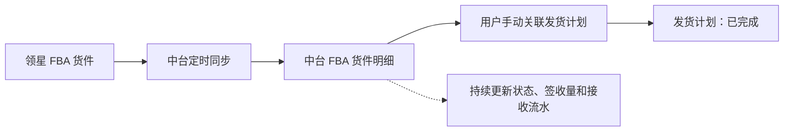

# 领星 FBA 货件对接 PRD

## 一、文档信息

| 项目 | 内容 |
|---|---|
| 需求名称 | 中台对接领星 FBA 货件 |
| PRD 版本 | 草稿版 |
| 适用模块 | 供应链中台：发货计划、FBA 货件、库存管理 |
| 涉及系统 | 供应链中台、领星、亚马逊 FBA |
| 本次定位 | 货件同步、发货计划关联、货件状态与接收数据同步 |

## 二、需求概述

### 2.1 需求背景

中台当前缺少领星侧 FBA 货件数据，发货计划无法与亚马逊实际入库货件建立对应关系。业务人员需要在领星与中台之间人工核对货件、目的 FBA 仓、申报数量和接收进度，无法在中台形成完整的计划执行链路。

### 2.2 需求目标

1. 从领星同步 FBA 货件、货件明细、状态及接收数据至中台。
2. 支持用户在中台 FBA 货件明细中，手动关联中台发货计划。
3. 关联成功后，将对应发货计划从「待发货」流转为「已完成」。
4. 通过 FBA 货件持续展示目的仓、申报量、签收量和差异，不把 FBA 后续履约状态混入发货计划状态。

### 2.3 本次范围

**本次处理：**

- 对接领星 FBA 货件列表、货件详情、FBA 到货接收明细接口；
- 中台存储并展示 FBA 货件及 SKU 明细；
- FBA 货件 SKU 明细手动关联中台发货计划；
- 支持解除关联，并将发货计划回退至「待发货」；
- 同步货件当前状态、申报量、累计签收量及接收流水。

**本次不处理：**

- 不在中台创建或修改 STA 任务；
- 不接入领星 FBA 发货单的配货、实际出库、头程费用和物流计划；
- 不在本次确定 FBA 实际接收后自动增加团队库存 / 平台仓库存的规则。

## 三、需求效益

| 维度 | 效益 |
|---|---|
| 计划执行 | 发货计划可关联到真实 FBA 货件，形成计划与实际入库目标的对应关系。 |
| 业务协同 | 在中台统一查看货件目的仓、申报量、签收量和状态，减少跨系统人工核对。 |
| 库存基础 | 为后续按 FBA 实际接收建立库存入账、在途核对和差异追溯提供数据基础。 |
| 风险控制 | 通过关联、解除关联和同步日志保留操作与数据来源，降低错关联和重复处理风险。 |

## 四、总体业务流程

| 步骤 | 操作角色 / 系统 | 处理内容 | 输出结果 |
|---|---|---|---|
| 1 | 领星 | 维护 STA 任务和 FBA 货件，亚马逊生成货件及后续状态。 | 领星存在 FBA 货件数据。 |
| 2 | 中台定时任务 | 调用「查询货件列表」拉取货件主数据及 SKU 明细。 | 中台新增或更新 FBA 货件。 |
| 3 | 业务用户 | 在 FBA 货件明细中，为指定货件 SKU 明细手动关联发货计划。 | 建立货件明细与发货计划关系。 |
| 4 | 中台 | 关联成功后回写发货计划状态。 | 发货计划「待发货 → 已完成」。 |
| 5 | 中台定时任务 | 持续同步货件状态、申报量、累计签收量及接收流水。 | FBA 货件展示当前履约和接收进度。 |
| 6 | 业务用户 | 关联错误或货件取消时解除关联。 | 解除关系，发货计划「已完成 → 待发货」。 |

### 4.1 总体业务流程图

### 4.2 状态边界

发货计划的「已完成」在 FBA 链路中，仅表示该计划已经关联领星 FBA 货件，计划层面的执行交接完成；不表示本地仓已出库、货物已发运、已送达 FBA 仓或亚马逊已签收。

货件发货、运输、接收、关闭、取消等后续履约信息，以领星同步的 FBA 货件状态及数量为准，后续状态变化不再驱动发货计划继续流转。

### 4.3 与原发货单逻辑的关系

普通发货链路原有规则继续保留：发货计划成功关联中台发货单后，发货计划执行完成（终态）。

FBA 链路为并行逻辑：发货计划成功关联领星 FBA 货件后，同样进入「已完成」。两种关联方式互不替代。

## 五、领星接口对接方案

### 5.1 查询货件列表

| 项目 | 说明 |
|---|---|
| 接口 | `POST /erp/sc/data/fba_report/shipmentList` |
| 对接目的 | 批量建立并更新中台 FBA 货件主数据，是中台同步的主入口。 |
| 调用时机 | 首次历史同步、日常定时增量同步、接口失败后的重试。具体历史范围与频率待确认。 |
| 查询方式 | 按店铺 `sid`、货件创建日期查询；支持货件号、状态、分页及修改日期条件。 |
| 中台处理 | 按货件号新增或更新货件头信息及 SKU 明细；更新状态、目的物流中心、申报量、累计签收量等当前快照。 |
| 主要用途 | FBA 货件列表展示、货件明细关联入口、状态与在途/签收快照。 |

**需同步的核心字段：**店铺、货件号、STA 任务标识 / 任务号、货件状态、物流中心编码、货件创建和状态时间、发货地址、目的地址、Reference ID、SKU / MSKU / FNSKU、申报量、初始申报量、累计签收量、关联发货计划号。

### 5.2 查询货件详情

| 项目 | 说明 |
|---|---|
| 接口 | `POST /amzStaServer/openapi/inbound-shipment/shipmentDetailList` |
| 对接目的 | 补齐指定 FBA 货件的 STA 专属详情，不作为批量同步主接口。 |
| 调用时机 | 用户打开货件详情时按需调用，或中台发现货件主数据缺少详情字段时补充调用。 |
| 查询方式 | 按店铺 ID + 货件单号查询，或按 STA 任务号 + 货件 ID 查询。 |
| 中台处理 | 补充货件发货/配送地址、入库区域、送达时间段、提货单号、追踪号、ASIN、父 ASIN、商品名称及图片等信息。 |
| 主要用途 | FBA 货件详情展示、人工核对与问题追溯。 |

### 5.3 查询 FBA 到货接收明细

| 项目 | 说明 |
|---|---|
| 接口 | `POST /erp/sc/data/fba_report/receivedInventory` |
| 对接目的 | 获取 FBA 仓每次实际接收或调整的明细流水，不能用货件列表的累计签收量替代。 |
| 调用时机 | 按店铺、签收日期定时拉取；也可按 FBA 货件号补拉。具体频率待确认。 |
| 中台处理 | 保存接收日期、货件号、SKU / FNSKU、物流中心、数量及唯一索引；同一货件商品多条接收记录按业务需要汇总。 |
| 主要用途 | 接收流水、按日接收量、数量调整追溯，以及后续库存入账的可用数据来源。 |

**接口关系说明：**

- 货件列表提供“截至当前累计签收量”的快照，用于货件列表、在途与签收进度展示。
- 到货接收明细提供“每次接收 / 调整”的流水；同一货件商品可能多条，数量可能为负数。
- 接收明细的货件与店铺归属，以货件列表中的货件主数据为准进行关联，不以接收明细返回的 `sid` 作为货件归属判断依据。

## 六、数据同步与数据规则

### 6.1 数据来源与主数据口径

| 数据对象 | 数据来源 | 中台使用口径 |
|---|---|---|
| FBA 货件、状态、目的物流中心、申报量、累计签收量 | 领星「查询货件列表」 | 以领星同步结果为准。 |
| 货件详情、地址、预约、追踪等 | 领星「查询货件详情」 | 按需补充展示与核对。 |
| FBA 每次到货接收 / 调整记录 | 领星「查询 FBA 到货接收明细」 | 以流水记录为准，不直接覆盖历史流水。 |
| 发货计划及其状态 | 中台 | 以中台发货计划数据为准。 |
| 货件与发货计划关联关系 | 中台 | 由用户手动操作创建、解除，并保留操作日志。 |

### 6.2 中台关联数据

中台需保存以下关联维度：

| 对象 | 关键字段 |
|---|---|
| FBA 货件 | 店铺 ID、货件号、STA 任务号、物流中心编码、货件状态 |
| FBA 货件 SKU 明细 | 货件号、SKU、MSKU、FNSKU、申报量、累计签收量 |
| 发货计划 | 发货计划号、SKU、计划数量、平台、店铺、团队、发货仓、目的仓、状态 |
| 关联记录 | 货件号、货件 SKU 明细标识、发货计划号、关联数量、关联状态、关联/解除操作人及时间 |
| 接收流水 | 货件号、SKU / FNSKU、接收日期、物流中心、数量、`unique_md5 + unique_index` |

### 6.3 幂等与重复处理

1. 货件主数据以店铺 + 货件号作为业务识别依据，重复拉取时新增或更新，不重复创建。
2. 接收流水以 `unique_md5 + unique_index` 作为去重依据；同一流水重复拉取不得重复入账或重复展示。
3. 接口失败、分页中断或重试时，不得改变已成功关联的发货计划状态。
4. 同步到已取消、已关闭货件时更新货件状态；是否自动解除已有关联，见待确认问题。

## 七、功能需求

### 7.1 FBA 货件列表与详情

1. 中台展示从领星同步的 FBA 货件及 SKU 明细。
2. 货件列表 / 明细至少展示货件号、店铺、物流中心编码、货件状态、SKU / MSKU / FNSKU、申报量、已发货量、签收量和现有差异字段。
3. 用户进入 FBA 货件明细后，可在货件 SKU 明细行发起「关联发货计划」操作。
4. 货件详情可按需查询并展示地址、入库区域、送达时间段、提货单号、追踪号及商品信息。

### 7.2 关联发货计划

| 项目 | 规则 |
|---|---|
| 关联入口 | FBA 货件明细的 SKU 行操作入口。 |
| 操作方式 | 用户手动选择并关联中台发货计划。 |
| 关联粒度 | 一个发货计划仅包含一个 SKU；一条 FBA 货件 SKU 明细允许关联多个发货计划。 |
| 可选计划 | 仅展示状态为「待发货」的发货计划；具体数量、店铺、平台、SKU 校验规则待确认。 |
| 关联成功 | 创建关联记录；对应发货计划状态从「待发货」变为「已完成」。 |
| 状态含义 | 计划已落实为 FBA 货件，不代表真实出库、运输或 FBA 签收。 |
| 后续状态 | 货件后续状态、签收量变化仅更新 FBA 货件数据，不改变发货计划状态。 |

### 7.3 解除关联

| 项目 | 规则 |
|---|---|
| 适用场景 | 用户关联错误，或 FBA 货件已取消。 |
| 操作结果 | 解除货件 SKU 明细与发货计划的关联关系。 |
| 状态回退 | 对应发货计划从「已完成」回退至「待发货」。 |
| 日志 | 必须记录解除操作人、时间、货件号、计划号、解除原因、原状态与新状态。 |
| 限制 | 已存在签收量时是否允许解除关联，待确认。 |

### 7.4 数量与差异展示

1. 中台展示货件申报量、已发货量、签收量，以及现有申发差异、收发差异等字段。
2. 申报量与累计签收量不一致时，仅使用差异字段展示，不在本次自动调账。
3. 接收流水出现负数调整时，保存并展示原始流水；不在本次定义自动调整团队库存 / 平台仓库存。

## 八、状态与日志规则

### 8.1 发货计划关联与解除关联状态图

### 8.2 发货计划状态流转

| 触发事件 | 原状态 | 新状态 | 说明 |
|---|---|---|---|
| FBA 货件关联发货计划成功 | 待发货 | 已完成 | 表示发货计划已完成向 FBA 货件的执行交接。 |
| 用户解除关联 / FBA 货件取消后解除关联 | 已完成 | 待发货 | 释放发货计划，允许重新关联。 |
| FBA 货件状态变更、签收量变更 | 已完成 | 已完成 | 仅更新货件履约数据，不改变发货计划状态。 |

### 8.3 操作与同步日志

| 日志类型 | 至少记录内容 |
|---|---|
| 关联日志 | 操作人、操作时间、货件号、SKU 明细、发货计划号、关联数量、原状态、新状态。 |
| 解除关联日志 | 操作人、操作时间、货件号、SKU 明细、发货计划号、解除原因、原状态、新状态。 |
| 同步日志 | 接口名称、请求范围、开始/结束时间、成功/失败数量、失败原因、重试结果。 |

## 九、异常与边界场景

| 场景 | 系统处理 |
|---|---|
| 领星接口调用失败 | 保留中台上一次成功同步数据；记录同步日志并支持任务重试；不改变发货计划状态。 |
| 同一货件重复同步 | 按货件业务标识更新，不重复创建货件和明细。 |
| 同一接收流水重复拉取 | 按接收流水唯一索引去重，不重复处理。 |
| 无可关联发货计划 | 不自动创建或自动关联，仅提示无符合条件的「待发货」计划。 |
| FBA 货件取消 | 更新货件状态；用户可发起解除关联，是否自动解除待确认。 |
| 申报、发货、签收数量不一致 | 展示现有差异字段，不在本次自动调账。 |
| 接收数量为负数 | 保存接收调整流水，不在本次自动调整库存。 |
| 已有签收量后解除关联 | 规则待确认，默认不在本 PRD 中定义自动库存回滚。 |

## 十、系统影响

| 系统 / 模块 | 影响内容 | 本次是否处理 |
|---|---|---|
| 中台 FBA 货件 | 新增领星货件同步、详情展示、计划关联与解除关联。 | 是 |
| 中台发货计划 | 增加 FBA 货件关联关系和「待发货 ↔ 已完成」状态回写。 | 是 |
| 中台库存 | 接收数据作为后续库存处理的数据来源；自动入账规则待确认。 | 部分 |
| 领星 | 仅读取开放接口数据，不回写领星。 | 是 |
| 中台发货单 | 普通发货计划关联发货单逻辑继续保留。 | 不改动 |

## 十一、验收标准摘要

1. 可按店铺与时间范围从领星分页同步 FBA 货件；重复同步不产生重复货件或明细。
2. 中台 FBA 货件可展示货件号、状态、目的物流中心、SKU / MSKU / FNSKU、申报量、签收量及差异字段。
3. 用户可在 FBA 货件 SKU 明细中选择多个「待发货」发货计划并完成关联。
4. 关联成功后，每个被关联发货计划状态由「待发货」变为「已完成」，并生成关联日志。
5. 解除关联后，对应发货计划由「已完成」回退至「待发货」，并生成解除日志。
6. FBA 货件状态和累计签收量变化后，中台更新货件数据，但不改变已完成的发货计划状态。
7. 可拉取并保存 FBA 到货接收明细；重复拉取同一接收流水不重复处理。
8. 申报、发货、签收数量不一致或出现负数接收调整时，系统展示现有差异字段 / 原始流水，不自动调账。
9. 接口失败或同步重试不改变已关联发货计划的状态；同步日志可追溯失败原因和结果。

## 十二、待确认问题

| 问题 | 为什么重要 | 影响范围 | 建议确认对象 |
|---|---|---|---|
| 一个发货计划是否允许关联多张 FBA 货件？ | 亚马逊可能将同一 SKU 的计划数量拆至多个货件；将影响关联记录的基数及计划状态回退规则。 | 关联逻辑、数量校验、解除关联、状态流转 | 供应链业务、研发 |
| 关联时需要校验哪些字段和数量？ | 需确定店铺、平台、SKU、目的仓、计划数量与申报量的校验方式，以及不一致时阻断还是仅展示差异。 | 候选计划范围、关联弹窗、差异处理 | 供应链业务、研发 |
| 已有签收量的 FBA 货件是否允许解除关联？ | 会影响历史接收归属、库存追溯与异常处理。 | 解除关联、库存、日志 | 供应链业务、库存负责人 |
| FBA 实际接收后是否自动增加团队库存 / 平台仓库存？ | 需明确入账仓库、团队、货权、数量口径及负数调整的处理方式。 | 库存、货权、接收明细 | 供应链业务、库存负责人 |
| 首次同步历史范围、日常同步频率及修改数据回补窗口是什么？ | 影响接口调用量、数据完整性及旧货件状态更新。 | 定时任务、运维 | 业务、研发 |
| 已关闭、已取消货件是否持续同步？是否自动解除关联？ | 影响历史完整性、计划状态和异常处理。 | 同步、解除关联 | 供应链业务、研发 |
| 哪些角色可查看、关联、解除关联、查看接收流水和重试同步？ | 需防止无权限人员改动计划关联关系。 | 权限、页面操作 | 业务负责人、管理员 |
| 接收日期采用领星当地日期还是统一中台日期？ | 会影响按日收货统计及后续库存入账日期。 | 接收明细、报表、库存 | 供应链业务、数据负责人 |

## 十三、接口参考

- [领星：查询货件列表](https://apidoc.lingxing.com/#/docs/FBA/FBAShipmentList)
- [领星：查询货件详情](https://apidoc.lingxing.com/#/docs/FBA/ShipmentDetailList)
- [领星：查询 FBA 到货接收明细](https://apidoc.lingxing.com/#/docs/FBA/FBAReceivedInventory)
