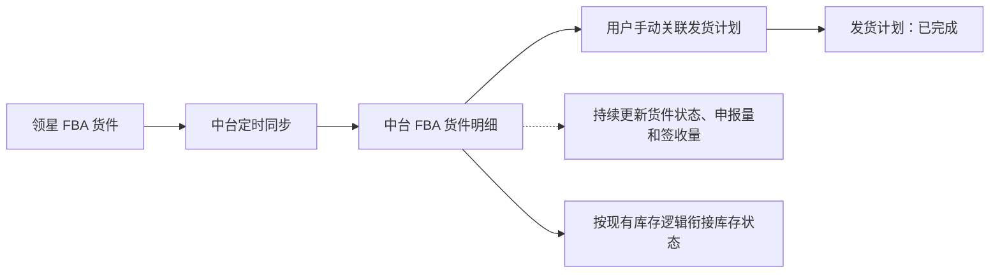
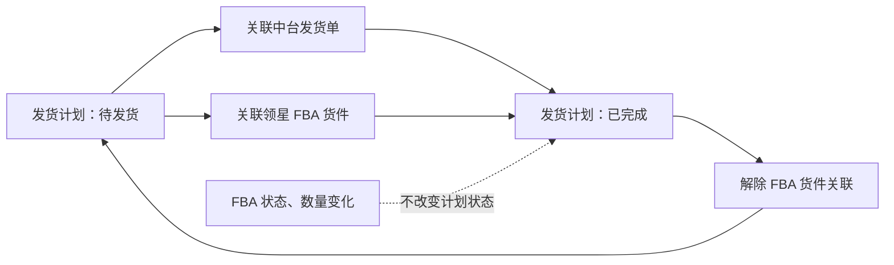

# 领星 FBA 货件对接 PRD

## 一、需求概述

### 1.1 需求背景

中台当前**缺领星侧 FBA 货件数据**，业务需要在两边人工核对货件、目的仓、申报量、接收进度，无法建立"中台发货计划 — 亚马逊 FBA 货件"的一一对应关系。本方案通过领星接口同步 FBA 货件，并在 FBA 货件 SKU 明细上**手动关联中台发货计划**，补齐计划执行与单据追溯链路。

### 1.2 需求目标

1. 同步领星 FBA 货件、状态、数量及签收快照至中台。
2. 按 SKU 明细手动关联 FBA 货件与中台发货计划，建立“发货计划—FBA 货件”的追溯关系。
3. 对照计划发货数量与 FBA 申报量、签收量，展示申收差异；具体数量校验规则待确认。
4. 关联成功后，发货计划由「待发货」变为「已完成」；支持按关联状态查看 SKU，并对已关联 SKU 取消关联。
5. 关联粒度为 FBA 货件 SKU 明细，一条 SKU 明细最多关联一个发货计划，本期不支持批量关联。
6. 关联后限制发货计划作废和生成采购计划；关联动作本身不直接产生库存变化。
7. 本期按 FBA 货件签收量在中台计算并联动库存：初始化写入静态在库与在途，日常同步按签收量增目的仓(FBA)在库、减在途，新拉货件减发货仓；不拉 FBA 实时库存，关联 / 解除关联不触库存，本期不纠错（下版本做实时库存查询页 + 月末对账）。具体规则见 5.5。
8. FBA 货件 Tab 支持按货件、发货计划、SKU、店铺、国家、物流中心、Reference ID、关联状态和创建时间进行组合查询。

### 1.3 本次范围

**本次处理：**

- 对接 FBA 货件列表；
- 存储展示 FBA 货件 / SKU、状态、数量及签收快照；
- 支持 FBA 货件 Tab 多条件组合查询、重置和分页查看；
- 支持按 SKU 关联、解除关联和关联状态筛选；
- 展示计划数量、FBA 数量及差异，按现有库存逻辑衔接库存流转。

**本次不处理：**

- 不在中台创建或修改 STA 任务；
- 不新增库存流转规则，具体触发节点、目标团队、目标仓库和货权口径沿用现有逻辑，未明确部分列入待确认。

## 二、需求效益

| 维度 | 效益 |
|---|---|
| 计划执行 | 发货计划可关联到真实 FBA 货件，形成计划与实际入库目标的对应关系。 |
| 数据追溯 | 建立中台发货计划与亚马逊 FBA 货件之间的对应关系，便于定位实际入库目标。 |
| 数量核对 | 支持对比计划发货数量与 FBA 申报量，及时发现计划与实际货件之间的数量差异。 |
| 业务协同 | 统一查看货件、目的仓、签收量和状态，减少跨系统核对。 |
| 库存基础 | 为本地仓扣减、头程在途、FBA 接收及后续库存入账提供数据基础。 |

## 三、总体业务流程

- 发货计划「已完成」**仅表示**已关联 FBA 货件、计划层面执行交接完成，不代表本地已出库、已发运或亚马逊已签收；货件信息以领星同步数据为准，后续状态变化不驱动发货计划继续流转。
- 原有"发货计划 → 中台发货单"链路保留；FBA 链路与其并行，互不替代。

## 四、领星接口对接方案

### 4.1 查询货件列表

| 项目 | 说明 |
|---|---|
| 接口 | `POST /erp/sc/data/fba_report/shipmentList` |
| 对接目的 | 批量建立并更新中台 FBA 货件主数据，是中台同步的主入口。 |
| 调用时机 | 首次历史同步、日常定时增量同步、接口失败后的重试。具体历史范围与频率待确认。 |
| 查询方式 | 按店铺 `sid`、货件创建日期查询；支持货件号、状态、分页及修改日期条件。 |
| 中台处理 | 按货件号新增或更新货件头信息及 SKU 明细；更新状态、目的物流中心、申报量、累计签收量等当前快照。 |
| 主要用途 | FBA 货件列表展示、货件明细关联入口、状态与在途/签收快照。 |

**需同步的核心字段：**店铺、货件号、STA 任务标识 / 任务号、货件状态、物流中心编码、货件创建和状态时间、发货地址、目的地址、Reference ID、SKU / MSKU / FNSKU、申报量、初始申报量、累计签收量、关联发货计划号。

> **备注：** 货件接口返回的「物流中心编码」即 FBA 官方仓的收货仓编码，库存流转中 FBA 目的仓（收货仓）由此字段确定，无需额外维护收货仓字段。

### 4.2 幂等与重复处理

1. 货件主数据以店铺 + 货件号作为业务识别依据，重复拉取时新增或更新，不重复创建。
2. 接口失败、分页中断或重试时，不得改变已成功关联的发货计划状态，也不得重复触发库存流转。
3. 同步到已取消、已关闭、已删除或已放弃货件时更新货件状态；不自动解除已有的关联关系。

## 五、功能需求

### 5.1 FBA 货件列表

1. 中台展示从领星同步的 FBA 货件及 SKU 明细。
2. 货件列表 / 明细至少展示货件号、店铺、物流中心编码、货件状态、SKU / MSKU / FNSKU、申报量、签收量和现有差异字段。
3. 用户进入 FBA 货件明细后，可在货件 SKU 明细行发起「关联发货计划」操作。

#### 查询功能

FBA 货件 Tab 查询区按“货件主信息 + SKU 明细信息 + 关联信息”提供组合筛选。货件状态、货件号、店铺、国家、物流中心编码、Reference ID 和创建时间按货件主信息筛选；发货计划号、SKU、领星 SKU、FNSKU、ASIN 和关联状态按 SKU 明细筛选。查询结果仍按货件分组展示，货件下展示符合条件的 SKU 明细。

| 序号 | 查询项 | 控件 | 默认值 | 查询规则 |
|---|---|---|---|---|
| 1 | 货件状态 | 单选下拉 | 全部 | 可选：已取消、已登记、已关闭、已删除、已送达、运输中、接收中、已发货；选择后立即刷新结果并回到第 1 页。 |
| 2 | 货件单号 | 多值文本输入 | 空 | 支持多个值，精确匹配；支持逗号、中文逗号、空格、分号、中文分号和换行分隔。 |
| 3 | 发货计划号 | 多值文本输入 | 空 | 支持多个值，精确匹配；匹配当前 SKU 明细的发货计划号及已关联的发货计划号。 |
| 4 | SKU | 多值文本输入 | 空 | 支持多个值，精确匹配 SKU。 |
| 5 | 领星 SKU | 多值文本输入 | 空 | 支持多个值，精确匹配领星 SKU。 |
| 6 | FNSKU | 多值文本输入 | 空 | 支持多个值，精确匹配 FNSKU。 |
| 7 | ASIN | 多值文本输入 | 空 | 支持多个值，精确匹配 ASIN。 |
| 8 | 店铺 | 多选下拉 | 不选择 | 支持下拉内搜索和多选；按货件所属店铺精确匹配。 |
| 9 | 国家 | 多选下拉 | 不选择 | 支持下拉内搜索和多选；按货件所属国家精确匹配。 |
| 10 | 物流中心编码 | 多值文本输入 | 空 | 支持多个值，精确匹配物流中心编码。 |
| 11 | Reference ID | 多值文本输入 | 空 | 支持多个值，精确匹配 Reference ID。 |
| 12 | 关联状态 | 单选下拉 | 未关联 | 可选：全部、未关联、已关联；按 SKU 明细是否存在有效发货计划关联进行筛选。 |
| 13 | 创建时间 | 开始日期＋结束日期 | 空 | 按货件创建日期筛选；开始日期和结束日期均可单独填写，分别表示大于等于开始日期、小于等于结束日期。 |

查询交互规则遵循中台统一约定：不同查询项为 AND，同一多值查询项为 OR；文本查询按回车或点击「查询」触发；重置回到默认状态（货件状态=全部 / 关联状态=未关联 / 第 1 页）；条件不影响发货计划 Tab。

### 5.2 关联发货计划

| 项目 | 规则 |
|---|---|
| 关联入口 | FBA 货件明细的 SKU 行操作入口。 |
| 操作方式 | 用户手动选择并关联中台发货计划。 |
| 关联粒度 | 一个发货计划仅包含一个 SKU；一条 FBA 货件 SKU 明细最多关联一个发货计划，本期不支持批量关联。 |
| 默认候选范围（缩小范围） | 打开「关联发货计划」弹窗后，候选发货计划**必须同时满足**：状态 =「待发货」**且** SKU = 当前 FBA 货件 SKU **且** FNSKU = 当前 FBA 货件 FNSKU **且** 店铺 = 当前 FBA 货件所属店铺；三者精确匹配（SKU / FNSKU 大小写不敏感）。三项任一为空或无法一致时对应维度不参与过滤，但仍必须满足「待发货」。弹窗上方「默认匹配：SKU — FNSKU — 店铺 — 状态：待发货」显示当前用于缩小范围的条件，仅用于展示，不参与实际过滤逻辑。 |
| 候选查询与重置 | 查询区字段保持不变：**发货计划号、SKU、FNSKU**（均支持多值精确匹配，含 查询 / 重置 按钮）；用户在默认缩小范围的基础上可继续叠加条件进一步缩小候选；**重置只清空用户在查询区输入的条件，不会回到所有计划**，重置后仍按默认 SKU / FNSKU / 店铺范围展示候选。 |
| 可选计划 | 仅展示状态为「待发货」、且已被默认候选范围 + 用户查询条件命中的发货计划；用户从候选列表中单选一条计划完成关联。具体数量校验规则待确认。 |
| 关联成功 | 创建关联记录；对应发货计划状态从「待发货」变为「已完成」；**后台自动生成发货单用于库存流转**（页面不展示，仅用于后端库存计算）。 |
| 状态含义 | 计划已落实为 FBA 货件，不代表真实出库、运输或 FBA 签收。 |
| 关联状态查询 | 枚举为「全部、未关联、已关联」，默认选择「未关联」。 |
| 关联状态展示 | 默认筛选「未关联」，只展示货件下未关联的 SKU；一个货件只要存在未关联 SKU，就展示该货件及其未关联 SKU，已关联 SKU 不展示。 |
| 已关联操作 | 筛选「已关联」或「全部」时，已关联 SKU 的操作列展示「取消关联」。 |
| 关联后的操作限制 | 只要存在有效的 FBA 货件关联记录，发货计划**不允许作废**、**不允许生成发货单**（含批量操作）；对应按钮置灰并提示「当前计划已关联 FBA 货件」。发货计划列表行内展示「已关联货件」标签，鼠标悬浮可查看关联详情。 |
| 后续状态 | 货件后续状态、申报量或签收量变化仅更新 FBA 货件数据，不改变发货计划状态。 |

#### FBA 货件状态与关联规则

本期不根据 FBA 货件状态限制关联。包括 `DELETED`（已删除）、`CANCELLED`（已取消）和 `ABANDONED`（已放弃）在内的所有货件状态，均允许用户按现有关联流程关联发货计划。

货件状态仅用于页面展示、查询和业务追踪；货件状态后续发生变化时，不自动解除已有的关联关系，也不改变已关联发货计划的状态。

### 5.3 解除关联

| 项目 | 规则 |
|---|---|
| 适用场景 | 用户关联错误，或需要人工解除已有的货件 SKU 与发货计划关联。 |
| 操作结果 | 解除货件 SKU 明细与发货计划的关联关系。 |
| 状态回退 | 对应发货计划从「已完成」回退至「待发货」。 |
| 操作入口 | 已关联 SKU 的操作列展示「取消关联」；本期按 SKU 单条操作，不支持批量取消关联。 |
| 二次确认 | 标题为「取消关联发货计划」；文案为「确定要取消当前 SKU「XXX」与发货计划「XXX」的关联吗？取消后，该 SKU 将恢复为未关联状态，可重新关联发货计划。」按钮为「取消」和「确认取消关联」。 |
| 操作限制恢复 | 仅当发货计划已解除全部有效 FBA 关联并回到「待发货」后，才恢复作废和生成采购计划操作。 |
| 限制 | 已存在签收量时是否允许解除关联，待确认。 |

> **说明（本期范围说明）：** FBA 货件 Tab 内「关联发货计划」保持保留；发货计划 Tab 侧的「关联货件」「导入关联 FBA 货件」「操作列日志」等入口**本次版本不提供**（UI 与逻辑已预留为隐藏开关状态，下一版本再启用），相关方案不纳入本 PRD。

### 5.4 数量与差异展示

1. 中台展示货件申报量、签收量，以及申收差异字段。
2. 差异字段按 FBA 货件 SKU 明细维度计算，具体口径如下：

| 字段 | 计算公式 | 业务含义 |
|---|---|---|
| 申收差异 | 申报量 - 签收量 | 亚马逊申报数量与 FBA 实际签收数量的差异。 |

3. 相关数量发生同步更新后，差异字段同步重新计算，计算结果保留正负号，不对负数做绝对值处理。
4. 差异字段仅用于展示和业务核对，本次不根据差异结果自动调账。
5. 签收量以货件列表返回的当前快照为准；本期不维护额外的历史签收流水。

### 5.5 库存流转逻辑

本期 FBA 货件**参与中台库存计算**，采用「中台自闭环计算、不拉实时库存、本期不纠错」的策略。库存变化由**货件签收量与货件拉取事件**驱动，与「关联 / 解除关联」动作解耦。库存扣减遵循**三级优先级**：① 细维度（SKU+仓库+团队+平台+店铺+SellerSKU，渠道专属货）→ ② 本团队通用货（SKU+仓库+团队，本团队共享）→ ③ 公共库存团队（SKU+仓库+公共库存团队，全团队兜底）。

> **备注：** 货件接口的「物流中心编码」即 FBA 官方仓的收货仓编码，库存流转中提及的「FBA 目的仓」「收货仓」均由此字段确定。

#### 5.5.1 总体原则

1. **不拉取 FBA 实时库存**：实时库存含订单退件 / 分拨件，与单据流计算口径不一致，本期不准。
2. **中台库存为自闭环计算值（派生计算，非流水累加）**：目的仓在库 = 初始化静态值 + 累计签收量；在途 = 初始在途 − 累计签收量。即使接口重复同步、状态反复变化也不会多加库存。
3. **关联 / 解除关联不触库存**：库存由签收量驱动，与关联状态无关；取消关联不回滚已加库存。
4. **本期不纠错**：中台库存与线下实际允许存在偏差，下版本通过「实时库存查询页 + 月末库存报表对账」收敛。
5. **三级扣减优先级**：库存扣减按①细维度（渠道专属货）→②本团队通用货（共享）→③公共库存团队（兜底）顺序执行，每级内按先进先出（FIFO）消耗，三级扣减在同一事务内完成。
6. **初始化不变动原则**：初始化时只导入静态库存和建立货件主数据，不扣发货仓、不加 FBA 在途（静态库存已包含在途量）；库存变动从日常同步签收开始。

#### 5.5.2 阶段 1：初始化（上线前一次性，初始化时间点待确认）

- **前置**：上线前在中台维护 **FBA 平台仓主数据**，并初始化两边**静态库存**——发货仓（本地 / 供应商仓）在库 + FBA 目的仓在库 + FBA 在途（静态值，已包含所有在途货件的待签收量）。
- 拉取**在途 / 待收货**货件，仅建立货件主数据用于展示和关联，标记为「历史在途」；**不扣发货仓、不加 FBA 在途**（静态库存已包含）。
- **历史已完成货件不拉**。
- 建议初始化窗口选在供应链不发货的日期（如周一周二），避免初始化与日常发货重叠导致漏扣 / 多扣。

#### 5.5.3 阶段 2：日常同步（每天 4 次：8 点 / 12 点 / 15 点 / 18 点 + 手动刷新按钮）

- 同步货件状态、签收量（接口全量覆盖，中台按「上次签收量」计算增量，保证幂等）。
- **签收量变化 → 目的仓(FBA)在库 += 签收增量，FBA 在途 -= 签收增量。** 签收增量从静态库存的 FBA 在途中扣减（历史在途货件）或从新货件新增的 FBA 在途中扣减。
- **新拉到的货件（初始化后首次拉取到的货件）→ 发货仓在库 -= 该货件发货数量（三级扣减），FBA 在途 += 货件发货数量。** 以初始化时间节点为界：初始化时拉到的货件标记为「历史在途」、不扣发货仓、不加 FBA 在途；初始化后首次拉取到的货件视为新建、扣发货仓、加 FBA 在途。
- **三级扣减顺序**：发货仓扣减时按①细维度（渠道专属货）→②本团队通用货（共享）→③公共库存团队（兜底）执行，每级内按 FIFO 消耗，三级在同一事务内完成。
- ⚠️ **发货仓字段缺口**：领星「查询货件列表」未返回「发货仓」字段，「新拉货件减发货仓」的来源待确认。

#### 5.5.4 阶段 3：订单（T-1）

- 订单售出 → 平台仓 / 海外仓库存 -= 销量（卖一个减一个），按三级扣减优先级执行。本期不纠错。

#### 5.5.5 库存流转表

当前系统暂不提供库存流水功能，本节只定义各库存位置的增减方向、数量口径和状态约束；开发实现时直接更新对应库存。

**库存扣减遵循三级优先级：** ① 细维度（SKU+仓库+团队+平台+店铺+SellerSKU，渠道专属货）→ ② 本团队通用货（SKU+仓库+团队，本团队共享）→ ③ 公共库存团队（SKU+仓库+公共库存团队，全团队兜底）。每级内按先进先出（FIFO）消耗，三级扣减在同一事务内完成。

| 动作 | 触发条件 | 扣减什么 | 增加什么 | 数据流向 | 数量口径与状态结果 |
|---|---|---|---|---|---|
| 初始化：静态库存导入 | 上线前一次性导入，业务方提供数据 | — | 发货仓在库（静态值）、FBA目的仓在库（静态值）、FBA在途（静态值） | 业务方数据 → 中台库存 | 按 SKU+仓库+团队 维度写入静态在库量和FBA在途量；FBA在途已包含所有在途货件的待签收量；不涉及扣减；不拉历史已完成货件 |
| 初始化：拉取在途货件 | 上线前，拉取在途/待收货货件 | — | — | 不产生库存变化 | 仅建立货件主数据用于展示和关联；标记为「历史在途」；不扣发货仓、不加FBA在途（静态库存已包含） |
| 日常同步：历史在途货件签收 | 定时同步（8/12/15/18点 + 手动刷新），历史在途货件签收量发生变化 | FBA在途 | FBA目的仓在库 | FBA在途 → FBA目的仓在库 | 目的仓在库 += 签收增量；FBA在途 -= 签收增量；签收增量 = 本次签收量 − 上次签收量；从静态库存的FBA在途中扣减；全量覆盖 + 增量幂等，重复同步不多加库存 |
| 日常同步：新货件首次拉取 | 初始化后首次拉取到的货件 | 发货仓在库（三级扣减） | FBA在途 | 发货仓 → FBA在途 | 发货仓在库 -= 货件发货数量；FBA在途 += 货件发货数量；按三级优先级扣减发货仓；⚠️发货仓字段来源待确认 |
| 日常同步：新货件签收 | 新货件签收量发生变化 | FBA在途 | FBA目的仓在库 | FBA在途 → FBA目的仓在库 | 目的仓在库 += 签收增量；FBA在途 -= 签收增量；与历史在途货件签收逻辑一致 |
| 订单售出（T-1） | 订单产生销量 | 平台仓/海外仓在库（三级扣减） | — | 平台仓/海外仓 → 清除 | 库存 -= 销量；按三级优先级扣减；本期不纠错 |
| 关联 FBA 货件 | 用户手动关联发货计划与 FBA 货件 SKU 明细 | — | — | 不产生库存变化 | 仅创建关联记录；发货计划「待发货 → 已完成」；后台生成发货单用于库存流转（页面不展示）；关联动作本身不触发库存加减 |
| 解除关联 | 用户取消 FBA 货件 SKU 明细与发货计划的关联 | — | — | 不产生库存变化 | 仅解除关联记录；发货计划「已完成 → 待发货」；不回滚已加库存；已有签收量时是否允许解除待确认 |

 

**三级扣减优先级说明：**

1. **扣减顺序**：先扣细维度（渠道专属货），不够再扣本团队通用货（共享），仍不够最后扣公共库存团队（兜底）。
2. **FIFO**：每级内按先进先出原则消耗。
3. **事务原子性**：三级扣减必须在同一事务内完成，防止并发超卖。
4. **并发锁**：粗维度（团队通用货、公共库存）为多店铺/多团队共享，扣减时需加并发锁，保证扣减量不超过可用库存。
5. **精确匹配**：细维度匹配必须全字段精确（平台 + 店铺 + SellerSKU 完全一致），不得跨店铺扣减。
6. **签收扣减例外**：签收量增加时减少的 FBA在途，是针对特定货件的在途记录直接扣减，不走三级优先级。
7. **派生计算**：FBA目的仓在库 = 初始化静态值 + 累计签收量；FBA在途 = 初始在途静态值 − 累计签收量。接口重复同步、状态反复变化不会多加库存。
8. **初始化不变动原则**：初始化时只导入静态库存和建立货件主数据，不扣发货仓、不加FBA在途（静态库存已包含）；库存变动从日常同步签收开始。
9. **过渡目标**：细维度只出不进（采购侧停填渠道字段），自然清零后废弃 SellerSKU 维度，最终收敛为单一 SKU+仓库+团队 维度。

#### 5.5.6 库存流转流程图

```mermaid
flowchart TD
    subgraph INIT["阶段1：初始化（上线前一次性，初始化时间点待确认）"]
        I1["维护 FBA 平台仓主数据 + 导入静态在库/在途"]
        I2["拉取在途/待收货货件，建立货件主数据"]
        I3["标记「历史在途」<br/>不扣发货仓、不加FBA在途"]
        I4["历史已完成货件不拉"]
        I1 --> I2 --> I3
        I2 -.-> I4
    end

    subgraph SYNC["阶段2：日常同步（每天4次 8/12/15/18点 + 手动刷新）"]
        S1["同步货件状态、签收量（全量覆盖+增量幂等）"]
        S2{"签收量有变化?"}
        S3["FBA在途 -= 签收增量<br/>FBA目的仓在库 += 签收增量"]
        S4{"初始化后首次拉到的新货件?"}
        S5["发货仓在库 -= 货件发货数量（三级扣减）<br/>FBA在途 += 货件发货数量<br/>⚠️发货仓来源待确认"]
        S1 --> S2
        S2 -- 是 --> S3
        S1 --> S4
        S4 -- 是 --> S5
    end

    subgraph ORDER["阶段3：订单 T-1"]
        O1["订单售出"]
        O2["平台仓/海外仓库存 -= 销量<br/>（三级扣减）"]
        O1 --> O2
    end

    INIT --> SYNC
    SYNC --> ORDER
```

#### 5.5.7 纠错边界与说明

- 中台库存为计算值，与领星 / 亚马逊实际库存的偏差不在本期处理；供应链通过月末对账追溯。
- 入库批次 / 到货接收明细接口**不对接**，库龄以领星为准。

## 六、状态与日志规则

### 6.1 发货计划关联与解除关联状态图

### 6.2 发货计划状态流转

| 触发事件 | 原状态 | 新状态 | 说明 |
|---|---|---|---|
| FBA 货件关联发货计划成功 | 待发货 | 已完成 | 表示发货计划已完成向 FBA 货件的执行交接。 |
| 用户主动解除关联 | 已完成 | 待发货 | 释放发货计划，允许重新关联；FBA 货件进入已删除、已取消或已放弃状态时不自动触发。 |
| FBA 货件状态变更、签收量变更 | 已完成 | 已完成 | 仅更新货件履约数据，不改变发货计划状态。 |

### 6.3 操作与同步日志

| 日志类型 | 至少记录内容 |
|---|---|
| 关联日志 | 操作人、操作时间、操作类型「关联 FBA 货件」、货件号、Reference ID、SKU 明细、发货计划号、关联数量、原状态、新状态、操作结果。 |
| 解除关联日志 | 操作人、操作时间、操作类型「解除 FBA 货件关联」、货件号、Reference ID、SKU 明细、发货计划号、解除数量、解除原因、原状态、新状态、操作结果。 |
| 同步日志 | 接口名称、请求范围、开始/结束时间、成功/失败数量、失败原因、重试结果。 |

发货计划「日志」入口需展示关联和解除关联的独立历史记录；同一计划关联多张 FBA 货件时，按每次操作分别记录。发货计划列表操作列提供「日志」入口，点击弹窗展示该计划的完整操作历史（复用发货单页面日志弹窗样式）。

## 七、异常与边界场景

| 场景 | 系统处理 |
|---|---|
| 领星接口调用失败 | 保留上次成功数据，记录失败原因并支持重试；不改变计划状态或触发库存流转。 |
| 货件重复同步 | 按店铺 + 货件号新增或更新，不重复创建或触发库存流转。 |
| 无可关联发货计划 | 不自动创建或关联，仅提示无符合条件的「待发货」计划。 |
| FBA 货件状态发生变化 | 更新货件状态；不限制新关联，不自动解除已有的关联关系，保留关联记录用于历史追溯。 |
| 数量不一致 | 展示申报量、签收量和申收差异，不自动调账。 |
| 已有签收量后解除关联 | 是否允许解除待确认；默认不自动回滚库存。 |
| 已关联计划作废或生成采购计划 | 禁止操作；解除全部有效关联并回到「待发货」后恢复。 |

## 八、验收标准摘要

1. 可分页同步 FBA 货件；重复同步不重复创建或触发库存流转。
2. 中台可展示货件号、状态、目的物流中心、SKU / MSKU / FNSKU、申报量、签收量及申收差异字段。
3. FBA 货件默认按 SKU 展示未关联明细；一个货件存在未关联 SKU 时展示该货件及对应 SKU。
4. 一条 FBA 货件 SKU 明细最多关联一个发货计划；支持单条关联，不支持批量关联。
5. 关联成功后发货计划由「待发货」变为「已完成」并生成日志；已关联计划不可作废或生成采购计划。
6. 所有 FBA 货件状态均允许新关联，包括 `DELETED`、`CANCELLED`、`ABANDONED`；不因货件状态变化自动解除已有的关联关系。
7. 「已关联」或「全部」筛选下可取消关联；确认后计划回到「待发货」，并生成解除日志。
8. 发货计划日志可查看关联和解除关联记录；FBA 货件状态更新不改变已完成的计划状态。
9. 申收差异按定义计算，数量更新后重算并保留正负号；不自动调账。
10. 接口失败、重试和异常场景可追溯，不改变已关联计划状态或重复触发库存流转。
11. FBA 货件 Tab 展示货件状态、货件单号、发货计划号、SKU、领星 SKU、FNSKU、ASIN、店铺、国家、物流中心编码、Reference ID、关联状态和创建时间查询项。
12. 文本查询项支持多值输入和精确匹配；多值支持逗号、中文逗号、空格、分号、中文分号和换行分隔。
13. 不同查询项使用 AND 关系，同一查询项的多个值使用 OR 关系；货件层条件与 SKU 明细层条件组合后，按货件分组展示命中的明细。
14. 关联状态默认「未关联」，查询、重置、空结果和 Enter 触发查询行为符合查询交互规则。
15. 候选发货计划按 **SKU、FNSKU、店铺** 筛选，校验失败的计划不出现在候选列表中。
16. 关联成功后发货计划自动生成发货单用于库存流转（后端逻辑，页面不展示）。
17. 发货计划列表已关联货件的计划，「作废」「生成发货单」按钮置灰并提示；批量选择含已关联计划时同样禁止操作。
18. 发货计划操作列提供「日志」入口，点击展示关联/解除关联的操作历史。

## 九、接口参考

- [领星：查询货件列表](https://apidoc.lingxing.com/#/docs/FBA/FBAShipmentList)
