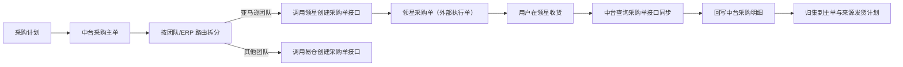

# 领星采购单对接 PRD（初稿）

## 一、需求概述

### 1.1 需求背景

中台采购单是采购业务的「主单」，负责统一组织采购需求并汇总执行结果；领星采购单是由中台推送创建、在领星侧实际执行采购收货的「外部执行单」。

当前中台尚未打通与领星的采购单接口，亚马逊团队的采购单需要在领星与中台之间人工创建、人工核对单号和收货结果，无法在中台形成「采购计划 → 中台采购单 → 领星采购单 → 收货结果」的完整追溯链路。

因此，需要对接领星采购单接口，由中台自动向领星创建采购单，并同步领星的采购单状态、到货数量及收货相关单据，形成闭环的采购执行与追溯能力。

### 1.2 需求目标

1. 中台按团队 + ERP 路由规则，将亚马逊团队的采购需求自动推送至领星并创建领星采购单。
2. 同步领星采购单号、状态、到货数量及 SKU 明细至中台，建立「中台采购单 ↔ 领星采购单」的单据映射。
3. 同步领星收货产生的入库单、收货单、质检单、退货单、变更单等执行单据，回写中台采购明细。
4. 按「外部明细 → 中台采购明细 → 来源发货计划 → 中台采购主单」逐级归集数量，形成采购、收货、在途的数量闭环。
5. 建立推送状态、幂等与重试机制，避免重复创建外部采购单。

### 1.3 本次范围

**本次处理：**

- 对接领星「创建采购单」「查询采购单」接口。
- 支持按团队 + ERP 路由，将亚马逊团队采购需求推送至领星。
- 存储展示领星采购单号、外部单据 ID、状态及明细映射。
- 同步领星收货产生的执行单据（入库单、收货单、质检单等）并回写中台。
- 建立推送状态与分支级幂等、重试机制。

**本次不处理：**

- 非亚马逊团队的采购单对接（走易仓，不在本 PRD）。
- 不新增采购收货、货权调整等中台侧业务规则；沿用现有逻辑。
- 不改变领星侧的采购审批、收货等操作流程。

## 二、需求效益

| 维度 | 效益 |
|---|---|
| 执行闭环 | 中台采购单自动推送至领星，减少人工建单和跨系统录入。 |
| 数据追溯 | 建立「中台采购单 ↔ 领星采购单 ↔ 收货单据」映射，便于回溯采购归属。 |
| 数量核对 | 采购、收货、在途数量按链路归集，及时发现计划与执行的差异。 |
| 业务协同 | 统一查看采购单号、状态、收货结果，减少跨系统核对。 |
| 幂等可靠 | 分支级幂等与重试，避免重复建单和重复累计收货。 |

## 三、总体业务流程

| 步骤 | 操作角色 / 系统 | 处理内容 | 输出结果 |
|---|---|---|---|
| 1 | 中台 | 基于采购计划生成中台采购主单及明细。 | 中台采购单。 |
| 2 | 中台 | 按团队 + ERP 路由拆分：亚马逊团队推送领星，其他团队推送易仓。 | 确定各 ERP 分支。 |
| 3 | 中台 | 调用领星「创建采购单」接口。 | 领星采购单及外部单据 ID。 |
| 4 | 中台 | 保存领星采购单号、外部单据 ID 及明细映射，更新推送状态。 | 建立单据映射。 |
| 5 | 用户在领星 | 在领星采购单中执行收货、变更、退货、结束收货等操作。 | 领星产生收货结果及执行单据。 |
| 6 | 中台 | 通过「查询采购单」接口同步状态、到货数量及 SKU 明细。 | 回写中台采购明细。 |
| 7 | 中台 | 按链路逐级归集数量，汇总至中台采购主单和来源发货计划。 | 采购、收货、在途数量闭环。 |

### 3.1 总体业务流程图



### 3.2 单据关系

1. 中台采购单的正式来源**只有采购计划**，不直接由发货计划生成。
2. 一个中台采购单可合并多个发货计划对应的采购需求；每个发货计划保留所属团队、SKU、计划数量及来源关系。
3. 按团队 + ERP 路由拆分：亚马逊团队推送领星，其他团队推送易仓。
4. 同一个团队的多个发货计划可合并到同一个 ERP 外部采购单；一个发货计划不允许拆分到多个外部采购单。
5. 中台采购单 ↔ 外部采购单是 **1:N** 关系，最多同时包含一个领星采购单和一个易仓采购单。
6. 同一个 SKU 分属不同团队或 ERP 时，必须按团队/ERP 分别保留采购明细和收货结果，不能仅按 SKU 汇总互相覆盖。
7. 外部采购单创建成功后，中台保存外部 ERP、外部采购单号、外部单据 ID、创建结果、同步时间及错误信息，并建立中台明细到外部明细的映射。

## 四、领星接口对接方案

### 4.1 创建采购单

| 项目 | 说明 |
|---|---|
| 接口 | `POST /erp/sc/routing/purchase/purchase/createPurchaseOrder` |
| 对接目的 | 中台向领星创建采购单，是推送创建的外部入口。 |
| 调用时机 | 中台采购主单按团队/ERP 分组后，对亚马逊团队分支调用。 |
| 中台处理 | 传入采购明细；成功后保存领星采购单号、外部单据 ID 及明细映射，更新推送状态为「已推送」。 |
| 主要用途 | 生成领星采购单，供用户在领星侧执行收货。 |

### 4.2 查询采购单

| 项目 | 说明 |
|---|---|
| 接口 | `POST /erp/sc/routing/data/local_inventory/purchaseOrderList` |
| 对接目的 | 同步领星采购单状态、到货数量及 SKU 明细，是中台同步的主入口。 |
| 调用时机 | 日常定时同步、接口失败后重试。具体频率与回补窗口待确认。 |
| 查询方式 | 按采购单号或更新时间查询。 |
| 中台处理 | 按外部单号/外部明细 ID/SKU 匹配，回写中台采购明细，汇总到主单与来源发货计划。 |
| 主要用途 | 采购单状态与收货数量同步。 |

### 4.3 采购单下单（本期不调用）

| 项目 | 说明 |
|---|---|
| 接口 | `POST /erp/sc/routing/purchase/purchase/setOrders` |
| 处理方式 | 本期直接创建「待到货」状态的领星采购单，不经过「待下单 → 待到货」的状态变更流程，故不调用该接口。 |

## 五、数据同步与数据规则

### 5.1 数据来源与主数据口径

| 数据对象 | 数据来源 | 中台使用口径 |
|---|---|---|
| 中台采购单及其状态 | 中台 | 以中台采购单数据为准。 |
| 领星采购单、状态、到货数量及 SKU 明细 | 领星「查询采购单」接口 | 以领星同步结果为准。 |
| 中台采购单与领星采购单映射 | 中台 | 由中台创建时生成并保存。 |

### 5.2 中台关联数据

中台需保存以下关联维度：

| 对象 | 关键字段 |
|---|---|
| 中台采购单 | 中台采购单号、整体状态、采购总数、已收货数、待收货数、在途数、关联 ERP 分支数 |
| ERP 分支 | ERP 类型、领星/易仓采购单号、外部单据状态、推送状态、最近同步时间、同步异常 |
| 来源发货计划明细 | 发货计划号、团队、SKU、计划采购数、对应外部采购单号、已收货数、在途数、待收货数 |
| 收货明细 | 收货批次/时间、外部入库单号、收货单号、质检单号、收货数量、质检结果及原始来源 |

### 5.3 推送状态

| 状态 | 含义 |
|---|---|
| 未推送 | 中台采购单已生成，尚未调用外部 ERP。 |
| 推送中 | 正在调用领星或易仓创建接口。 |
| 部分成功 | 多个 ERP 分支中，部分创建成功、部分失败。 |
| 已推送 | 所有需要推送的 ERP 分支均创建成功。 |
| 推送失败 | 外部 ERP 创建失败，可修复后重试。 |

一条外部 ERP 分支失败时，不回滚另一条已成功创建的外部采购单；中台保留成功结果，仅允许重试失败分支。

### 5.4 数量归集口径

数量归集沿「外部明细 → 中台采购明细 → 来源发货计划 → 中台采购主单」逐级汇总：

```text
采购数量 = 中台采购明细或外部采购明细的下单数量
已收货数量 = 外部 ERP 返回的收货数量，并回写中台对应收货数量字段
待收货数量 = 采购数量 − 已收货数量（需考虑取消、退货和数量调整）
在途数量 = 暂以外部 ERP 返回的在途数量为准
```

- 合格数量、不合格数量和待质检数量暂不在中台页面展示。
- 部分收货、取消、退货、质检不合格及外部数量调整，直接回写中台对应字段。
- 外部接口未返回某类字段时，保留当前中台值并记录同步异常，不使用其他数量字段覆盖。

### 5.5 幂等与重试规则（暂定）

1. 每个中台采购单按 ERP 分支分别生成推送记录，唯一键建议为「中台采购单 ID + ERP 类型」。
2. 为每个 ERP 分支生成固定业务请求号，建议为「中台采购单号 + ERP 类型」；首次调用和重试复用同一请求号。
3. 调用外部接口前先将分支状态置为「推送中」；接口明确成功后保存外部采购单号、外部单据 ID 及明细映射，并置为「已推送」。
4. 接口超时、连接中断或返回不明确时，不能直接再次创建；先使用业务请求号、采购单号或接口支持的唯一条件查询外部是否已创建，确认不存在后再重试。
5. 外部接口支持幂等键时，直接传入固定业务请求号；不支持时，通过中台唯一约束、外部单号/备注中的中台采购单号和创建前查询共同避免重复创建。
6. 自动重试仅针对网络超时、限流和临时性服务异常，最多 3 次递增间隔；参数错误、业务校验失败、权限失败等明确失败不自动重试，转人工处理。
7. 领星和易仓分支分别维护推送状态、重试次数、最近请求时间、错误信息和外部单号。
8. 外部明细映射以「ERP 类型 + 外部采购单号/外部单据 ID + 外部明细 ID」作为唯一识别依据，避免重复回写。

> 以上为暂定方案，最终幂等键、外部查询条件和可重试错误码需结合领星创建采购单接口确认。

## 六、功能需求

### 6.1 领星采购单同步展示

采购单页面同时展示中台主单汇总和外部 ERP 分支信息：

| 层级 | 展示内容 |
|---|---|
| 中台采购主单 | 中台采购单号、整体状态、采购总数、已收货数、待收货数、在途数、关联 ERP 分支数 |
| ERP 分支 | ERP 类型、领星/易仓采购单号、外部单据状态、推送状态、最近同步时间、同步异常 |
| 来源发货计划明细 | 发货计划号、团队、SKU、计划采购数、对应外部采购单号、已收货数、在途数、待收货数 |
| 收货明细 | 收货批次/时间、外部入库单号、收货单号、质检单号、收货数量、质检结果及原始来源 |

### 6.2 领星采购单各动作的数据流

| 中台操作 | 领星动作 | 中台结果与关联单据 |
|---|---|---|
| 提交采购单 | 领星 API 创建采购单 | 同步领星 PO 单号（已审批）；中台 PO 进入待收货 |
| 收货 | 领星 PO API 写入收货数量并创建入库单 | 中台队列拉取领星入库单号，挂在中台 PO 及对应采购计划行 |
| 变更采购单 | 领星 PO API 写入变更字段并创建变更单 | 中台队列拉取领星变更单号并挂在中台 PO 及对应采购计划行 |
| 修改收货数量 | 领星 PO API 写入退货数量和备注并创建退货单 | 中台队列拉取领星退货单号并挂在中台 PO 及对应采购计划行 |
| 结束收货 | 领星 PO API 执行强制完成 | 中台采购单结束收货 |

## 七、状态与日志规则

### 7.1 中台采购单状态流转

| 状态 | 含义 | 下一状态 |
|---|---|---|
| 待提交 | 新建采购单，尚未提交审批 | 待审批 |
| 待审批 | 已提交，等待审批 | 待收货（审批通过）/ 待提交（驳回） |
| 待收货 | 审批通过，货物在途等待收货 | 已完成 |
| 已完成 | 全部收货完成（终态） | — |

领星采购单创建成功后，中台同步领星 PO 单号（已审批状态），中台 PO 进入「待收货」。

### 7.2 操作与同步日志

| 日志类型 | 至少记录内容 |
|---|---|
| 推送日志 | 中台采购单号、ERP 类型、业务请求号、调用时间、外部采购单号、外部单据 ID、创建结果、错误信息、重试次数。 |
| 收货同步日志 | 中台采购单号、外部采购单号、外部明细 ID、SKU、收货数量、来源单据类型（入库/收货/质检/退货/变更）、同步时间、同步结果。 |
| 同步日志 | 接口名称、请求范围、开始/结束时间、成功/失败数量、失败原因、重试结果。 |

## 八、异常与边界场景

| 场景 | 系统处理 |
|---|---|
| 领星创建采购单接口失败 | 分支置「推送失败」，保留错误信息，可修复后重试；不回滚其他成功分支。 |
| 接口超时或返回不明 | 不直接重试，先查询外部是否已创建，确认不存在后再重试。 |
| 外部重复同步 | 按外部单号/外部明细 ID 去重，不重复累计收货数量。 |
| 查询失败 | 保留上次成功数据，记录失败原因和重试信息，不改变已确认的收货数量。 |
| 外部接口未返回某字段 | 保留当前中台值并记录同步异常，不用其他字段覆盖。 |
| 同一 SKU 跨团队/ERP | 按团队/ERP 分别保留明细，不按 SKU 汇总覆盖。 |

## 九、系统影响

| 系统 / 模块 | 影响内容 | 本次是否处理 |
|---|---|---|
| 中台采购单 | 新增领星采购单推送、状态与收货数量同步、单据映射。 | 是 |
| 领星 | 通过接口创建采购单并回传状态/收货结果。 | 是 |
| 中台易仓采购单 | 易仓分支逻辑继续保留，不在本 PRD。 | 不变 |

## 十、验收标准摘要

1. 中台采购单可按团队 + ERP 路由拆分，亚马逊团队分支自动推送领星创建采购单。
2. 创建成功后中台保存领星采购单号、外部单据 ID 及明细映射，并更新推送状态。
3. 领星采购单状态、到货数量及 SKU 明细可通过查询接口同步至中台。
4. 收货产生的入库单、收货单、质检单、退货单、变更单可同步并挂到中台 PO 及对应采购计划行。
5. 数量按「外部明细 → 中台采购明细 → 来源发货计划 → 中台采购主单」逐级归集。
6. 合格数量、不合格数量和待质检数量暂不展示。
7. 分支级幂等生效：同一中台采购单在同一 ERP 下最多创建一张外部采购单，重试复用同一业务请求号。
8. 一条分支失败不回滚其他成功分支，仅允许重试失败分支。
9. 接口失败、超时、重复同步和查询失败场景可追溯，不重复创建外部采购单、不重复累计收货数量。

## 十一、待确认问题

| 问题 | 为什么重要 | 影响范围 | 建议确认对象 |
|---|---|---|---|
| 领星创建采购单接口是否原生支持幂等键？ | 决定幂等与重试的最终实现方式。 | 幂等、重试 | 研发、领星接口负责人 |
| 创建采购单接口的必填字段与数量口径是什么？ | 影响推送参数与明细映射。 | 创建接口、数据映射 | 研发、供应链业务 |
| 查询采购单接口支持哪些查询条件与回补窗口？ | 影响同步完整性。 | 定时同步、运维 | 研发、业务 |
| 在途数量的准确口径以哪个字段为准？ | 当前暂以外部返回值为准，需确认。 | 数量归集、页面展示 | 供应链业务、库存负责人 |
| 收货后产生的执行单据（入库/收货/质检/退货/变更）分别对应哪些接口字段？ | 影响单据映射与回写。 | 收货同步、日志 | 研发、领星接口负责人 |
| 哪些角色可查看、推送和重试同步？ | 防止无权限人员改动采购关联。 | 权限、页面操作 | 业务负责人、管理员 |

## 十二、接口参考

- 领星：创建采购单 `POST /erp/sc/routing/purchase/purchase/createPurchaseOrder`
- 领星：查询采购单 `POST /erp/sc/routing/data/local_inventory/purchaseOrderList`
