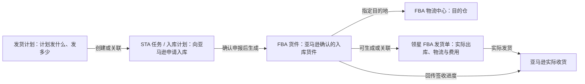
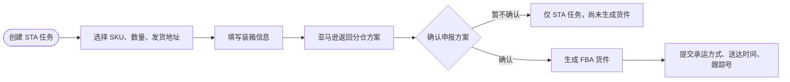
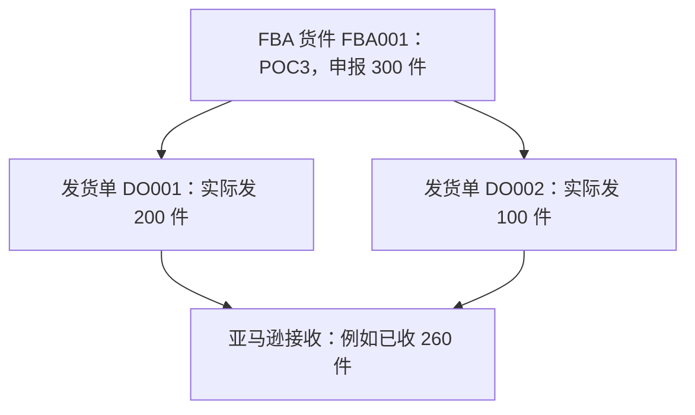
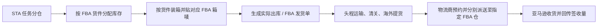
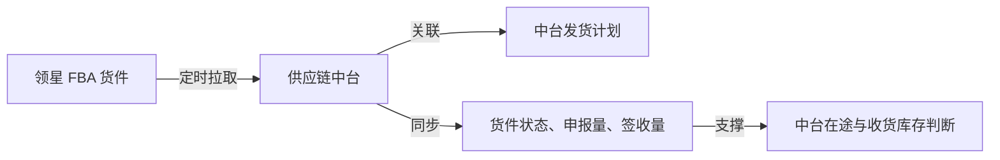

# FBA 发货业务流程与对象关系

> **用途**：帮助产品、业务和研发统一理解亚马逊 FBA 发货中的 STA、FBA 货件、领星发货单、物流中心编码及中台同步边界。
>
> **当前中台范围**：第一阶段仅讨论从领星同步 **FBA 货件及 FBA 到货接收结果**；暂不要求中台创建 STA 任务，也暂不接入领星 FBA 发货单的实际出库、配货和费用数据。

---

## 一、先看全景：一批货如何进入 FBA

FBA 发货不是一张单据完成的，而是由“计划、亚马逊入库货件、实际发货执行”三类对象共同组成。



这张图的核心是：

- **发货计划**解决“计划要发什么货”；
- **FBA 货件**解决“亚马逊允许并要求把什么货送到哪个 FBA 仓”；
- **领星 FBA 发货单**解决“企业实际从哪里发了多少、如何运输、产生多少头程费用”。

---

## 二、核心对象与关系

### 2.1 对象总览

| 对象 | 一句话定义 | 主要归属 | 关注重点 |
|---|---|---|---|
| FBA | 亚马逊提供的仓储、配送服务及仓网 | 亚马逊 | 货最终进入亚马逊仓，并由亚马逊履约。 |
| STA | Send to Amazon，亚马逊创建 FBA 入库货件的新版流程 | 亚马逊 | 填报商品、发货地址、装箱和运输信息，申请入库。 |
| STA 任务 / 入库计划 | STA 流程中的一份入库申请 | 亚马逊 / 领星 | 尚未确认分仓时，它是“任务”，不是最终货件。 |
| FBA 货件 | 亚马逊确认后的实际入库货件 | 亚马逊 | 有 FBA 货件号、目的物流中心、申报量、签收量和状态。 |
| 物流中心编码 | 亚马逊目的 FBA 仓的编码，如 `POC3` | 亚马逊 | 标识这张货件要送往哪个 FBA 物流中心。 |
| 领星 FBA 发货单 | 从本地仓或海外仓实际发往 FBA 的执行单据 | 领星 | 配货、出库、实际发货量、装箱、头程物流和费用。 |

### 2.2 关系规则

```text
1 个 STA 任务 / 入库计划
    → 可生成 1 张或多张 FBA 货件

1 张 FBA 货件
    → 对应 1 个目的 FBA 物流中心
    → 可关联 1 张或多张领星 FBA 发货单
```

亚马逊可能将一个 STA 入库计划拆分为多张 FBA 货件，例如分配到不同物流中心。每一张拆分后的 FBA 货件，都有自己的货件号、SKU 数量、状态和目的物流中心。

---

## 三、STA 与 FBA 货件：流程与区别

### 3.1 STA 是什么

STA 是 **Send to Amazon** 的缩写，是亚马逊用于创建 FBA 入库货件的流程。它不是仓库，也不是最终运输单，而是“向亚马逊申请把货送入 FBA”的操作流程。

### 3.2 从 STA 任务到 FBA 货件



关键分界点：

- **确认申报前**：只有 STA 任务，可以继续编辑；此时还没有最终 FBA 货件。
- **确认申报后**：亚马逊生成 FBA 货件，领星 FBA 货件列表才会出现对应数据；此后可查看货件、打印箱唛、生成或关联发货单。

### 3.3 为什么一个 STA 任务会生成多张货件

同一批准备入 FBA 的商品，亚马逊可能按分仓结果拆到多个目的物流中心。

```text
STA 任务：SKU A 200 件
    ├─ FBA 货件 FBA001：100 件 → POC3
    └─ FBA 货件 FBA002：100 件 → POC2
```

因此，中台不能只把“STA 任务”当成一张最终发货单；同步库存和收货时，应以拆分后的 **FBA 货件 + SKU 明细** 为准。

---

## 四、物流中心编码与 FBA 仓的关系

### 4.1 物流中心编码是什么

物流中心编码是亚马逊为 FBA 仓分配的识别码，例如截图中的 `POC3`。

```text
FBA 货件号：FBA19LJ...  = 这一票货的编号
物流中心编码：POC3      = 这一票货要送达的 FBA 目的仓
```

它不是物流商编码、头程服务商编码、店铺编码，也不是企业内部仓库名称。

### 4.2 与货件、FBA 仓的对应关系


通常一张 FBA 货件对应一个目的物流中心；不同 FBA 货件可以反复发往同一个物流中心。亚马逊后续若在内部调拨库存，不改变卖家这张货件原本的目的物流中心。

### 4.3 中台如何使用该编码

中台接到领星货件数据后，应将物流中心编码作为：

1. FBA 目的仓的外部识别码；
2. 中台仓库主数据与领星 / 亚马逊仓库映射的关键字段；
3. 发货计划、发货单与 FBA 货件关联、核对目的仓的依据之一。

---

## 五、FBA 货件与领星 FBA 发货单的区别

两者有关联，但不要把它们理解成同一张单据。

| 对比项 | FBA 货件 | 领星 FBA 发货单 |
|---|---|---|
| 本质 | 亚马逊 FBA 入库货件 | 企业内部实际发货执行单 |
| 主要数据来源 | 亚马逊 shipment / Send to Amazon | 领星内部仓储、物流操作 |
| 回答的问题 | 亚马逊要求什么货送到哪里、已签收多少 | 实际从哪里发出多少、如何运输、费用多少 |
| 核心字段 | 货件号、物流中心、申报量、签收量、Reference ID、状态 | 发货仓、实际发货量、出库、装箱、头程物流、重量体积、费用 |
| 库存角色 | 表示 FBA 入库及签收进度 | 扣减发货仓库存，形成实际在途、承载费用 |
| 关系 | 一张 FBA 货件可关联多张发货单 | 多张发货单可共同履约同一 FBA 货件 |

### 5.1 为什么两者数量可能不同

FBA 货件的申报量不一定等于实际发货量。例如：

```text
FBA 货件申报：100 件
领星发货单实际发出：90 件
亚马逊已签收：60 件
```

此时：

```text
按 FBA 货件计算在途：100 − 60 = 40
按实际发货单计算在途：90 − 60 = 30
```

所以，FBA 货件适合反映亚马逊侧的申报与签收；发货单更适合反映企业侧的实际出库和物流执行。

### 5.2 用一个例子理解两张单的关系

可以把 **FBA 货件** 理解为“亚马逊的入仓要求单”，把 **FBA 发货单** 理解为“企业实际的出库运输执行单”。

```text
FBA 货件 FBA001（亚马逊侧）
目的仓：POC3
申报入库：MSKU-A 100 件、MSKU-B 200 件，共 300 件

领星 FBA 发货单 DO001（企业侧）
发货仓：深圳自有仓
实际发货：MSKU-A 60 件、MSKU-B 140 件，共 200 件
物流：海运拼箱；记录头程费用、重量、体积和跟踪信息

领星 FBA 发货单 DO002（企业侧）
发货仓：深圳自有仓或海外中转仓
实际发货：MSKU-A 40 件、MSKU-B 60 件，共 100 件
物流：空运补货；记录对应的物流费用和运输信息
```

两张发货单合计实际发出 300 件，共同履约同一张 FBA 货件 FBA001。随后亚马逊按 FBA001 回传接收量；例如已收 260 件，表示该货件仍有 40 件未被 FBA 接收。



这个例子说明：**货件的申报数量、实际发货数量和 FBA 接收数量可能不同**。本地库存以发货单的实际出库扣减；FBA 在途与收货进度以货件的申报和接收数据判断。

### 5.3 三种创建与关联路径

创建顺序可以不同，但“货件管 FBA 入库目标与签收、发货单管企业出库与物流执行”的职责不变。

| 路径 | 单据创建顺序 | 自动关联方式 | 适用理解 |
|---|---|---|---|
| 路径一 | 发货计划 → FBA 货件 → FBA 发货单 | 发货单由货件生成或关联。 | 先确认亚马逊分仓结果，再安排实际发货。 |
| 路径二 | 发货计划 → FBA 发货单；发货计划 → FBA 货件 | 两张单通过同一发货计划自动关联。 | 内部物流计划与 FBA 货件可并行创建。 |
| 路径三 | 发货计划 → FBA 发货单 → 外部创建 FBA 货件 | 在发货单中手动关联货件，或由发货单创建货件。 | 货件已在亚马逊后台创建，后补齐系统关联。 |

---

## 六、自有仓如何按 FBA 货件实际发货

当企业在自有本地仓（国内仓或海外仓）备货，且一个 STA 任务被亚马逊拆分为多张 FBA 货件时，仓库要以 **FBA 货件** 为最小发货执行单元，而不是只按 STA 任务整体出库。



### 6.1 自有仓侧的执行步骤

以一个 STA 任务被拆分为两张货件为例：

```text
STA 任务：SKU A 共 200 件
├─ FBA 货件 1：100 件 → POC3
└─ FBA 货件 2：100 件 → POC2
```

仓库与物流执行步骤如下：

1. **按货件分配库存**：分别锁定货件 1 的 100 件和货件 2 的 100 件，避免不同货件之间串货。
2. **按货件装箱和贴标**：每个箱子贴所属 FBA 货件的箱唛；不同货件的箱唛、货件号和目的仓不能混用。
3. **创建实际发货执行单**：记录发货仓、实际发货量、箱数、头程服务商、跟踪号及费用；该单据通常对应领星 FBA 发货单或中台发货单。
4. **安排头程物流**：国内仓需经历提货、国际运输、清关、海外提货等；海外仓则从海外仓直接安排末端派送。
5. **按目的仓送仓**：物流商按每张 FBA 货件的目的物流中心预约并派送，例如一票送 POC3，另一票送 POC2。
6. **同步收货结果**：亚马逊接收后，以货件和 SKU 维度回传接收数量；中台据此更新在途、收货进度或库存状态。

### 6.2 海外港口不是 FBA 收货节点

货物抵达海外港口后，通常仍在企业的头程物流链路中。物流商需完成清关、提柜或提货、预约及末端派送，最终把货送到 FBA 货件指定的物流中心。

默认情况下，亚马逊不会因为货物到达海外港口而自动提货、再分发至不同 FBA 仓；货物必须先被送至亚马逊为该货件指定的接收仓。

### 6.3 两种入仓模式

| 模式 | 企业 / 物流商的职责 | 亚马逊的职责 | 适用理解 |
|---|---|---|---|
| 多仓直送（亚马逊优化分仓等） | 按多张 FBA 货件，分别送到各自指定的 FBA 物流中心。 | 在各目的仓接收货物。 | 企业承担多仓派送的执行复杂度。 |
| 最少分仓（Minimal shipment splits） | 将货送到亚马逊指定的较少、可能单一的首个入库点。 | 接收后在亚马逊网络内分拨到其他履约中心。 | 企业减少送仓点，但可能产生入库配置服务费。 |

即使选择最少分仓，企业也仍需负责将货物送至亚马逊指定的首个接收仓；这不等于把货物交到海外港口后由 FBA 自动提货。

---

## 七、中台当前接入领星 FBA 货件的目的

### 7.1 当前要解决的问题

亚马逊 FBA 货件在领星 / 亚马逊侧创建和变化。如果中台不知道货件已经生成、发出或被 FBA 接收，中台的发货计划和库存状态会与实际业务脱节。

中台同步 FBA 货件后，可获取：

- FBA 货件号；
- 店铺、SKU、MSKU、FNSKU；
- 目的物流中心编码；
- 申报量、实际签收量；
- Reference ID；
- 货件状态及创建、发货、收货、关闭等时间。

### 7.2 当前接入边界



本阶段中台仅做“读取和同步”：

- 拉取领星 FBA 货件及状态；
- 关联中台发货计划；
- 拉取 FBA 到货接收数量，用于收货进度或库存判断。

本阶段暂不做：

- 从中台创建 STA 任务；
- 从中台修改装箱、分仓、承运、跟踪号；
- 接入领星 FBA 发货单的配货、出库和头程费用数据。

### 7.3 建议优先使用的领星接口

| 用途 | 接口 | 作用 |
|---|---|---|
| 货件主同步 | `POST /erp/sc/data/fba_report/shipmentList` | 查询 FBA 货件列表、状态、目的物流中心、SKU 申报量和签收量。 |
| 货件详情补充 | `POST /amzStaServer/openapi/inbound-shipment/shipmentDetailList` | 按货件号查询详情；可用于中台详情页按需展示。 |
| FBA 实际接收 | `POST /erp/sc/data/fba_report/receivedInventory` | 查询 FBA 到货接收明细；同一货件 SKU 多条记录时需汇总。 |

---

## 八、术语速查

| 术语 | 快速记忆 |
|---|---|
| STA | 创建 FBA 入库货件的流程。 |
| STA 任务 | 尚在申请、装箱、分仓或等待确认的入库任务。 |
| FBA 货件 | 亚马逊确认后生成的实际入库货件。 |
| 物流中心编码 | FBA 目的仓代码，例如 `POC3`。 |
| FBA 发货单 | 企业实际从仓库出库、发往 FBA 的执行与费用单据。 |
| 申报量 | 向亚马逊声明将发出的数量。 |
| 签收量 / 接收量 | 亚马逊 FBA 实际已接收的数量。 |
| Reference ID | 亚马逊为货件提供的关联标识，用于货件跟踪和单据关联。 |

---

## 九、参考资料

- [领星：FBA 发货流程](https://www.lingxing.com/help/article/fbaShippingProcess)
- [领星：FBA 货件（STA）](https://www.lingxing.com/help/article/newFBAShipments)
- [领星：发货单](https://www.lingxing.com/help/article/deliveryOrder)
- [领星：业务配置中的 FBA 在途口径](https://www.lingxing.com/help/article/configureid)
- [领星开放接口：查询货件列表](https://apidoc.lingxing.com/#/docs/FBA/FBAShipmentList)
- [领星开放接口：查询 FBA 到货接收明细](https://apidoc.lingxing.com/#/docs/FBA/FBAReceivedInventory)
- [Amazon Seller Central：入库分仓与亚马逊网络内分拨说明](https://sellercentral.amazon.com/seller-forums/discussions/t/656d2cdb-6074-4763-b73d-6758852641b8?postId=656d2cdb-6074-4763-b73d-6758852641b8)
- [Amazon Seller Central：送仓与预约说明](https://sellercentral.amazon.com/help/hub/reference/external/GM2ADTH3XH3A5N57?itemid=200285190&locale=en-us)
