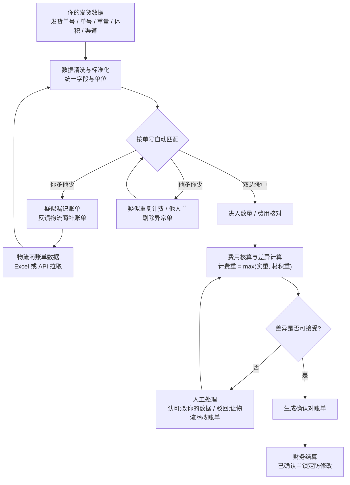

# 物流对账功能调研笔记

> 本文档用于梳理「物流对账」功能的行业通用逻辑与落地思路,帮助产品经理在进入需求设计前建立整体认知。内容包括:对账的本质、通用流程、行业模式、常见踩坑点,以及结合中台现状的落地路径。

---

## 一、物流对账的本质

物流对账的核心是:**把你实际发出的货,和物流商向你收的钱,逐单核对,确认没有多收、漏收。**

两个核心对象:

| 对象 | 内容 |
|---|---|
| 你(货主 / 中台) | 每一票货发出去了多少、重量体积是多少、走的什么渠道 |
| 物流商(承运商) | 按什么规则算的钱(首重续重、材积重、燃油附加费等) |

两边数据碰在一起,算出「账单金额 vs 实际应计金额」的差异,处理差异,最终确认结算。

---

## 二、行业通用的对账流程(六步)

### 第 1 步:数据归集(两边数据先拉齐)

- 一边是**你的发货数据**:发货单号、单号(总单号/服务商单号)、渠道、重量、体积、时间
- 一边是**物流商的账单数据**:通常是物流商按月/按周期发来的 Excel 账单,或通过 API 拉取
- **关键**:两边必须用同一个「单号」对上(总单号、服务商单号、跟踪号——对账的核心就是靠单号把两边数据钉在一起)

### 第 2 步:数据清洗与标准化

- 物流商账单格式五花八门,需统一字段、统一单位(重量是 kg 还是 lb)
- 去掉重复行、空行、格式脏数据
- 这一步占了对账工作量 60%+,行业常说「对账 80% 的时间花在整理数据上」

### 第 3 步:自动匹配(核心)

按单号把两边数据匹配起来,分三类结果:

| 匹配结果 | 含义 | 处理 |
|---|---|---|
| 双边命中 | 你这边有单、物流商账单也有 | 进入数量/费用核对 |
| 单边存在(你多他少) | 你的单物流商没算钱 | 可能是漏记账单,需问物流商 |
| 单边存在(他多你少) | 物流商账单有、你没发货记录 | 可能是重复计费或别人的单,需剔除 |

### 第 4 步:费用核算与差异计算

对命中的单,按**你的计费规则**重新算一遍费用,与物流商账单金额对比:

- 计费重 = max(实重, 材积重) ← 最容易产生差异的地方
- 首重/续重、附加费(燃油、偏远、旺季)、保险费、税
- 差异 = 物流商账单金额 − 你的应计金额
- 差异分「允许的差异」(汇率、舍入)和「真差异」(多收重量、重复收费)

### 第 5 步:差异处理(人工介入)

- 行业通例:**系统自动对账,人工处理差异**
- 差异单要么「认可」(物流商对,改你的数据)、要么「驳回」(你这边对,让物流商改账单)
- 处理完的差异单要有留痕(谁处理、什么时候、结论是什么),因为涉及钱

### 第 6 步:确认与结算

- 全部差异处理后,生成「确认对账单」
- 财务按确认结果付款;已确认的单要锁定,防止后续被改

### 对账业务流程图

---

## 三、行业常见模式

| 模式 | 说明 | 适合谁 |
|---|---|---|
| 事后月度对账(最常见) | 物流商每月出账单,你拿账单和自己发货数据对 | 多数公司,数据量不大时 |
| 系统自动对账 | 物流商给 API/接口,系统定时拉账单自动匹配,只留差异人工处理 | 发货量大、物流商配合 |
| 预付/结算单核对 | 先按预估充值,再按实际账单多退少补 | 与物流商有充值模式 |
| 三方对账 | 货主、物流商、中间环节(货代、海外仓)三方互对 | 链路复杂的跨境场景 |

跨境电商走头程海运,大概率是「事后月度对账 + 系统自动匹配 + 人工处理差异」的组合。

---

## 四、行业踩坑点(设计前就要注意)

1. **单号不统一就是对不上的根源**——总单号/服务商单号的意义:一票多件合单后,若物流商按总单计费,子单就永远对不上。**必须定清楚对账的单号粒度(总单 or 子单)**
2. **重量口径**(实重 vs 材积重)是差异大户,必须双方确认按哪个算
3. **计费区间**(首重续重按 0.5kg 还是 1kg 进位)不一样,每单都差钱
4. **附加费不透明**(燃油附加费、旺季附加费),物流商账单里的费用规则要先讲清楚
5. **历史数据**——同领星采购单初始化一样,对账也有「存量账单从什么时候开始对」的问题

---

## 五、结合中台现状的落地建议

### 中台已有基础

- 发货单(含跟踪号、服务商单号、总单号的概念)
- 头程费用查询页(按发货单、SKU、仓、渠道维度看费用分摊)

这些是物流对账的**前端基础**。

### 落地路径(分三阶段)

**第一阶段(先跑起来)**:支持上传物流商账单 Excel + 按单号自动匹配 + 展示差异 → 先解决「人工对账靠眼睛」的痛点

**第二阶段(提效)**:差异自动分类、处理留痕、生成确认对账单

**第三阶段(自动化)**:物流商 API 对接自动拉账单、自动对账

---

## 六、进入需求设计前需确认的问题

1. 与物流商的实际对账方式是月度账单 Excel 还是 API?→ 决定功能复杂度与阶段划分
2. 对账单号粒度是总单还是子单?→ 决定匹配规则
3. 计费规则(重量口径、计费区间、附加费)由谁维护、谁确认?→ 决定费用核算能否自动化
4. 差异处理角色与流程(认可/驳回、留痕)由谁负责?→ 决定权限与操作设计
5. 存量账单从何时开始对?→ 决定历史数据初始化范围
