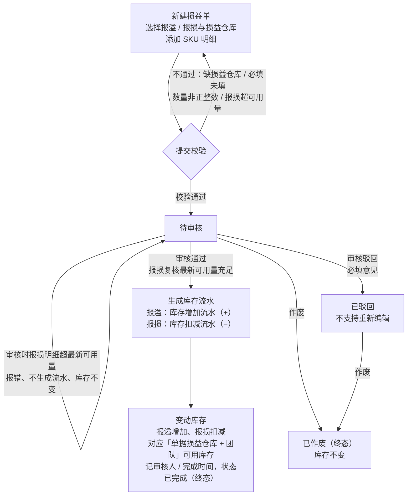

```mermaid
flowchart TD
    A[新建损益单<br/>选择报溢 / 报损与损益仓库<br/>添加 SKU 明细] --> B{提交校验}
    B -->|不通过：缺损益仓库 / 必填未填<br/>数量非正整数 / 报损超可用量| A
    B -->|校验通过| C[待审核]
    C -->|编辑保存<br/>状态保持待审核、单号不变| C
    C -->|审核通过<br/>报损复核最新可用量充足| G[生成库存流水<br/>报溢：库存增加流水（+）<br/>报损：库存扣减流水（−）]
    G --> D[变动库存<br/>报溢增加、报损扣减<br/>对应「单据损益仓库 + 团队」可用库存<br/>记审核人 / 完成时间，状态已完成（终态）]
    C -->|审核时报损明细超最新可用量<br/>报错、不生成流水、库存不变| C
    C -->|审核驳回<br/>必填意见| E[已驳回<br/>不支持重新编辑]
    C -->|作废| F[已作废（终态）<br/>库存不变]
    E -->|作废| F
```
