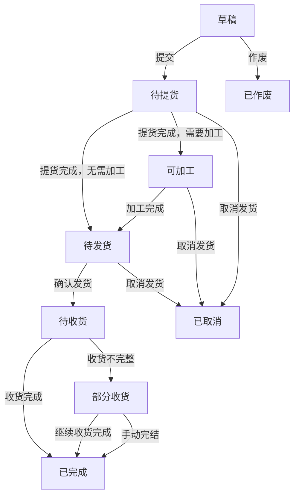

# 发货单功能版本确认

> 本文档用于业务方确认发货单原型方案。当前原型展示内容按 1.0 版本整理，后续根据确认结果再编写正式 PRD。

原型地址：[中台发货单原型](https://heiquanrenheiquanren-lab.github.io/Middle-Platform-Pages/#shipmentOrder)

## 一、1.0 版本功能

| 功能模块 | 主要功能 |
|---|---|
| 发货单查询 | 按发货单号、计划单号、SKU、物流单号、仓库、物流渠道、平台、店铺、团队、创建人、创建日期查询 |
| 状态管理 | 草稿、待提货、可加工、待发货、待收货、部分收货、已完成、已作废、已取消 |
| 新建发货单 | 新建发货单，支持填写发货仓、目的仓、平台、店铺、物流渠道、计划数量、申报数量等信息 |
| 一票多件 | 一张发货单支持多个 SKU，并可关联多个发货计划 |
| 提货管理 | 录入提货数量、提货仓和提货批次 |
| 物流加工 | 支持组合品加工，记录已加工数量和可加工数量 |
| 发货管理 | 录入实际发货数量，查看发货进度 |
| 收货管理 | 录入实际收货数量，生成收货批次，展示已收货和待收货数量 |
| 数量调整 | 支持调整提货数量、发货数量和收货数量 |
| 差异明细 | 查看计划发货数量、申报数量、提货数量、发货数量、收货数量及差异数量 |
| 手动完结 | 部分收货或异常情况下支持手动完结发货单 |
| 日志记录 | 记录提货、加工、发货、收货、数量调整、完结等操作 |
| 费用与物流信息 | 提供物流费用导入、轨迹信息导入、其他头程费用分摊入口 |
| 辅助操作 | 支持导出和手动刷新数据 |

## 二、后续版本功能

| 功能模块 | 后续功能 |
|---|---|
| 外部系统对接 | 对接 Amazon、领星、易仓，自动同步货件、物流和收货数据 |
| 货件关联与校验 | 关联货件单号、Reference ID，并校验计划发货数量与货件申报数量 |
| 库存数据联动 | 发货、收货、提货、作废、取消与库存台账及库存批次实时联动 |
| 费用实际核算 | 物流费、清关费、头程费用按收货批次实际分摊并进入成本 |
| 退货与库存回滚 | 支持提货错误、供应商选错、整单作废后的退货和库存回滚 |
| 组合品拆分 | 支持组合品拆分为子 SKU，并支持子 SKU 后续单独发货 |
| 质检与不良品 | 收货时区分良品、不良品，并支持不良品退货 |
| 耗材与辅料 | 记录耗材、辅料使用情况并纳入成本 |
| 供应商协同 | 支持供应商参与提货、收货和退货确认 |
| 货代模板 | 按不同货代生成对应的物流下单、发票和资料模板 |

## 三、发货单状态流转

### 状态说明

| 状态 | 说明 |
|---|---|
| 草稿 | 发货单已保存，尚未正式提交 |
| 待提货 | 等待从发货仓或供应商仓提货 |
| 可加工 | 已提货，存在需要物流加工的 SKU |
| 待发货 | 已完成提货或加工，等待发货 |
| 待收货 | 已发货，等待目的仓或平台仓收货 |
| 部分收货 | 已收货，但收货数量少于发货数量 |
| 已完成 | 收货完成或业务确认手动完结 |
| 已作废 | 发货单被作废，不再继续执行 |
| 已取消 | 发货流程被取消，不再继续执行 |

