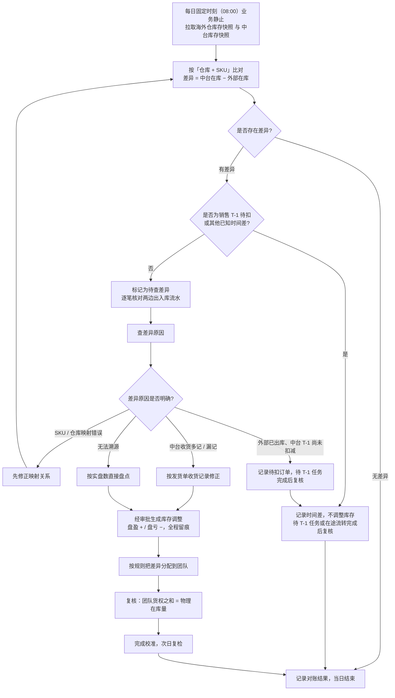
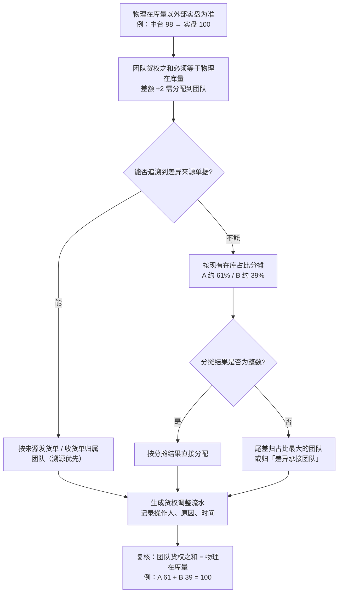
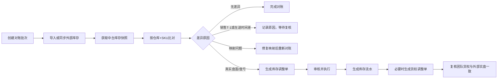

# 库存对账与校准方案

> 背景：中台库存（海外仓、平台仓、自营仓、供应商仓、物流中转仓）在上线初始化时导入，采购收货会加库存、发货单会扣库存。但中台未与海外仓/平台仓对接库存接口，所有流转都在中台内计算，可能与外部实物库存产生差异，且差异可能越来越大。

## 一、本次目标

在业务静止时点，拉取海外仓的库存，与中台按「仓库 + SKU」维度比对，找出差异、判断差异原因，并将中台库存校准到与外部一致。

> 本期对账范围：**仅海外仓**（易仓海外仓、跨跃猫、4PX 等）。平台仓（Amazon FBA、AliExpress、Temu、Shopee）**暂不纳入**，后续再扩展。

## 二、对账前先对齐口径

| 口径项 | 建议 | 说明 |
|---|---|---|
| 对账维度 | 仓库 + SKU | 中台有「团队」维度、海外仓没有；先在 Excel 把中台按仓库+SKU 求和汇总 |
| 对账数量 | 先只对「在库」 | 在库是最核心的实物口径；在途、占用、待确认后面单独对 |
| 取数时点 | 业务开始操作前的同一时刻 | 收货、发货持续发生，必须同一时点取数 |
| 对账范围 | 海外仓（本期暂不含平台仓） | 平台仓本期不参与；自营仓、供应商仓、物流中转仓中台自身即权威，暂不参与 |

> 关键提醒：在途是差异的最大来源。中台认为「已发货未收货=在途」，海外仓可能已经上架入库（外部在库多、中台在途多），这类属于时间差，不是货损货差。

## 三、操作步骤

1. 定取数时点（如明早 9:00），在此之前停止采购收货和发货单操作。
2. 拉外部库存（各渠道导出，字段需含仓库、SKU、在库数量、在途数量）：

| 仓库类型 | 数据来源 | 导出方式 | 本期是否纳入 |
|---|---|---|---|
| 海外仓（跨跃猫 / 4PX / 易仓海外仓） | 各服务商后台 | 库存报表导出 | 纳入 |
| 平台仓 Amazon FBA | 亚马逊后台或领星 | FBA 库存报告（fulfillable 可售 / inbound 在途 / unfulfillable 不可售） | 暂不纳入 |
| 平台仓 AliExpress / Temu / Shopee | 各平台后台 | 库存导出 | 暂不纳入 |

3. 拉中台库存：在「库存查询」页导出（仓库、SKU、在库、在途等字段）。
4. Excel 比对：以「仓库+SKU」为主键 VLOOKUP，计算 差异 = 中台在库 − 外部在库。
5. 差异归类：

| 归类 | 特征 | 处理 |
|---|---|---|
| 销售 T-1 待扣减时间差 | 海外仓已实际销售出库，但订单尚未进入或尚未完成中台 T-1 销售扣减 | 不调整库存，记录待扣订单，待 T-1 任务完成后复核 |
| 时间差（在途未转） | 在库+在途合计能对平 | 不改，等流转完成 |
| 待查差异 | 排除已知时间差后仍对不平 | 先核对流水和业务单据，不直接判定为盘盈 / 盘亏 |
| 口径 / 映射错误 | SKU 未配对、仓库未对应 | 先修映射再重新比对 |

## 四、差异原因怎么判断

方法：别只看「现在差多少」，去追「这个数是怎么一步步变过来的」（对流水）。

1. 先识别海外仓已出库、但尚未完成中台 T-1 扣减的销售订单；该部分作为销售待扣减时间差排除。
2. 对其余差异，只有在双方「在库」「在途」定义和范围已确认一致时，才可用「在库+在途」合计辅助过滤在途未转的时间差。
3. 排除已知时间差后仍对不平时，拉两边流水逐笔对：中台侧拉库存明细 / 批次（初始化、发货单收货、调拨入库出库、T-1 销售扣减）；海外仓侧拉出入库记录（上架、销售出库、调拨、报损、退货）。
4. 对照下表定位原因：

| 现象 | 最常见原因 | 去查哪里 |
|---|---|---|
| 中台比海外仓多 | 海外仓已销售出库，但中台尚未完成 T-1 销售扣减 | 中台 T-1 待扣订单、海外仓出库流水、T-1 任务执行记录 |
| 中台比海外仓多 | 中台收货多记 / 重复记 | 发货单收货数量 |
| 中台比海外仓少 | 海外仓有中台没记的入库（退货上架、调拨入） | 海外仓入库流水 |
| 中台比海外仓少 | 中台收货漏记 / 少记 | 发货单收货 vs 海外仓上架数 |
| 合计平、在库在途此消彼长 | 时间差 | 不用改 |

> 根因提醒：中台销售出库按 T-1 扣减。海外仓已实际出库、但尚未完成中台 T-1 扣减的订单，会使中台在库暂时高于海外仓；这是可预期的销售时间差，不能直接记为盘亏。需持续监控 T-1 任务是否按时、完整执行；超过约定扣减时限仍未完成的，才进入异常排查。

### 4.1 识别销售 T-1 时间差所需数据

库存查询接口只能发现数量差异，不能单独判断该差异是否由 T-1 销售待扣引起。要自动识别销售时间差，至少具备以下任一数据能力：

- 中台可查询「已发货但尚未完成 T-1 扣减」的销售订单、SKU、仓库和数量；
- 海外仓提供销售出库流水接口，可按仓库、SKU、订单和出库时间查询；
- 海外仓库存 API 提供库存数据截止时间，并支持按时间查询库存或出库变动。

对账批次需保存数据截止时间、时区和取数时间。若暂不具备上述任一能力，库存接口仅用于生成差异预警；不得依据库存快照自动校准中台库存。

## 五、团队维度怎么分配

账平铁律：一个「仓库+SKU」下，各团队货权之和 = 这个「仓库+SKU」的物理在库量。

以中台 98（A 团队 60 + B 团队 38）、海外仓实盘 100 为例：

1. 物理在库量以海外仓为准，改成 100。
2. 团队货权之和必须等于 100，现在是 98，差 +2 要补。
3. 这 +2 补给谁，按下面优先级选规则：

| 优先级 | 规则 | 适用场景 |
|---|---|---|
| ① 溯源优先 | 差异来自哪张发货单 / 哪笔收货，就归那个团队 | 能查到来源，最准 |
| ② 比例分摊 | 按现有在库占比摊：A 约 61%、B 约 39%，+2 → A 补 1、B 补 1 | 查不到来源时 |
| ③ 尾差规则 | 除不尽时尾差归占比最大团队，或设「差异承接团队」 | 保证账永远平 |

结果：A 60→61、B 38→39，合计 100，账平。

> 两个提醒：
>
> 1. 这是「货权调整」，不是「盘点」。盘点管数量对不对，货权调整管货算谁的。不要用盘点单改团队，也不要用货权调整改总数。
> 2. Amazon 多店铺要溯源到店铺 / 货件，不能简单按比例摊（不同店铺默认不共享库存）。

## 六、差异出来后怎么改中台库存

现实：中台目前没有「盘点单」，也没有其他能支撑库存调整的单据。本次首次历史校准可由开发临时写 SQL 改数据库；日常对账不得因发现差异即直接改库。这是临时方案，务必做好备份、留痕与审批，避免直接改出问题。

短期（本次）——开发写 SQL 改库：

1. 整理并审批差异清单：仓库、SKU、中台当前在库数、海外仓 WMS 账面数、差异数、原因、证据和处理意见。
2. 改库前保存中台与海外仓原始快照，并为本次调整生成唯一批次号；确认取数后未发生未纳入计算的收货、发货、调拨或 T-1 销售扣减。
3. 开发按已审批清单写 SQL，在同一事务内更新库存和团队货权；不得仅覆盖库存余额而不留下调整记录。
4. 留存操作日志：批次号、操作人、复核人、原因、时间、改前值 / 改后值、对应证据；脚本需具备失败回滚或按批次恢复的能力。
5. 团队货权同步调整：若同一 SKU 下区分团队，按「溯源优先 → 比例分摊 → 尾差规则」一并更新，使团队货权之和等于物理在库量。

长期（建议立项）：

- 新增「盘点单」：选择仓库 → 录入 SKU + 实盘数量 → 系统算 差异 = 实盘 − 账面 → 差异大于 0 生成盘盈入库、小于 0 生成盘亏出库 → 自动把账面在库调整到实盘数，全程留流水、留操作人、留原因。
- 「盘点单」管数量，「货权调整」管团队归属，两个能力分开落地，让后续改库不再依赖 SQL。

## 七、长期机制

1. 定对账频率：海外仓每月对一次（月底业务静止时）；平台仓后续纳入后再定频率。
2. 把对账做进系统：接入海外仓库存接口，从人工对账升级为自动对账 + 差异预警（平台仓接口后续再扩）。
3. 只对「在库+在途」合计，先过滤时间差，再拆到在库 / 在途。
4. 每次改库都走流水，保证下个月还能继续对平。

## 八、每日库存校验方案（未接接口前的过渡期）

核心思路：第一次先全面对账、逐笔溯源，把历史差异清干净；之后每天做「快照校验」——自动取数、比对、识别已知时间差并生成预警。发现差异后，先排除销售 T-1 待扣减、在途未转和口径问题；经人工确认属于真实盘盈 / 盘亏后才调整库存。当前不得把每日差异直接交由开发 SQL 改库，日校准单落地后也应保留审批和复核。

| 档位 | 渠道 | 获取方式 |
|---|---|---|
| A | 易仓海外仓、易仓物流中转仓 | 直调 API 自动下载（已有） |
| B | 跨跃猫、4PX 海外仓 | 每天人工导出 |
| C | 平台仓 | 暂不纳入，后续再对 |

每日执行（SOP）：

1. 定时：每天业务开始前（如 8:30），先让业务静止
2. 拉数：A 档自动跑，B 档人工导出
3. 汇入对账页自动比对，标记「销售 T-1 待扣减 / 其他已知时间差 / 待查差异」
4. 待查差异生成预警并由业务核实；仅经确认的真实盘盈 / 盘亏，按审批后的调整流程处理

注意：

- 优先 API / 导出文件，别爬页面（页面改版易失效）
- 外部「在库」口径需与中台一致（可售 + 不可售 = 在库，在途单独对）
- 每日对账仅自动预警，不自动校准；销售 T-1 待扣订单必须先排除，避免后续任务执行时重复扣减
- 第一次务必清干净历史差异，避免每天快照把历史错误带下去

## 九、RPA 落地与快照时间点

分工：RPA 脚本每天下载海外仓 + 中台库存快照；后端写逻辑做比对、算差异、按公式（溯源优先 → 比例分摊 → 尾差规则）分配团队。

快照时间点：每天固定北京时间 08:00——中台刚开工账面稳定、欧洲仓当地凌晨销售低谷；美国仓傍晚仍在销售，但固定同一时刻偏差恒定，用「在库 + 在途」合计口径消掉。仅覆盖美国仓时可改 14:00（美东午夜），但需后端支持日切。

## 十、处理流程图（讨论用）

### 10.1 库存校验与差异处理主流程

### 10.2 差异如何分配到团队

说明：

- 10.1 是每天的标准动作，先识别销售 T-1 待扣和其他已知时间差；无法识别的数量差异先预警、查原因，不直接校准。
- 10.2 是校准时的团队分配规则，重点在「溯源优先、比例兜底、尾差兜底」三级，保证团队货权之和永远等于物理在库量。
- 例外：Amazon 多店铺场景需溯源到店铺 / 货件，不能简单按比例分摊（不同店铺默认不共享库存）。

## 十一、系统页面与流程设计（参考方案）

### 11.1 页面设计原则

库存校准不能直接在「库存查询」页面修改库存余额，建议拆成「发现差异、核查原因、生成调整、审核执行、留痕追溯」几个环节。

核心关系：

> 库存对账负责发现差异；库存调整单负责调整总库存；货权调整单负责调整团队归属；库存流水负责记录全过程。

### 11.2 页面清单

| 页面 | 作用 | 是否新增 |
|---|---|---|
| 库存查询 | 查看中台当前库存，支持按仓库、SKU、团队等条件查询和导出 | 已有，保留 |
| 库存流水 | 查看每次入库、出库、冻结、解冻、调整等库存变动 | 已有，保留 |
| 批次库存 | 查看入库批次、批次剩余库存、批次成本和库龄 | 已有，保留 |
| 库存对账 | 导入 / 同步外部库存快照，按仓库 + SKU 比对并处理差异 | 新增 |
| 库存调整单 | 对确认的盘盈、盘亏执行总库存调整 | 新增 |
| 货权调整单 | 在总库存正确的前提下，调整库存属于哪个团队 | 新增 |

第一期建议先落地 3 个新页面：**库存对账、库存调整单、货权调整单**。库存查询、库存流水、批次库存继续作为查询和追溯页面，不承担直接改库存的职责。

### 11.3「库存对账」页面

#### 页面用途

作为库存校准的主页面，完成外部库存导入、中台快照获取、差异计算、原因分类和后续单据生成。

#### 查询项

- 对账批次
- 仓库
- SKU（支持多个）
- 外部仓库系统 / 数据来源
- 快照日期或数据截止时间
- 差异类型
- 处理状态

#### 顶部汇总

- 对账 SKU 总数
- 无差异数量
- 时间差数量
- 待核查数量
- 待调整数量
- 已完成数量

#### 列表字段

| 字段 | 说明 |
|---|---|
| 仓库 | 外部库存所在仓库 |
| SKU | 按仓库 + SKU 对账 |
| 中台在库 | 中台快照中的在库量 |
| 外部在库 | 海外仓快照中的在库量 |
| 在库差异 | 中台在库 − 外部在库 |
| 中台在途 | 中台快照中的在途量 |
| 外部在途 | 外部快照中的在途量，有数据时展示 |
| 销售待扣量 | 已销售出库但尚未完成 T-1 扣减的数量 |
| 差异类型 | 无差异、销售时间差、在途时间差、待核查、映射问题 |
| 处理状态 | 待处理、核查中、待调整、已完成、已忽略 |
| 操作 | 查看详情、标记原因、生成调整单、查看流水 |

#### 对账详情弹窗 / 详情页

建议展示以下内容：

1. **对比结果**：中台数量、外部数量、差异数量、数据截止时间、时区和实际取数时间；
2. **原因分类**：销售 T-1 待扣、在途未转、映射问题、收货差异、盘盈、盘亏、待查；
3. **依据数据**：关联订单、发货单、收货单、调拨单、库存流水、外部原始快照；
4. **后续动作**：暂不调整、等待复核、生成库存调整单、生成货权调整单。

页面上必须能查看中台快照和外部原始快照，不能只保留计算后的差异结果。

### 11.4「库存调整单」页面

#### 页面用途

对已经确认属于真实盘盈 / 盘亏的差异，形成正式的库存调整单，替代直接修改数据库。

#### 列表字段

- 调整单号
- 对账批次
- 仓库
- SKU 数量
- 盘盈数量
- 盘亏数量
- 调整总数量
- 创建人 / 创建时间
- 审核人 / 审核时间
- 状态
- 操作

#### 建议状态

`草稿 → 待审核 → 审核通过 → 执行中 → 已完成 → 已关闭`

审核不通过时进入「已驳回」，允许修改后重新提交。

#### 调整单明细

- 仓库、SKU、产品名称
- 中台调整前在库
- 外部确认在库
- 调整数量
- 调整后在库
- 调整原因
- 对账批次
- 证据附件或关联业务单据
- 团队分配结果（如需同步团队货权）

#### 执行规则

- 盘盈：生成库存调整入库流水；
- 盘亏：生成库存调整出库流水；
- 执行前重新查询最新库存并加锁，不能直接使用对账页面当时展示的数量；
- 执行后记录调整前、调整数量、调整后、操作人、复核人和执行时间；
- 调整单执行后，不允许直接编辑，只能通过冲销 / 反向调整纠正。

### 11.5「货权调整单」页面

#### 为什么需要单独设计

外部海外仓通常只能提供「仓库 + SKU」的实物库存，中台还需要区分团队。因此总库存校准后，还要保证团队货权之和等于外部实物库存。

例如：外部实盘 100，中台 A 团队 60、B 团队 38，团队合计 98。总库存补到 100 后，还需要把差额 2 分配到团队，不能只改仓库 + SKU 汇总数。

#### 页面字段

- 货权调整单号
- 对账批次
- 仓库
- SKU
- 调整前团队库存
- 调整后团队库存
- 调整数量
- 分配规则
- 调整原因
- 审核状态
- 操作记录

#### 分配规则

1. 能追溯到来源单据时，按发货单 / 收货单所属团队分配；
2. 无法追溯时，按各团队现有库存比例分配；
3. 比例分配产生尾差时，归入占比最大的团队，或指定「差异承接团队」；
4. 分配完成后校验：所有团队货权合计 = 外部实物在库量。

Amazon 多店铺不能直接按团队比例分配，必须追溯到店铺、货件或 FNSKU；不同店铺默认不共享库存。

### 11.6 外部库存导入 / 同步

「库存对账」页面需要同时支持两种方式：

- **接口同步**：适用于已有库存接口的海外仓，保存同步时间、数据条数和失败信息；
- **文件导入**：适用于人工导出的海外仓报表，导入时选择外部仓库、数据截止时间并完成字段映射。

每次对账都要保存：

- 外部原始文件或原始接口快照；
- 中台库存快照；
- 对账批次号；
- 数据截止时间、时区、实际取数时间；
- 导入人、同步日志、错误明细。

不能只保存“对账后差异”，否则后续无法解释差异是怎么产生的。

### 11.7 页面之间的业务流程

### 11.8 权限与审计要求

建议至少区分以下角色：

| 角色 | 权限建议 |
|---|---|
| 业务 / 供应链 | 查看对账、导入外部快照、填写差异原因、提交调整 |
| 复核人 | 审核差异和调整单，确认是否属于真实盘盈 / 盘亏 |
| 库存管理员 | 执行已审核的库存调整和货权调整 |
| 开发 / 系统管理员 | 处理接口、导入异常和历史数据修复，不直接替代业务审核 |
| 财务 / 审计 | 查看调整依据、库存流水和操作日志 |

所有调整都要记录：调整前数量、调整后数量、差异原因、关联对账批次、操作人、审核人、执行时间和来源证据。

### 11.9 第一阶段建议范围

第一阶段不建议一次性覆盖所有库存状态和所有仓库，建议按下面顺序落地：

1. 只做海外仓；
2. 先对账在库数量；
3. 支持接口同步和文件导入；
4. 支持销售 T-1 待扣、在途时间差、映射问题、待查差异分类；
5. 上线库存对账、库存调整单、货权调整单 3 个页面；
6. 每日只自动预警，不自动改库存；
7. 跑通后，再扩展在途、占用、冻结、平台仓和 Amazon 多店铺场景。

最终要形成一条可追溯链路：

> 外部快照 → 中台快照 → 对账差异 → 原因核查 → 调整单 / 货权调整单 → 库存流水 → 次日复核。
